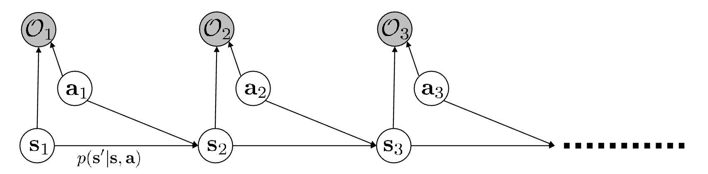

## Control as Inference

Use $O_t$ as some optimality binary variable, $O_t=1$ if $a_t$ is optimal, $O_t=0$ otherwise. We use $O_t$ to denote $O_t=1$ below

then use $p(O_t|s_t,a_t)\varpropto\exp(r(s_t,a_t))$, then

$$
p(\tau|O_{1:T})\varpropto p(\tau)\exp\left(\sum_{t=1}^T r(s_t,a_t)\right)
$$

How to do inference ?

1. compute backward messages $\beta_t(s_t,a_t)=p(O_{t:T}|s_t,a_t)$
2. compute policy $p(a_t|s_t,O_{1:T})$
3. compute forward messages $\alpha_t(s_t)=p(s_t|O_{1:t-1})$

### Backward messages

$$
\beta_t(s_t,a_t)=\int p(O_{t+1:T}|s_{t+1})p(s_{t+1}|s_t,a_t)p(O_t|s_t,a_t)ds_{t+1}\\

=p(O_t|s_t,a_t)\mathbb{E}_{s_{t+1}\sim p(s_{t+1}|s_t,a_t)}[\beta_{t+1}(s_{t+1})]
$$

and under prior $p(a_t|s_t)$

$$
\beta_t(s_t)=p(O_{t:T}|s_{t})=\mathbb{E}_{a_t\sim p(a_t|s_t)}[\beta_t(s_t,a_t)]
$$

we can solve $\beta_t(s_t,a_t)$ and $\beta_t(s_t)$ in reverse order of $t$

define $V_t(s_t)=\log\beta_t(s_t)$ and $Q_t(s_t,a_t)=\log\beta_t(s_t,a_t)$, we get

$$
V_t(s_t)=\log\mathbb{E}_{a_t\sim p(a_t|s_t)}[\exp(Q_t(s_t,a_t))]
$$

$V_t(s_t)\rightarrow\max_{a_t}Q_t(s_t,a_t)$ as $Q_t(s_t,a_t)$ gets larger and

$$
Q_t(s_t,a_t)=r(s_t,a_t)+\log\mathbb{E}_{s_{t+1}\sim p(s_{t+1}|s_t,a_t)}[\exp(V_{t+1}(s_{t+1}))]
$$

under deterministic transition, the above equation is equivalent value iteration.

But in stochastic transition, we estimate the expectation too optimistic due to Jensen's inequality

If action prior $p(a_t|s_t)$ is not uniform

$$
V(s_t)=\log\int\exp\left(Q(s_t,a_t)+\log p(a_t|s_t)\right)da_t
$$

define

$$
\tilde{Q}(s_t,a_t)=r(s_t,a_t)+\log p(a_t|s_t)+\log\mathbb{E}_{s_{t+1}\sim p(s_{t+1}|s_t,a_t)}[\exp(V_{t+1}(s_{t+1}))]
$$

the relation of $\tilde{Q}$ and $V$ under uniform prior is same as $Q$ and $V$ under $p(a_t|s_t)$

Always fold the action prior into the reward, we can assume $p(a_t|s_t)$ is uniform w.l.o.g

### Policy computation

Assume $p(a_t|s_t)$ is uniform

for $t=T-1$ to 1:

1. $Q_t(s_t,a_t)=r(s_t,a_t)+\log\mathbb{E}_{s_{t+1}\sim p(s_{t+1}|s_t,a_t)}[\exp(V_{t+1}(s_{t+1}))]=\log\beta_t(s_t,a_t)$
2. $V_t(s_t)=\log\int\exp(Q_t(s_t,a_t))da_t=\log\beta_t(s_t)$

use Bayes' rule, $p(a_t|s_t,O_{1:T})=\frac{\beta_t(s_t,a_t)}{\beta_t(s_t)}p(a_t|s_t)$

$$
\pi(a_t|s_t)=\frac{\beta_t(s_t,a_t)}{\beta_t(s_t)}=\exp(Q_t(s_t,a_t)-V_t(s_t))
$$

which is analogous to Boltzmann exploration

### Forward messages

assume $\alpha_1(s_1)=p(s_1)$ is usually known and prior $p(a_{t}|s_t)$ is uniform

$$
\alpha_t(s_t)=\int p(s_t,s_{t-1},a_{t-1}|O_{1:t-1})ds_{t-1}da_{t-1}\\

=\int p(s_t|s_{t-1},a_{t-1}, O_{1:t-1})p(a_{t-1}|s_{t-1},O_{1:t-1})p(s_{t-1}|O_{1:t-1})ds_{t-1}da_{t-1}\\

=\int p(s_t|s_{t-1},a_{t-1})p(a_{t-1}|s_{t-1}, O_{t-1})p(s_{t-1}|O_{1:t-1})ds_{t-1}da_{t-1}
$$

the final step comes from the property of Markov chain, simplify

$$
p(a_{t-1}|s_{t-1},O_{t-1})p(s_{t-1}|O_{1:t-1})=\frac{p(O_{t-1}|s_{t-1},a_{t-1})p(a_{t-1}|s_{t-1})}{p(O_{t-1}|s_{t-1})}\frac{p(s_{t-1}|O_{1:t-2})p(O_{t-1}|s_{t-1})}{p(O_{t-1}|O_{1:t-2})}\\

=\frac{p(O_{t-1}|s_{t-1},a_{t-1})p(a_{t-1}|s_{t-1})}{p(O_{t-1}|O_{1:t-2})}\alpha_{t-1}(s_{t-1})
$$

hence

$$
\alpha_t(s_t)=\int p(s_t|s_{t-1},a_{t-1})\frac{p(O_{t-1}|s_{t-1},a_{t-1})p(a_{t-1}|s_{t-1})}{p(O_{t-1}|O_{1:t-2})}\alpha_{t-1}(s_{t-1})ds_{t-1}da_{t-1}\\

\varpropto\int p(s_t|s_{t-1},a_{t-1})\exp(r(s_{t-1},a_{t-1}))\alpha_{t-1}(s_{t-1})ds_{t-1}da_{t-1}
$$

similarly

$$
p(s_t|O_{1:T})=\frac{p(O_{1:T}|s_t)p(s_t)}{p(O_{1:T})}=\frac{p(O_{t:T}|s_t)p(s_t,O_{1:t-1})}{p(O_{1:T})}\varpropto\beta_t(s_t)\alpha_t(s_t)
$$

Intuition: high $\alpha_t(s_t)$ shows state with high probability of being reached from initial state with high reward, high $\beta_t(s_t)$ shows state with high probability of reaching goal state with high reward

### Control as Variational Inference

Inference problem: compute $p(\tau|O_{1:T})$, marginalize and condition, we can get $p(a_t|s_t,O_{1:T})$ which is the policy and $p(s_{t+1}|s_t,a_t,O_{1:T})$

However, $p(s_{t+1}|s_t,a_t,O_{1:T})\neq p(s_{t+1}|s_t,a_t)$, which is the real transition model.

Our goal is find another transition model $q(s_{1:T},a_{1:T})$ that is close to $p(s_{1:T},a_{1:T}|O_{1:T})$ but have dynamics $p(s_{t+1}|s_t,a_t)$

$$
q(s_{1:T},a_{1:T})=p(s_1)\prod_t p(s_{t+1}|s_t,a_t)q(a_t|s_t)
$$

using variational lower bound

$$
\log p(O_{1:T})\geq\mathbb{E}_{q(s_{1:T},a_{1:T})}[\log p(O_{1:T},s_{1:T},a_{1:T})-\log q(s_{1:T},a_{1:T})]
$$

and since

$$
p(O_{1:T},s_{1:T},a_{1:T})=p(s_1)\prod_t p(s_{t+1}|s_t,a_t)p(a_t|s_t)p(O_t|s_t,a_t)
$$

since we assume $p(a_t|s_t)$ is uniform, we can get

$$
\log p(O_{1:T})\geq\mathbb{E}_{q(s_{1:T},a_{1:T})}[\sum_t\log p(O_t|s_t,a_t)-\log q(a_t|s_t)]\\

=\sum_t\mathbb{E}_{(s_t,a_t)\sim q(s_t,a_t)}[r(s_t,a_t)+\mathcal{H}(q(a_t|s_t))]
$$

our goal is maximize $p(O_{1:T})$, we can maximize the lower bound

$$
q(a_T|s_T)=\arg\max_{q(a_T|s_T)} \mathbb{E}_{s_T\sim q(s_T)}[\mathbb{E}_{a_T\sim q(a_T|s_T)}[r(s_T,a_T)-\log q(a_T|s_T)]]
$$

optimal when

$$
q(a_T|s_T)=\frac{\exp(r(s_T,a_T))}{\int\exp(r(s_T,a_T))da_T}=\exp(Q(s_T,a_T)-V(s_T))\\

\mathbb{E}_{s_T\sim q(s_T)}[\mathbb{E}_{a_T\sim q(a_T|s_T)}[r(s_T,a_T)-\log q(a_T|s_T)]]=\mathbb{E}_{s_T\sim q(s_T)}[V(s_T)]
$$

use math induction, max $q(a_t|s_t)$ in the reverse order of $t$, we know

$$
\max_{q}\sum_{t=t_0}^T \mathbb{E}_{s_t\sim q(s_t)}[\mathbb{E}_{a_t\sim q(a_t|s_t)}[r(s_t,a_t)-\log q(a_t|s_t)]]= \mathbb{E}_{s_t\sim q(s_t)}[V(s_t)]
$$

hence

$$
q(a_t|s_t)=\arg\max_{q(a_t|s_t)} \mathbb{E}_{s_t\sim q(s_t)}[\mathbb{E}_{a_t\sim q(a_t|s_t)} [r(s_t,a_t)+\mathbb{E}_{s_{t+1}\sim p(s_{t+1}|s_t,a_t)}[V(s_{t+1})]-\log q(a_t|s_t)]]\\

=\exp(Q(s_t,a_t)-V(s_t))
$$

where $Q(s_t,a_t)=r(s_t,a_t)+\mathbb{E}_{s_{t+1}\sim p(s_{t+1}|s_t,a_t)}[V(s_{t+1})]$, which is regular Bellman backup, not the one in control as inference

### Algorithm as Inference

soft policy gradient with soft optimality: also known as maximum entropy RL

$$
J(\pi)=\sum_{t=0}^{T-1}\mathbb{E}_{(s_t,a_t)\sim\rho_\pi}[r(s_t,a_t)+ \mathcal{H}(\pi(\cdot|s_t))]=\mathbb{E}_{(s,a)\sim\rho_{\pi_\theta}}[Q^\pi(s,a)+\mathcal{H}(\pi(\cdot|s))]
$$

under the framework of maximum entropy RL, the soft $Q$-function is

$$
Q^\pi(s_t,a_t)=r(s_t,a_t)+\sum_{i>t}\gamma^{i-t}\mathbb{E}_{(s_i,a_i)\sim\rho_\pi}[r(s_i,a_i)+\mathcal{H}(\pi(\cdot|s_i))]\\

=r(s_t,a_t)+\gamma\mathbb{E}_{s_{t+1}\sim p(\cdot|s_t,a_t)}[\mathbb{E}_{a_{t+1}\sim\pi(\cdot|s_{t+1})}[Q^\pi(s_{t+1},a_{t+1})]+\mathcal{H}(\pi(\cdot|s_{t+1}))]
$$

then

$$
\nabla_\theta J(\pi_\theta)=\mathbb{E}_{(s,a)\sim\rho_{\pi_\theta}}[(Q^\pi(s,a)-\log\pi_\theta(a|s)-1)\nabla_\theta\log\pi_\theta(a|s)]
$$

or soft $Q$-learning

$$
Q(s,a)\leftarrow r(s,a)+\gamma\mathbb{E}_{s'\sim p(\cdot|s,a), a'\sim\pi(\cdot|s')}[Q(s',a')-\log\pi(a'|s')]\\

\pi_{\text{new}}(a|s)=\argmin_\pi D_{KL}(\pi'(\cdot|s)||\frac{1}{Z}\exp Q^{\pi_{\text{old}}}(s,\cdot))
$$

Benifit of soft optimality: Improve exploration, easier to finetune policy, more robustness, easy to reduce to hard optimality
