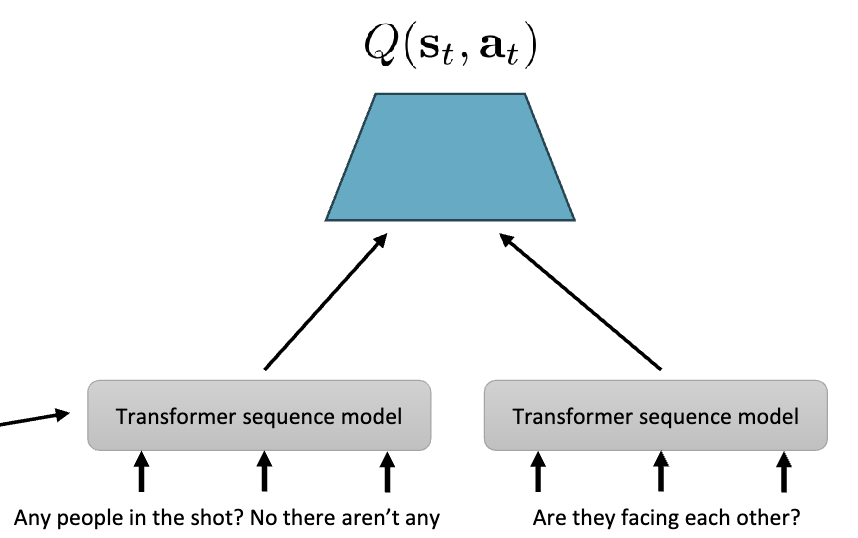

## RL with Sequence Model

Which methods handle partial observability ?

Policy gradient:

$$
\nabla_\theta J(\theta)=\frac{1}{N}\sum_{i=1}^N\left(\sum_{t=1}^T \nabla_\theta\log\pi_\theta(a_{i,t}|o_{i,t})\right)\left(\sum_{t=1}^T r(o_{i,t},a_{i,t})\right)
$$

But using $r_{i,t}+\gamma\hat{V}(o_{i,t+1})-V(o_{i,t})$ as the advantage is incorrect, since $o$ loses property of Markov chain

Also, $Q(o,a)\leftarrow r(o,a)+\gamma\max_{a'}Q(o',a')$ is also incorrect, since $o$ is not Markov. Because past observations matter for future observations

State space models: learn a Markovian state space

$$
p(z)=p(z_1)\prod_t p(z_{t+1}|z_t,a_t)\\

p_\theta(o|z)=\prod_t p(o_t|z_t)\quad q_\phi(z|o)=\prod_t q_\phi(z_t|o_{1:t})
$$

This work quite well, $Q(z,a)\leftarrow r(z,a)+\gamma\max_{a'}Q(z',a')$ is correct.

Since $q_\phi(z|o_{1:t})$ depends on all the previous observations, we use RNN to model it, which means state is a function of history. We can adjust

$$
Q(o_{1:t},a)\leftarrow r(o_t,a)+\gamma\max_{a'}Q(o_{1:t+1},a')
$$

Deep Recurrent Q-Network (DRQN): use RNN to model $q_\phi(z|o_{1:t})$

1. Collect $(o_t,a_t,r_t,o_{t+1})$, get history by catenate $o_{1:t-1}$ and add to replay buffer
2. Sample batch $\{(o_{1:t,i},a_{t,i},o_{t+1,i})\}$ from replay buffer
3. Update $Q$ function on batch

### Language Model

Language models: $\pi_\theta(a|s)$ where $a$ is completion and $s$ is context/prompt/prefix. Use policy gradients

$$
\nabla_\theta\mathbb{E}_{\pi_\theta(a|s)}[r(s,a)]=\frac{1}{N}\sum_{i=1}^N\frac{\pi_\theta(a_i|s)}{\bar{\pi}(a_i|s)}\nabla_\theta\log\pi_\theta(a_i|s)r(s,a_i)
$$

where $r(s,a)$ is the reward of completion. We can use RNN to model $\pi_\theta(a|s)$

how to define reward ? Use reward from preference

$$
p(a_1>a_2)=\frac{\exp(r(s,a_1))}{\exp(r(s,a_1))+\exp(r(s,a_2))}
$$

1. Run supervised learning to get initial $\pi_\theta(a|s)$
2. For each $s$ sample $K$ answers from $\pi_\theta(a|s)$, add to dataset $\mathcal{D}=\{(s_i,a_{i,1},\dots,a_{i,K})\}$
3. Get human to label which $a_{i,k}$ they prefer, train $r$ on labeled dataset
4. Update $\pi_\theta$ using RL with reward $r(s,a)$

Issues: human preferences are expensive, overoptimization, reward models needs to be very good

    

Multi-step RL with language model:

action: bot says, observation: human says, state: the history, reward: dialogue outcome

Time step: per utterance: short horizon but huge action space, per token: simple action but long horizon

Compute value using pretrained language model
