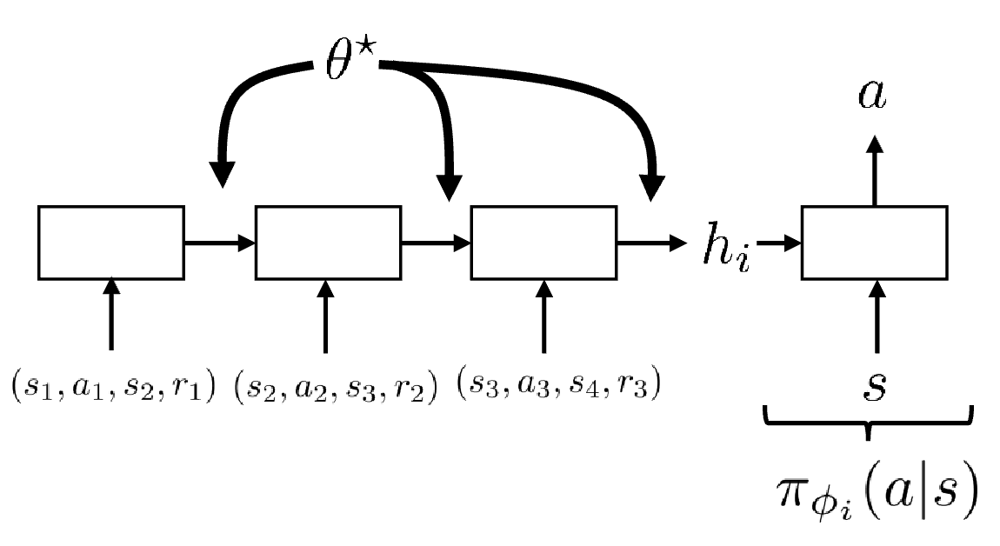

## Transfer Learning

Meta learning: using experience from one set of tasks for faster learning and better performance on a new task

Issues: Domain shift, Difference in MDP, Fine-tuning issues

### Domain adaptation

Same network may work in simulation but not in real world -> Invariance assumption: everything that is different between domains is irrelevant

Formally: $p(x)$ is different between domains, but exists $z=f(x)$ such that $p(y|z)=p(y|x)$ and $p(z)$ is the same between domains

Use domain classifier: $D_\phi(z)$ to distinguish between domains, use adversarial loss

When dynamics don't match, invariance is not enough because we don't want to ignore functionally relevant differences, define $\Delta_r$ as

$$
\Delta_r(s_t,a_t,s_{t+1})=\left(\log p(\text{target}|s_t,a_t,s_{t+1})-\log p(\text{source}|s_t,a_t,s_{t+1})\right)\\

-\left(\log p(\text{target}|s_t,a_t)-\log p(\text{source}|s_t,a_t)\right)
$$

which answers the question: for the task of predicting whether a transition came from the source or target domain, how much better can you perform after observing $s_{t+1}$.

Define

$$
\tilde{r}(s_t,a_t,s_{t+1})=r(s_t,a_t)+\lambda\Delta_r(s_t,a_t,s_{t+1})
$$

then perform RL using $\tilde{r}$

Intuition: the more varied the training domain is, the more likely we are to generalize in zero shot to a slightly different domain

Randomization: randomizing physical parameters (EPOpt)

Contextual policies: $\pi_\theta(a|s,\omega)$ where $\omega$ is context, define augemented state space $\tilde{\mathcal{S}}=\mathcal{S}\times\Omega$

Goal-conditioned policies: $\pi_\theta(a|s,g)$, reward as $r(s,a,g)=\delta(s=g)$ in discrete case and $r(s,a,g)=\delta(||s-g||\leq\epsilon)$ in continuous case

### Meta Learning

Meta learning: learn to learn, learn a policy that can quickly adapt to new tasks

supervised learning: $f(x)\rightarrow y$, meta learning: $f(\mathcal{D},x)\rightarrow y$

$$
\theta^*=\arg\min_\theta\sum_{i=1}^n\mathcal{L}(f_\theta(\mathcal{D}^{\text{train}}_i),\mathcal{D}^{\text{test}}_i)
$$

Meta RL:

$$
\theta^*=\arg\min_\theta\sum_{i=1}^n\mathbb{E}_{\pi_{\phi_i}(\tau)}[R(\tau)]
$$

where $\phi_i=f_\theta(\mathcal{M}_i)$, $\mathcal{M}_i$ is MDP for task $i$. Assume $\mathcal{M}_i\sim p(\mathcal{M})$

Meta test: sample $\mathcal{M}_{\text{test}}\sim p(\mathcal{M})$, get $\phi_{\text{test}}=f_\theta(\mathcal{M}_{\text{test}})$, then get policy $\pi_{\phi_{\text{test}}}$

    

Meta-RL with recurrent policy: what should $f_\theta(\mathcal{M}_i)$ do

1. improve policy with experience from $\mathcal{M}_i$
2. choose how to interact, how to explore

Gradient-based meta-RL: $f_\theta(\mathcal{M}_i)$ can be an RL algorithm, such as

$$
f_\theta(\mathcal{M}_i)=\theta+\alpha\nabla_\theta J_i(\theta)
$$

where $J_i$ requires interacting with $\mathcal{M}_i$ to estimate $\nabla_\theta\mathbb{E}_{\pi_\theta}[R(\tau)]$ e.g.

$$
\theta'_i=\theta-\alpha\sum_{(x,y)\in\mathcal{D}_i^{\text{train}}}\nabla_\theta\mathcal{L}_i(f_\theta(x),y)\\

\theta\leftarrow\theta-\beta\nabla_\theta\sum_{i}\mathcal{L}_i(f_{\theta'_i}(\mathcal{D}_i^{\text{test}}),\mathcal{D}_i^{\text{test}})
$$

final output network $f_{\text{MAML}}(\mathcal{D}^{\text{train},x})=f_{\theta'}(x)$

Meta-RL as partially observed RL: $\tilde{\mathcal{M}}=\{\tilde{\mathcal{S}},\mathcal{A},\tilde{\mathcal{O}},\tilde{\mathcal{P}},\mathcal{E},r\}$ where $\tilde{\mathcal{S}}=\mathcal{S}\times\mathcal{Z}$, $\tilde{\mathcal{O}}=\mathcal{S}$.

$z$ is encapsulates information policy needs to solve current task. Learning a task equals inferring $z$

Solving POMDP $\tilde{\mathcal{M}}$ is equivalent to solving meta-learning.

Exploring via posterior sampling with latent context

1. sample $z\sim\hat{p}(z_t|s_{1:t},a_{1:t},r_{1:t})$, use variational inference to approximate $q_\phi\sim\hat{p}$
2. act according to $\pi(a|s,z)$ to collect more data

$$
(\theta,\phi)=\arg\max_{\theta,\phi}\frac{1}{N}\sum_{i=1}^N\mathbb{E}_{z\sim q_\phi, \tau\sim\pi_\theta}[R(\tau)-D_{KL}(q(z|s_{1:t},a_{1:t},r_{1:t})||p(z))]
$$

similar to RNN meta-RL, but with stochastic $z$ which enables exploration

Conclusion: three perspectives of meta-RL

1. just RNN: conceptually simple, easy to apply, but vulnerable to overfitting and challenging to optimize
2. bi-level optimization: good consistency, conceptually elegant, but requires many samples
3. inference: simple exploration, elegent reduction to POMDP,  but vulnerable to overfitting and challenging to optimize
