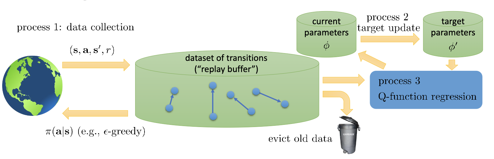

## Value Function Methods

$A^{\pi}(s,a)$ measures how much better is $a_t$ than the average action at state $s_t$.

Forget policies and just do $\arg\max_a A^\pi(s,a)$ !

Bootstrap update: update value function using value function itself, then set $\pi'$ to be greedy policy w.r.t. $V^{\pi}_{\phi}$

$$
V^{\pi}_{\phi}(s_t)\leftarrow r(s,\pi(s))+\gamma\mathbb{E}_{s'\sim p(s'|s,\pi(s))}[V^{\pi}_{\phi}(s')]
$$

Even simpler, use Q-function

$$
Q^{\pi}(s,a)=r(s,a)+\gamma\mathbb{E}_{s'\sim p(s'|s,a)}[V^{\pi}(s')]
$$

and set $V^{\pi}(s)=\mathbb{E}_{a\sim\pi(a|s)}[Q^{\pi}(s,a)]=\max_a Q^{\pi}(s,a)$. However, it's impossible to represent $V(s)$ using a big table, instead we use parameters $\phi$

fitted value iteration:

$$
y_i\leftarrow\max_{a_i} (r(s_i,a_i)+\gamma\mathbb{E}_{s'_i\sim p(s'|s_i,a_i)}V_{\phi}(s_i'))\\

\phi\leftarrow\arg\min_{\phi}\sum_i(y_i-V_{\phi}(s_i))^2
$$

The problem is that we must interact with the environment with enough samples to get $y_i$, so we can estimate $Q$ function

full fitted Q-iteration: $Q_{\phi}(s,a)=r(s,a)+\gamma\mathbb{E}_{s'\sim p(s'|s,a)}\max_{a'}Q_{\phi}(s',a')$, take max before expectation to improve sample efficiency

1. collect a batch of transitions $\tau=\{s_i,a_i,s_i',r_i\}$ using some policy

   iterate $K$ times:
2. set $y_i\leftarrow r(s_i,a_i)+\gamma\max_{a'_i}Q_{\phi}(s_i',a'_i)$
3. set $\phi\leftarrow\arg\min_{\phi}\sum_i(y_i-Q_{\phi}(s_i,a_i))^2$

equivalent to find a function that satisfies Bellman equation

Advantage: off-policy, since $r(s_i,a_i)$ and $\max_{a'_i}Q_{\phi}(s_i',a'_i)$ is independent of the policy

Online Q-iteration:

1. take action $a_i$ and observe $(s_i,a_i,s_i',r_i)$
2. $y_i\leftarrow r(s_i,a_i)+\gamma\max_{a'_i}Q_{\phi}(s_i',a'_i)$
3. $\phi\leftarrow\phi - \alpha\frac{\text{d}Q_{\phi}}{\text{d}\phi}(Q_{\phi}(s_i,a_i)-y_i)$

if always use $a_t=\arg\max_a Q_{\phi}(s_t,a)$, then it's easy to get stuck in local minimum, hence use $\epsilon$-greedy policy

$$
\pi(a|s)=\begin{cases}

1-\epsilon & \text{if } a=\arg\max_a Q_{\phi}(s,a)\\

\frac{\epsilon}{|\mathcal{A}|-1} & \text{otherwise}

\end{cases}
$$

or Boltzmann policy

$$
\pi(a|s)=\frac{\exp(Q_{\phi}(s,a)/\tau)}{\sum_{a'}\exp(Q_{\phi}(s,a')/\tau)}
$$

but our target $|Q_{\phi}(s,a)-r(s,a)-\gamma\max_{a'}Q_{\phi}(s',a')|^2$ is not fixed, we may not converge to the optimal solution

Another solution: use replay buffer, sample a batch of transitions from the buffer, then update $Q_{\phi}$

### Value function Theory

define operator $\mathcal{B}$

$$
\mathcal{B}V=\max_a r(s,a)+\gamma\mathbb{E}_{s'\sim p(s'|s,a)}[V(s')]
$$

then $V^*$ is a fixed point of $\mathcal{B}$, always exists and unique, and $\mathcal{B}$ is a contraction mapping, which means

$$
||\mathcal{B}V-\mathcal{B}V'||_\infty\leq\gamma||V-V'||_\infty
$$

choose $V'=V^*$, then we know $||\mathcal{B}V-V^*||_\infty\leq\gamma||V-V^*||_\infty$

value iteration: $V\leftarrow\mathcal{B}V$

fitted value iteration: $V\leftarrow\Pi\mathcal{B}V$

where $\Pi$ is a projection operator, $\Pi V=\arg\min_{V'\in\Omega}||V'-V||_2$, which projects $V$ to the space of function that can be represented by $\phi$

$\mathcal{B}$ is a contraction mapping w.r.t. $||\cdot||_\infty$, $\Pi$ is a contraction mapping w.r.t. $||\cdot||_2$, but $\Pi\mathcal{B}$ is not a contraction mapping w.r.t. any norm. It often doesn't converge to $V^*$ in practice

$Q\leftarrow\Pi\mathcal{B}Q$ is not a contraction mapping, $Q$-learning is not a gradient descent since we don't backpropagate throught $y_i$

But we can make it work in practice !

### Target Networks

Q-learning algorithm with buffer and target network:

1. update $\phi'\leftarrow\tau\phi+(1-\tau)\phi'$

   iterate $N$ times:
2. collect $M$ transitions $\tau=\{s_i,a_i,s_i',r_i\}$ using some policy, add to $\mathcal{B}$

   iterate $K$ times:
3. sample a minibatch $\{s_i,a_i,s_i',r_i\}$ from $\mathcal{B}$
4. $\phi\leftarrow\phi-\alpha\sum_i\frac{\text{d}Q_{\phi}}{\text{d}\phi}(Q_{\phi}(s_i,a_i)-(r(s_i,a_i)+\gamma\max_{a'}Q_{\phi'}(s_i',a_i')))$

DQN: pick $N=1$, $K=1$

1. take action $a_i$ and observe $(s_i,a_i,s_i',r_i)$, add it to $\mathcal{B}$
2. sample minibatch $\{s_i,a_i,s_i',r_i\}$ from $\mathcal{B}$
3. set $y_i=r_i+\gamma\max_{a'}Q_{\phi'}(s_i',a')$ using target network $Q_{\phi'}$
4. $\phi\leftarrow\phi-\alpha\frac{\text{d}Q_{\phi}}{\text{d}\phi}(Q_{\phi}(s_i,a_i)-y_i)$
5. update $\phi'\leftarrow\tau\phi+(1-\tau)\phi'$ ($\tau=0.001$ works well)

Online $Q$-learning: process 1, 2, 3 running at same speed

DQN: process 1, 3 at same speed, process 2 at slower speed

Fittered Q-iteration: process 3 faster than process 2, faster than process 1 (offline)

However, $Q$ often overestimate, since $Q_{\phi'}(s',a')$ is often noise, we use double Q-learning. Use current network to select action, use target network to evaluate the action

$$
y_i=r_i+\gamma Q_{\phi'}(s_i',\arg\max_{a'}Q_{\phi}(s_i',a'))
$$

$Q$-learning with $N$-step returns: define target as

$$
y_{i,t}=\sum_{t'=t}^{t+N-1}\gamma^{t-t'}r_{j,t'}+\gamma^N\max_{a_{j,t+N}}Q_{\phi'}(s_{i,t+N},a_{j,t+N})
$$

less biased target values when $Q$ is inaccurate, faster learning in early stage

Only actually correct when learning on-policy, we need $s_{j,t'},a_{j,t'}$ to be sampled from $\pi_{\theta}$

### Continuous Action Spaces

Ways to pick $a=\arg\max_a Q_{\phi}(s,a)$:

1. gradient descent on $Q_{\phi}(s,a)$ / choose from $N$ samples
2. use Normalized Advantage Functions: $Q_{\phi}(s,a)=-\frac{1}{2}(a-\mu_{\phi}(s))^TP_\phi(s)(a-\mu_{\phi}(s))+V_{\phi}(s)$, then $\mu_{\phi}(s)=\arg\max_a Q_{\phi}(s,a)$
3. train another network $\mu_\theta(s)$ s.t. $\mu_\theta(s)=\arg\max_a Q_{\phi}(s,a)$, then new target $y_i=r_i+\gamma Q_{\phi'}(s_i,\mu_{\theta}(s_i))$, update $\theta$ using $\nabla_{\theta}J(\theta)=\mathbb{E}(\nabla_\theta\mu_\theta(s)\nabla_a Q_\phi(s,\mu_\theta(s)))$

DDPG:

1. take action $a_i$ and observe $(s_i,a_i,s_i',r_i)$, add it to $\mathcal{B}$
2. sample minibatch $\{s_i,a_i,s_i',r_i\}$ from $\mathcal{B}$
3. compute target $y_i=r_i+\gamma Q_{\phi'}(s_i',\mu_{\theta'}(s_i'))$
4. update $\phi\leftarrow\phi-\alpha\frac{\text{d}Q_{\phi}}{\text{d}\phi}(Q_{\phi}(s_i,a_i)-y_i)$
5. update $\theta\leftarrow\theta+\beta\frac{\text{d}\mu_{\theta}}{\text{d}\theta}\nabla_a Q_{\phi}(s_i,a_i)|_{a_i=\mu_{\theta}(s_i)}$
6. soft update $\phi'\leftarrow\tau\phi+(1-\tau)\phi'$, $\theta'\leftarrow\tau\theta+(1-\tau)\theta'$

Tips: Large replay buffer, start with high exploration, clip gradients, double Q-learning, run multiple random seeds
