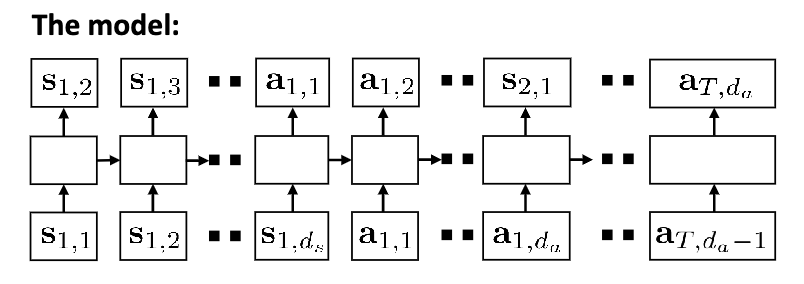

## Offline RL

Offline RL problems:

off-policy evaluation(OPE): given $\mathcal{D}$, estimate $J(\pi)=\mathbb{E}_\pi(\sum_{t=1}^Tr(s_t,a_t))$

offline RL: given $\mathcal{D}$, learn best possible policy $\pi_\theta$

### Batch RL

#### Via policy gradient

RL objective

$$
\max_\pi\sum_{t=0}^T\mathbb{E}_{s_t\sim d^\pi(s),a_t\sim\pi(a|s)}[\gamma^t r(s_t,a_t)]
$$

$d^\pi(s)$ is the state distribution choosen from data $\mathcal{D}$ under policy $\pi$, use importance sampling

$$
\nabla_\theta J(\theta)=\frac{1}{N}\sum_{i=1}^N\frac{\pi_\theta(\tau_i)}{\pi_\beta(\tau_i)}\sum_{t=0}^T\nabla_\theta\gamma^t\log\pi_\theta(a_{t,i}|s_{t,i})\hat{Q}(s_{i,t},a_{i,t})\\

\approx\frac{1}{N}\sum_{i=1}^N\sum_{t=0}^T\left(\prod_{t'=0}^{t-1}\frac{\pi_\theta(a_{t',i}|s_{t',i})}{\pi_\beta(a_{t',i}|s_{t',i})}\right)\nabla_\theta\log\pi_\theta(a_{t,i}|s_{t,i})\left(\prod_{t'=t}^{T}\frac{\pi_\theta(a_{t',i}|s_{t',i})}{\pi_\beta(a_{t',i}|s_{t',i})}\right)\hat{Q}(s_{i,t},a_{i,t})
$$

the first term accouts for difference in probability of landing in $s_{t,i}$, the second term accounts for having different actions in the future. If the difference between $\pi_\theta$ and $\pi_\beta$ is not too large, we can throw away first term

$$
\nabla_\theta J(\theta)\approx\frac{1}{N}\sum_{i=1}^N\sum_{t=0}^T\nabla_\theta\log\pi_\theta(a_{t,i}|s_{t,i})\left(\prod_{t'=t}^{T}\frac{\pi_\theta(a_{t',i}|s_{t',i})}{\pi_\beta(a_{t',i}|s_{t',i})}\right)\hat{Q}(s_{i,t},a_{i,t})
$$

we know $\hat{Q}(s_{i,t},a_{i,t})=\sum_{t'=t}^{t'=T}\gamma^{t'-t}r(s_{i,t'},a_{i,t'})$, and later action doesn't affect current reward, hence

$$
\nabla_\theta J(\theta)\approx\frac{1}{N}\sum_{i=1}^N\sum_{t=0}^T\nabla_\theta\log\pi_\theta(a_{t,i}|s_{t,i})\sum_{t'=t}^{T}\left(\prod_{t''=t}^{t'}\frac{\pi_\theta(a_{t'',i}|s_{t'',i})}{\pi_\beta(a_{t'',i}|s_{t'',i})}\right)\gamma^{t'-t}r(s_{i,t'},a_{i,t'})
$$

still exponentially exploding importance weights, must use value function estimation

Doubly Robust Estimator:

$$
V^{\pi_\theta}(s_t)\approx\sum_{t'=t}^{T}\left(\prod_{t''=t}^{t'}\frac{\pi_\theta(a_{t'',i}|s_{t'',i})}{\pi_\beta(a_{t'',i}|s_{t'',i})}\right)\gamma^{t'-t}r(s_{i,t'},a_{i,t'})=\sum_{t'=t}^T\left(\prod_{t''=t}^{t'}\rho_{t'}\right)\gamma^{t'-t}r(s_{i,t'},a_{i,t'})
$$

the recursive formula is

$$
V^{\pi_\theta}(s_t)=\rho_t(r(s_t,a_t)+\gamma V^{\pi_\theta}(s_{t+1}))
$$

use Doubly Robust Estimation:

$$
V_{DR}(s)=\hat{V}(s)+\rho(s,a)(r_{s,a}-\hat{Q}(s,a))=\mathbb{E}_{a\sim\pi_\beta(a|s)}[\rho(s,a)\hat{Q}(s,a)]+\rho(s,a)(r_{s,a}-\hat{Q}(s,a))
$$

where $\hat{V}(s)$ and $\hat{Q}(s,a)$ is a model, if $\hat{Q}(s,a)$ and $\rho$ are independent, then $V_{DR}(s)$ is unbiased, with a smaller variance. Hence

$$
V_{DR}^{\pi_\theta}(s_t)=\hat{V}(s_t)+\rho_t(r(s_t,a_t)+\gamma V_{DR}^{\pi_\theta}(s_{t+1})-\hat{Q}(s_t,a_t))
$$

we can use this to learn $V_{DR}$, then estimate $\nabla_\theta J(\theta)$

Marginalized Importance Sampling: instead of using $\frac{\pi_\theta(\tau_i)}{\pi_\beta(\tau_i)}$, we estimate

$$
w(s,a)=\frac{d^{\pi_\theta}(s,a)}{d^{\pi_\beta}(s,a)}\qquad J(\theta)=\frac{1}{N}\sum_i w(s_i,a_i)r_i
$$

we can estimate $w(s,a)$ using

$$
d^{\pi_\beta}(s,a)w(s,a)=(1-\gamma)p_0(s)\pi_\theta(a|s)+\gamma\sum_{s',a'}\pi_\theta(a|s)p(s|s',a')d^{\pi_\beta}(s',a')w(s',a')
$$

the first term is probability of starting in $(s,a)$, the second part is the probability of reaching $s$ from $(s',a')$ and then taking action $a$. Solving $w(s,a)$ is equivalent to solving some fixed point

#### Via Linear Fitted Value Functions

suppose we have a linear model with feature matrix $\phi, |\mathcal{S}|\times K$, from previous discussion about `Successor Representations`, we know $r(s)=\phi(s)^T w$, then the reward model and transition model can be written as

$$
\phi w_r=r\quad\phi P_\phi=P^{\pi}\phi
$$

where $P^{\pi}$ is the transition matrix under policy $\pi$, $P_\phi$ is estimated feature-space transition matrix. Use least square

$$
w_r=(\phi^T\phi)^{-1}\phi^Tr\quad P_\phi=(\phi^T\phi)^{-1}\phi^TP^{\pi}\phi
$$

then we can estimate $V^{\pi}\approx\phi w_v$ where $V^\pi=r+\gamma P^{\pi}V^{\pi}$, so

$$
w_V=(\phi^T\phi-\gamma\phi^TP^{\pi}\phi)^{-1}\phi^Tr
$$

we can replace $\phi$ with a $|\mathcal{D}|\times K$ matrix, for each $\{s_i,a_i,r_i,s_i'\}$ in $\mathcal{D}$, we have $\phi_i=\phi(s_i),\phi_i'=\phi(s_i'),r_i=r(s_i,a_i)$, then

$$
w_V=(\phi^T\phi-\gamma\phi^T\phi')^{-1}\phi^Tr
$$

However, $\phi'=P^{\pi}\phi$, is sampling from $\pi$, this is not possible in offline RL. Solution: use feature matrix for both states and actions, $\phi, |\mathcal{S}||\mathcal{A}|\times K$, then

$$
w_Q=(\phi^T\phi-\gamma\phi^T\phi')^{-1}\phi^Tr
$$

where $\phi'_i=\phi(s_i',\pi(s_i'))$, our algorithm is

1. compute $w_Q$ for $\pi_k$
2. $\pi_{k+1}(s)=\arg\max_a\phi(s,a)^T w_Q$
3. set $\phi'_i=\phi(s_i',\pi_{k+1}(s_i'))$, repeat until convergence

however, it doesn't work well in practice, since action distributional shift

### Policy Constraint Optimization

#### Advantage Weighted Actor Critic

One way to avoid distributional shift is constraint on $D_{KL}(\pi_{\theta}||\pi_{\beta})$, since

$$
D_{KL}(\pi||\pi_\beta)=-\mathbb{E}_{\pi}(\log\pi_\beta(a|s))-\mathcal{H}(\pi)
$$

use Lagrange multiplier, we can get

$$
\theta=\arg\max_\theta\mathbb{E}_{s\sim\mathcal{D}}(\mathbb{E}_{a\sim\pi_\theta(a|s)}[A(s,a)+\lambda\log\pi_\beta(a|s)]+\lambda\mathcal{H}(\pi_\theta(a|s)))
$$

solve

$$
\pi^*(a|s)=\frac{1}{Z(s)}\pi_\beta(a|s)\exp(\frac{1}{\lambda}A(s,a))
$$

we can approximate this via weighted maximum likelihood

$$
\pi(a|s)=\arg\max_\pi\mathbb{E}_{(s,a)\sim\pi_\beta}[\log\pi(a|s)\frac{1}{Z(s)}\exp(\frac{1}{\lambda}A_\phi(s,a))]
$$

we can iteratively update $\pi$ and $A_\phi$ until convergence.

#### Implicit Q-learning

if using $Q$-learning, we often overestimate $\max_a Q(s,a)$ with some unseen actions, so use four different functions: target $Q$ function $Q_{\hat{\theta}}$, $Q$ function $Q_\theta$, and value function $V_\phi$, and target value function $V_{\hat{\phi}}$. Using $V_\phi$ significantly reduces the overestimation of $Q$-values

Repeat: 1. update Value function w.r.t $L_V(\phi)=\mathbb{E}_{(s,a)\sim\mathcal{D}}[L_2^\tau(Q_\theta(s,a)-V_\phi(s))]$ where $L_2^\tau(x)=\begin{cases}(1-\tau)x^2 & x>0\\ \tau x^2 & \text{else}\end{cases}$

2. update $Q$ function w.r.t $L_Q(\theta)=\mathbb{E}_{(s,a,s')\sim\mathcal{D}}[(Q_\theta(s,a)-(r(s,a)+\gamma V_{\hat{\phi}}(s')))^2]$
3. update target $Q$ function $Q_{\hat{\theta}}\leftarrow\alpha Q_{\hat{\theta}}+(1-\alpha)Q_\theta$
4. update target value function $V_{\hat{\phi}}\leftarrow\alpha V_{\hat{\phi}}+(1-\alpha)V_\phi$

end repeat

5. Update policy using objective

$$
L_\pi(\psi)=-\mathbb{E}_{(s,a)\sim\mathcal{D}}[\log\pi_\psi(a|s)\exp(\frac{1}{\lambda}(Q_\theta(s,a)-V_\phi(s)))]
$$

when using big $\tau$, we are more likely to choose $\pi(a|s)=\delta(a=\arg\max_{a'\in\mathcal{A},\pi_\beta(a'|s')>0}Q(s,a))$, without risking out-of-distribution actions.

### Conservative Q-learning

use conservative Q-learning to avoid overestimation, we can use a conservative estimate of $Q$-value

$$
\hat{Q}^{\pi}=\arg\min_Q\max_\mu\alpha\mathbb{E}_{s\sim D,a\sim\mu(a|s)}[Q(s,a)]+\mathbb{E}_{(s,a,s')\sim\mathcal{D}}[(Q(s,a)-(r(s,a)+\gamma\mathbb{E}_\pi[Q(s',a')]))^2]
$$

where $\mu$ is a distribution over actions, $\alpha$ is a hyperparameter. The first term push down $Q$-values, the second term is the Bellman error. A better bound is

$$
\hat{Q}^{\pi}=\arg\min_Q\max_\mu\mathcal{L}_{\text{CQL}}(Q,\mu)=\\

\arg\min_Q\max_\mu\alpha\mathbb{E}_{s\sim D,a\sim\mu(a|s)}[Q(s,a)]-\alpha\mathbb{E}_{(s,a)\sim\mathcal{D}}[Q(s,a)]+\mathbb{E}_{(s,a,s')\sim\mathcal{D}}[(Q(s,a)-(r(s,a)+\gamma\mathbb{E}_\pi[Q(s',a')]))^2]
$$

Intuition: with term $\mathbb{E}_{s\sim D,a\sim\mu(a|s)}[Q(s,a)]-\mathbb{E}_{(s,a)\sim\mathcal{D}}[Q(s,a)]$, it's easy for us to decrease $Q$-values for actions that are not taken in the data, which also decrease the probability that $\mu$ will choose these actions

no longer guarantee $\hat{Q}^{\pi}(s,a)\leq Q^{\pi}(s,a)$ for all $(s,a)$, but guarantee $\mathbb{E}_{\pi(a|s)}(\hat{Q}^\pi(s,a))\leq\mathbb{E}_{\pi(a|s)}(Q^\pi(s,a))$ for all $s\in\mathcal{D}$. It's more stable

1. Update $\hat{Q}^{\pi}$ using $\mathcal{D}$ w.r.t $\max_\mu\mathcal{L}_{\text{CQL}}(Q,\mu)$
2. Update policy $\pi$ using $\theta\leftarrow\theta+\alpha\nabla_\theta\sum_i\mathbb{E}_{a\sim\pi(a|s)}[\hat{Q}^\pi(s_i,a)]$ if actions are continuous, use $\pi(a|s)=\delta(a=\arg\max_{a'}\hat{Q}^\pi(s,a))$ if actions are discrete
3. repeat until convergence

Improvement: add regularization term to $\mathcal{L}_{\text{CQL}}$

$$
\mathcal{L}_{\text{CQL}}(Q,\mu)=\alpha\mathbb{E}_{s\sim D,a\sim\mu(a|s)}[Q(s,a)]-\alpha\mathbb{E}_{(s,a)\sim\mathcal{D}}[Q(s,a)]-\mathcal{R}(\mu)+\mathbb{E}_{(s,a,s')\sim\mathcal{D}}[(Q(s,a)-(r(s,a)+\gamma\mathbb{E}_\pi[Q(s',a')]))^2]
$$

a common choice is $\mathcal{R}(\mu)=\beta\mathbb{E}_{s\sim\mathcal{D}}[\mathcal{H}(\mu(\cdot|s))]$

### Model Based Offline RL

Since data is fixed, we must punish the policy for exploiting. $\tilde{\pi}(s,a)=r(s,a)-\lambda u(s,a)$, where $u(s,a)$ is the uncertainty penalty

Conservative Model-Based RL(COMBO):

$$
\hat{Q}^{k+1}\leftarrow\arg\min_Q\beta\mathbb{E}_{s,a\sim\rho(s,a)}[Q(s,a)]-\beta\mathbb{E}_{(s,a)\sim\mathcal{D}}[Q(s,a)]+\frac{1}{2}\mathbb{E}_{(s,a,s')\sim\mathcal{D}}[(Q(s,a)-\hat{B}^\pi\hat{Q}^k(s,a))^2]
$$

where $\hat{B}^\pi$ is the Bellman operator, $\rho(s,a)$ is state-action distribution from the model

Intuition: if the model produces something that looks clearly different from real data, it's easy for the $Q$-learning to make it look bad

Trajectory Transformer: train a joint state-action model $p_\beta(\tau)=p_\beta(s_1,a_1,...,s_T,a_T)$, then use a big expressive model (Transformer)

use beam search w.r.t $\sum_t r(s_t,a_t)$ to get best trajectory
