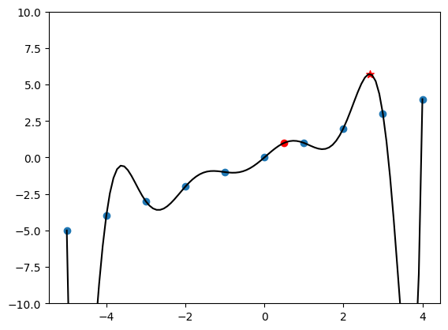

# Model-Based RL

在上一讲，我们已经介绍了如果我们有一个环境的模型，我们可以使用十分强大的算法来计算最优策略。因此，很多时候我们希望**建立一个模型**模拟环境的动力学，进而使用前面的方法。

一个最直接的思路：

1. 运行某种baseline policy $\pi_0$ （比如随机采样）, 收集数据集 $D=\{(s,a,s')\}$ ；
2. 在 $D$ 上学习一个动力学模型 $f(s,a)$ ，使得 $f(s,a)\approx s'$ ；
3. 使用前面介绍的方法（比如LQR）来计算最优策略 $\pi^\star$ 。

但这个方法有一定的问题：前面的baseline policy $\pi_0$ 因为没有任何策略，很可能不能探索到全部的state；但 $\pi^\star$ 因为是更优秀的，很可能到达 $\pi_0$ 没有到达的地方，因此有可能会不知所措。

> 比如说，一个游戏上来先有一些小兵，击败它们后会出现一个boss。如果我们的baseline policy只是随机走动，那么用它收集出来的数据训练出来的模型 $f$ 很可能只能学会小兵的动力学。这样，用 $f$ 计算出来的 $\pi^\star$ 虽然可以击败小兵，但是完全不可能知道如何击败boss。

这个问题被称为**distribution mismatch**。当然，我们很容易就可以给前面的方法做一个改进来减缓这个问题。想象上面的例子，只要我们每一次plan得到新的策略之后重新采集数据，就可以覆盖更多的state。这样，我们就得到了以下的方法：

1. 初始化策略为某种baseline policy $\pi_0$ （比如随机采样）。开始时，数据集 $D=\emptyset$ ；
2. 重复：
    1. 运行当前的最新策略 $\pi$ , 收集数据集 $D=D\cup \{(s,a,s')\}$ ；
    2. 在 $D$ 上学习一个动力学模型 $f(s,a)$ ，使得 $f(s,a)\approx s'$ ；
    3. 使用前面介绍的方法（比如LQR）来更新最优策略 $\pi$ 。

这个方法在理想情况下感觉可以跑的很好。但再仔细一想，如果学习环境的动力学模型出现错误，那么使用这个算法很可能会浪费很多数据。具体地，我们的LQR方法是基于模型的；如果模型出现了一定的误差，那么计算得到的 $\pi$ 的第一步差得还不多，但越走就会差得越远。

> 比如说，假设我们的模型要模拟开车的动力学。模型本身很可能只是有一个很小的误差（比如说，它认为车轮向左偏1度的时候才会让车直着走）。但是用这个模型计算最优策略（比如说目标就是让车直着走），那么这个策略走出来的轨迹就会越来越偏离目标。

这样，用存在很小误差的动力学走很多步，会把误差放大，采集出来的数据都很偏离目标，因此意义不大。

很容易想到，我们为了改变这个情况，需要给模型及时更正自己错误的机会。这样，我们就终于给出了Model-Based RL的一个基本思路：

> **Model-Based RL Algorithm** (a.k.a. Model Predictive Control,MPC)

1. 用某种baseline policy $\pi_0$ （比如随机采样）获得一个数据集 $D=\{(s,a,s')\}$ ；
2. 重复：
    1. 在 $D$ 上学习一个动力学模型 $f(s,a)$ ，使得 $f(s,a)\approx s'$ ；
    2. 使用某种planning的方法来更新最优策略 $\pi$ 。
    3. 运行当前的最新策略 $\pi$ **仅一步**, 收集 **一组（不是一个）** 数据，加入数据集： $D=D\cup \{(s,a,s')\}$ ；

这里值得一提的是一个有趣的细节：我们第2步的planning该怎么做？如果最保守，我们应该运行一个完整的LQR；但实际上我们可以稍微在这一步上放松，也就是取一个小一点的horizon，而不是完整的horizon。更进一步，LQR甚至都不是必须的，使用之前最“笨”的random shooting都是可以的。

> Q: 为什么这里planning的准确性并不被特别要求？
>
> A: 因为和之前已知环境演化的设定不同，这里我们的模型还没有完全学会环境的动力学。因此，与其在这个不完全正确的动力学上大花功夫，不如节约一些时间，多运行这个loop几次，从而从环境中采集更多的、方向更正确的数据。同时，上一讲的最后介绍[MPC](./10-optimal_control_planning.md#example-nonlinear-model-predictive-control)的时候也提到过，越是动力学不准确，horizon比较小的算法越是有优势。

## Uncertainty

> Q: Is that the end of the story?
> 
> A: No! There are a lots of issues that we still need to consider.

我们首先来考虑一个实际的问题：我们如何选取这个 $f$ 呢？当然，基于物理定律的模型（加上几个拟合的参数）确实可以，但不够一般，也不一定准确。因此，我们肯定希望能把 $f$ 选取为一个神经网络。

但这个时候就出现了一个不易察觉的问题（当然，对于非神经网络也有类似的问题，但是在神经网络的地方它体现的尤其严重）。我们的数据集虽然在不断拓展，但一开始的时候我们所有（或大部分）数据都还是来自那个最原始的base policy，也就是基本是随机选取的。在这种情况下，我们的神经网络**很容易overfit**。

> 就比如，我们还是希望神经网络能既学会小兵如何反应，也学会boss如何反应。但现在的情况是，我们有500组 $(s,a,s')$ ，它们都来自小兵；而我们只有10组 $(s,a,s')$ 来自boss。这样，神经网络很可能学会一个基本是小兵的动力学的模型，只是在boss的那10组数据上突然overfit一下。比如下面的图形，我们本来加入了一个数据点（红点），但莫名其妙出现了一个不该出现的“假”极值点（五角星标记的点）。

你也许会说，这并没有太大的问题呀——毕竟随着策略的提升，boss的数据会越来越多，一切都会好起来的。但问题的关键在于**planner的策略和模型形成一个正反馈**。在一开始的时候，如果描述环境动力学的网络overfit，就像是游戏规则有漏洞，会导致我们的planner（比如LQR）会利用这个漏洞，带着策略走向错误的方向；而错误的策略又进一步使得模型不能把能力集中在真正reward大的地方。这样，迭代次数越多，表现越差。

那么，问题的根源在于何处？容易看出，关键在于我们的planner现在**过度相信**我们的模型给出的动力学，完全按照这个动力学来作出决策。但实际上的事实是：我们的模型本身从环境获得的数据很少，预测的动力学很容易不准确。因此，我们需要对模型的**不确定性**有所考虑。

### Example: Why Uncertainty Matters

我们先来考虑一个简单的例子，从直觉上阐述不确定度给了我们什么样的信息。

假设现在我们的目标是到达悬崖的边上。离悬崖的边缘越近，reward就越高；但是如果掉下悬崖，就会又很多负的reward。我们先假设我们完全不考虑模型的不确定性，也就是使用之前的算法。那么，类似我们之前所说的那样，模型很容易学会向悬崖的方向行走，并且在接近悬崖边缘的时候我们也能采集到很多掉下去的数据和保持在上面的数据，因此能意识到悬崖边缘的存在性。但问题是，我们的模型根据这些数据拟合出来的结果（悬崖的边界）不一定完全精确。这就可能会导致我们可能会走向一个本来模型认为在悬崖上面的位置，但实际上掉下悬崖。

但设想我们现在对于每一个 $(s,a)$ 对都估计一下**模型给出的预测 $s'$ 的不确定度**。这样，在悬崖的边缘，不确定度应该很大，我们的planner也就不会贸然前进了。因此，通过这样地引入不确定性，我们就可以避免走向悬崖。

接下来，我们分两个部分进行讨论：第一个部分里，我们考虑如何估计模型的不确定性；第二个部分里，我们考虑如何利用这个不确定性来改进我们的planner。

### Estimating Uncertainty

如何估计模型的不确定性？一个直观的想法是，模型本身的输出是一个 $s'$ 的分布，那么我们就可以估计一下模型自己对输出的confidence好了。比如说，如果模型的任务是一个十分类，我们就输出softmax之后的 $s'$ 概率。然后，我们用这个概率来进行后面的策略安排（比如说，如果49%的概率掉下悬崖，51%的概率到达目标，我们大概还是不要这样做）。

但必须注意，这个直观的想法**并不正确**！在DL中，人们早已发现模型具有一种[overconfidence](https://proceedings.mlr.press/v70/guo17a/guo17a.pdf)的倾向。因此，我们必须分清两种不确定性：

- 模型**输出**显示出来的的不确定性（statistical uncertainty）：这是因为环境本身的动力学存在不确定性造成的那么模型的置信概率(confidence)不高。比如，如果给CIFAR上面的分类器扔一张狗站在车上的照片，那么它的输出很可能是“狗”和“车”两个类别的概率接近。换句话说，这是数据本身造成的问题；
- 模型**本身**的不确定性（model uncertainty）：这才是我们之前提到的，因为**模型训练的不确定性**造成的模型的bias。比如说，在DL训练分类器的时候，在CIFAR上面训练出来的模型有的就是分辨猫非常准，有的就是分辨狗非常准。这种不确定性是训练过程造成的，模型本身的问题。这样的不确定性显然是不能从模型的logits中看出来的。

一种数学上的表述是，第一种不确定性是

$$
p(y|x,\theta)
$$

也就是给定**当前的**模型，输出label $y$ 的概率（模型自己的confidence）有多大；而第二种不确定性是

$$
\mathbb{E}_{\theta \sim p(\theta|D)}[p(y|x,\theta)]
$$

也就是给定整个数据集，训练出来的模型不见得是固定的，因此预测的结果也不一定相同。我们要设法估计第二种不确定性，就必须知道这个分布的细节。

一个解决这个问题的方法就是**Bayesian Neural Networks(BNN)**。在这样的神经网络中，每一个weight不再是一个数字，而是一个分布（代表训练出来的神经网络）！同时，它近似地认为各个weight是独立的，并且遵循高斯分布。这样，我们就可以强行计算出 $p(\theta|D)$ 。这个topic比较复杂，我们会在之后再详细介绍。

这里，我们来搞一个“耍赖”的方法：**Ensemble**。这个方法的思路很简单：我们训练出来**多个**模型。然后我们把每一个模型都跑一遍，分别计算一下 $s'$ 的分布。这样，我们就可以得到一个模型的不确定性的估计。也就是说，我们近似

$$
\mathbb{E}_{\theta \sim p(\theta|D)}[p(y|x,\theta)]\approx \frac{1}{N}\sum_{i=1}^N p(y|x,\theta_i)
$$

可以认为，这还是合理的，因为每一个 $\theta_i$ 都是训练出来的，因此都是从 $p(\theta|D)$ 中取样得到的。而得到这些 $\theta_i$ 也是相对容易的：我们只需要训练出来多个模型就可以了。

> Q：我们从同样的数据集 $D$ 使用同样的方法训练多个模型，为什么结果会不一样呢？
>
> A: 当然不是。首先，我们的optimizer（比如，SGD）本身就具有一定的随机性。其次，我们每一次训练模型之前，模型里的参数也都是随机初始化的。最后，就算没有随机性，也有一些处理办法。比如，在古老的时候，人们先搞一个数据集 $D$ ，然后每一个训练 $\theta_i$ 的 $D_i$ 都是从 $D$ 中随机（可重复）取样得到的。当然，现在我们早已不采用这样的方法，因为SGD的随机性已经足够了。

实验中，一般取 $N=10$ 。你可能又要抱怨：这样方差也太大了吧。但实际上它work！

### Exploiting Uncertainty

我们现在已经有了一个方法来估计模型的不确定性。接下来，我们要考虑如何利用这个不确定性来改进我们的planner。

我们首先注意到，假设我们已经有了 $p(\theta|D)$ 或者其近似，那么计算目标函数 $J$ 对 $\theta$ 的**平均值**就足够了。因为，之前指出的问题全部来自于从 $p(\theta|D)$ 取样出某一个 $\theta$ 造成的偏见，这已经被这一方法消去了。（在之前悬崖的例子里，我们如果把多个模型得到的不同边界线平均一下，很可能就会得到一个比较精确的边界线）

因此，我们从现在开始只需要考虑如何计算 $J$ 的平均值。原来，我们的planner的目标是

$$
J=\sum_{t=0}^T r(s_t,a_t), \quad \text{s.t. } s_{t+1}=f(s_t,a_t)
$$

但现在相当于决定性的 $f$ 不再存在，而是变成了

$$
p(s_{t+1}|s_t,a_t)=\mathbb{E}_{\theta\sim p(\theta|D)}[p(s_{t+1}|s_t,a_t;\theta)]
$$

直观地想，给定 action sequence $a_1,a_2,\cdots$, 我们计算 $J$ 的方法应该是

1. 重复多次：
    1. 对 $t=1,2,\cdots,T-1$ :
        1. 从ensemble（或者更高级地，从 $p(\theta|D)$ ）随机采样一个 $\theta$ ；
        2. 用这个 $\theta$ 计算 $s_{t+1}$ ；
    2. 计算 $J$ 。
2. 计算各个得到的 $J$ 的平均值。

但实际上，我们**并不这样做**，而是采用以下的方法：

> **Objective with Ensemble**

1. 对每一个ensemble中的模型 $\theta$ ：
    1. 对 $t=1,2,\cdots,T-1$ ，**不断用这一个** $\theta$ 计算 $s_{t+1}$ ；
    2. 计算 $J$ 。
2. 计算各个得到的 $J$ 的平均值。

乍一看，这个方法完全不对——根据前面的理论，每个timestamp $t$ 对应的的 $\theta$ 必须是独立取样的，因为原先的

$$
r(s_1,a_1)+\mathbb{E}_{s_2\sim p(s_2|s_1,a_1)}\left[r(s_2,a_2)+\mathbb{E}_{s_3\sim p(s_3|s_2,a_2)}[r(s_3,a_3)+\cdots]\right]
$$

应该被展开为

$$
r(s_1,a_1)+\mathbb{E}_{\theta_1\sim p(\theta|D)}\mathbb{E}_{s_2\sim p(s_2|s_1,a_1;\theta_1)}\left[r(s_2,a_2)+\mathbb{E}_{\theta_2\sim p(\theta|D)}\mathbb{E}_{s_3\sim p(s_3|s_2,a_2;\theta_2)}[r(s_3,a_3)+\cdots]\right]
$$

而按照现在的这个算法，不同时间的 $\theta$ 完全是一样的。但实际上，这个方法work，而且表现的比我们最直观的思想给出的方法更好一点（可以参见hw4中的[实验数据](../../homework_repo/hw4/report.md)）！

> Q: 为什么会这样？
> 
> A: 因为我们的模型可能会学会某种**相关性**。直观上讲，我们原先的“直觉的”方法相当于在每一步做平均；而现在的方法相当于让ensemble中的 $N$ 个专家分别独立计算，然后做某种“voting”。
>
> 这样，如果这 $N$ 个模型都是专家，那么后者显然更好——假设现在我们请一群编程专家一起写代码。前一种方法相当于每一次轮流选取一个专家写一行代码，这样很可能大家什么都做不出来；而后面一种方法则是相当于让每一份专家独立写一份代码，最后把这些代码的运行结果进行投票。这样成功的可能性就会更高。
>
> 本质上，每个单独的专家预测的 $s_t$ 会有自己独特的 bias。假如让所有专家平均决策，就会产生单个专家没有见过的另外一种 bias，从而降低预测准确度。

# When Not Fully-observable

我们最后来讨论一个topic：当环境不是完全可观测的时候，我们该怎么办？之前，我们总是没有区分state（可以完全描述整个系统）和observation（由state唯一决定，但不一定可以完全描述整个系统）。现在，就让我们来考虑一下这个问题。

如果只有observation，会产生很多困难。比如说，如果observation是图片，那么它维度高，信息量却很低（比如，Inverted Pendulum环境中state只有4维，但画成图片却可以有几千维度）。此外，observation也不直接关联到dynamic，因此很难在observation上直接建模。

处理这一问题有两种思路。第一种思路是我们见招拆招，除了动力学模型之外，我们再学习一个**Observation Model** $p(o_t|s_t)$ 。然后，我们就需要训练

$$
\max_\phi \sum_t \mathbb{E}_{s_t,s_{t+1}\sim p(s_t,s_{t+1})}\left[\log p_\phi(s_{t+1}|s_t,a_t)+\log p_\phi(o_t|s_t)\right]
$$

但现在问题在于，我们不知道 $s_t$ ，也不知道 $s_t,s_{t+1}$ 应该从哪个分布取样（这个分布应该是state的分布，但我们并不知道这个分布）。

这时，我们突然想到这一场景很类似：在DL中我们学习过Latent Variable Model。这里的**state就像latent variable**：latent variable是对高维度低信息量图片的一个“压缩”；我们不知道latent variable的分布，但可以对其作出假设；我们不知道latent variable对于每一个输入具体是多少，因此我们需要一个**encoder** $q_\psi(s_t|o_t)$ 。这样，我们就可以给出新的目标：

$$
\max_{\phi,\psi} \sum_t \mathbb{E}_{o_t\sim p(o_t),o_{t+1}\sim p(o_{t+1})}\mathbb{E}_{s_t\sim q_\psi(s_t|o_t),s_{t+1}\sim q_\psi(s_{t+1}|o_{t+1})}\left[\log p_\phi(s_{t+1}|s_t,a_t)+\log p_\phi(o_t|s_t)\right]
$$

但是这里实际上有点tricky：为什么我们敢假设 $s_t$ 只依赖于 $o_t$ 的信息呢？实际上，很可能完全不是这样的：一般来说 $s_t$ 依赖于 $o_1,\cdots,o_{t-1},a_1,\cdots,a_{t-1}$ 都是可能的。因此，我们必须根据对于环境的基本假设给出encoder的形式。

> 比如说之前说到的Inverted Pendulum环境，我们的observation是一个图片。这个图片只包含角位置，但不包含角速度。而对于action的依赖性，我们举个例子：假设在某游戏里可以选择“开挂”这一action。操作后没有任何图片上的变化，只是攻击力变成原来的两倍。这样，就算给出所有observation也无法获得这一信息。

当然，我们还有第二种方法。这种方法就是——我们直接不管三七二十一，就学

$$
p(o_{t+1}|o_t,a_t)
$$

这样算法上是爽了，但相对应的就需要神经网络处理 $o_t$ 的水平很高。比如，可能给定 $o_t$ 之后进行多层卷积，还可能需要attention。这一方法也有成功的案例，但我们就不做过多介绍。

# Reference Papers

1. [Neural Network Dynamics for Model-Based Deep Reinforcement Learning with Model-Free Fine-Tuning](https://arxiv.org/abs/1708.02596.pdf)（介绍model-based和model-free的结合）
2. [Deep Reinforcement Learning in a Handful of Trials using Probabilistic Dynamics Models](https://arxiv.org/abs/1805.12114.pdf)（非常sample-efficient的model-based RL方法）
3. [Sample-Efficient Reinforcement Learning with Stochastic Ensemble Value Expansion](https://arxiv.org/abs/1807.01675.pdf)（介绍了model-based RL中的ensemble方法）
4. [SOLAR: Deep Structured Representations for Model-Based Reinforcement Learning](https://arxiv.org/abs/1808.09105.pdf)（介绍了 partially observed model-based RL中的latent variable方法）