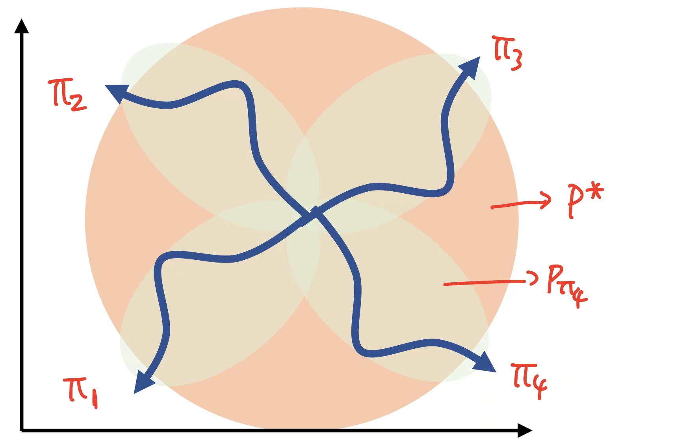
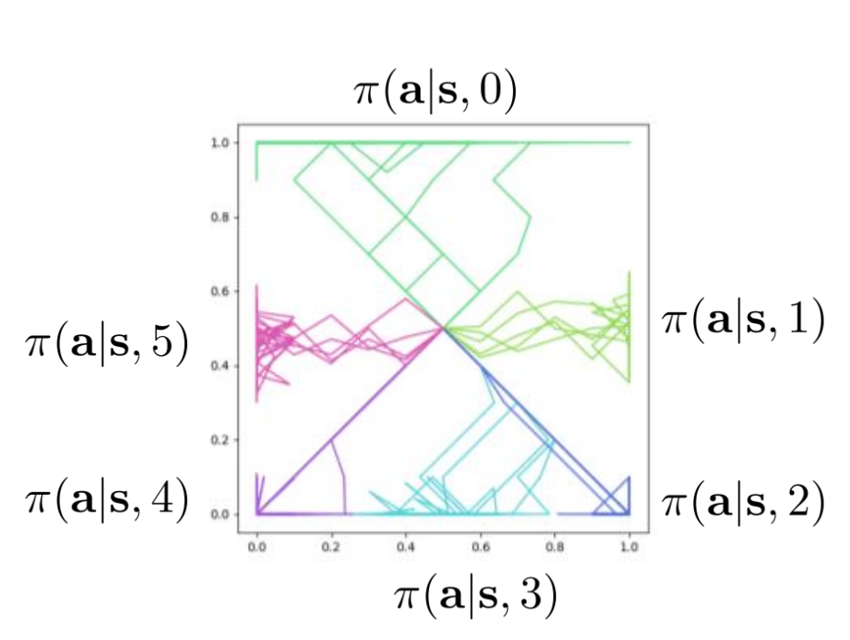
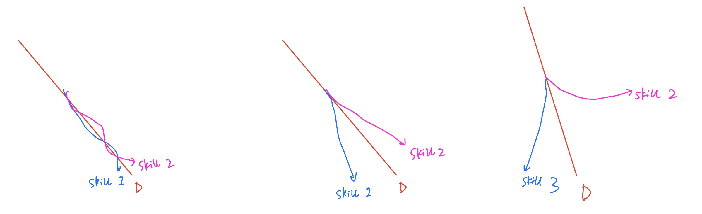

# Exploration without Rewards

如果总结前面一讲介绍的exploration方法，我们会发现，我们基本上是在原先的方法上面作出一个修正，依然目标是单一的，但只不过增加一些explore的成分。而现在，我们考虑一个新的视角：我们试着通过unsupervised的方法，在**不给任何reward**的情况下，让模型自己进行“探索”。

直观上，这是更容易成功的，因为在没有目标的情况下，探索是一个更加自然的行为。（想想刚会爬行的婴儿，在没有任何人向他提出任何要求的时候，也会自己探索周围的环境。）

一个具体的例子：假设我们把机器人扔到一个环境里，这一环境可能有很多东西，比如有一个可以拉开的柜门，有一个可以按下的按钮，等等。在训练的过程中，我们不给机器人任何reward，也不告诉它怎么做，只是让它自己去探索。但最后，我们给出一个对目标(goal state)的描述，然后机器人需要完成这一目标。

我们这一讲就来研究如何完成这一任务。

## Some Information Theory: Empowerment

Empowerment 被定义为
$$\mathcal{I}(s_{t+1};a_t)=\mathcal{H}(s_{t+1})-\mathcal{H}(s_{t+1}|a_t).$$
这个函数可以用来作为 exploration 的 objective。直观上理解，第一项凸显了 **diversity**: 在现在的策略下，$s_{t+1}$ 有足够多的可能性；而第二项则体现了 **authority**: 我们想要最小化 $\mathcal{H}(s_{t+1}|a_t)$，也就是说在给出操作 $a_t$ 时，$s_{t+1}$ 能被我们预知到。综合两项，我们得到了一个 objective，既能够促进探索的多样性，也能确保我们做出的操作能够更加 deterministic 地决定下一步，而不会做出无法预测结果的行为。

## Imagining Goals

怎样在没有reward的时候也完成训练呢？Imagining Goals 方法引入一个 VAE：对于观察到的 state $s$ 通过 encoder $q_\phi$ 到达 latent variable $z$ ，而 $z$ 通过 decoder $p_\theta$ 重建 state $s'$。这样，我们可以通过 $p(z)$ 随机取样一个新的任务 $z_g$，重建成为新的目标 $x_g$ 供 policy model $\pi(a|x,x_g)$ 训练。

在这样的构造下，大致流程如下：

> **Imagining Goals**

1. 在latent space随机采样作为目标： $z_g\sim p(z)$ ，然后通过decoder生成目标state： $x_g\sim p_\theta(x_g|z_g)$ ；
2. 按照现有的policy $\pi(a|x,x_g)$ 来收集rollout，得到最终的state $\bar{x}$ （最终理想上，我们希望 $\bar{x}=x_g$ ）；
3. 利用现在的数据训练 $\pi$；
4. 把 $\bar{x}$ 加入数据集来训练VAE。

但这一方法有一定的问题。具体来说，因为 VAE 的训练数据是历史上出现过的所有 state，所以从 latent space 中任意取出 $z$ ，训练出来的大概率也和见过的 state 差别不大。解决方案很简单：我们把当前已经探索过，但概率较小的 state 的权重放大。具体来说，对 VAE 的 reconstruction loss 中的 MLE loss 做出如下修改：

$$
\log p_\theta(\bar{x})\to p_\theta(\bar{x})^\alpha \cdot \log p_\theta(\bar{x})
$$

其中 $\alpha \in (-1,0)$（因为要放大较小 $p_\theta(x)$ 的贡献，所以 $\alpha<0$；但还需要维持概率的序关系，所以 $\alpha>-1$。当 $\alpha\to -1$ 时，数学上近似于任何点的均匀随机取样）。这一方法被称为 **skew-fit**。

事实上，可以证明，这样的更新会使得 $\mathcal{H}(p_\theta(x))$ 增加，所以最终会让 $p_\theta$ 趋于均匀分布。

> 你也可能会奇怪：我们生成这样的一个均匀分布有什么意义呢？这里必须注意到，这个均匀分布是在所有**valid state**上面的均匀分布！换句话说，如果state以一个图像的形式呈现，那么这个分布并不是对于每一个pixel的均匀分布，而是整体一切在该环境内有意义的图像的均匀分布。

### Objective?

我们能否给出这一流程等效的objective呢？我们刚才知道（虽然并没有在这里证明）训练VAE的过程相当于是最大化分布的熵

$$
\mathcal{H}_{g\in G}(p_{\text{VAE}}(g)).
$$

但与此同时我们也在训练一个 policy $\pi$，使得最终的结果 $\bar x$ 和真正目标 $g$ 尽可能接近。如果我们用 $\tilde{p}(g|\bar{x})$ 表示已知在我们的模型最后停在 $\bar{x}$ 的时候，实际目标是 $g$ 的概率，那么我们的模型就是让这一概率分布的熵尽量小（比如，在最理想情况下，看到 $\bar{x}$ 就可以立刻给出 $g$ 是什么）。将两项整合在一起，整体的目标可以形式上写成

$$
J=\mathcal{H}(\tilde{p}(g))-\mathcal{H}(\tilde{p}(g|\bar{x}))=\mathcal{I}(g;\bar x).
$$

这一形式实际上正是之前提到的**互信息**。这一思想十分关键，我们会看到之后的一些方法也可以写为对其它东西的互信息的形式。

> 互信息的形式有何种深意？我们可以发现，前一项的最大化说的恰是我们的模型要尽量多地探索；而后一项的最小化代表我们的模型“说到做到”，选取了准确的操作。这两者的平衡，正是我们在这一问题假设下所追求的。

### Mutual Information Property

在继续下面的内容之前，我们先来论证一个关于互信息的性质：

$$
\mathbb{E}_{y}\left[\mathcal{H}(p(x))-\mathcal{H}(p(x|y))\right]=\mathbb{E}_y[\text{KL}(p(x|y)||p(x))]
$$

这一性质的证明比较容易，关键在于理解它的思想：获得的信息越大对应着两个分布的差距越大。证明可以直接展开来完成

$$
\text{LHS}=\sum_{x,y}p(y)\left(-p(x)\log p(x)+p(x|y)\log p(x|y)\right)
$$

$$
=\sum_{x,y}p(x,y)\log \frac{p(x|y)}{p(x)}=\sum_{x,y}p(y)\cdot \text{KL}(p(x|y)||p(x))
$$

$$
=\mathbb{E}_y[\text{KL}(p(x|y)||p(x))]=\text{RHS}
$$

## State Marginal Matching (SMM)

另外一个新的方法是，我们考虑一个更加一般的问题。我们的目标是最后state marginal是某个给定的 $p^\star(s)$ ，也就是

$$
p_\pi(s)\approx p^\star(s)
$$

其中 $p_\pi(s)$ 代表按照当前的策略，在任何时候到达 $s$ 的概率。这样，只要把 $p^\star(s)$ 选取为均匀分布，就可以实现exploration；而如果稍微调整这一分布，就可以实现某种“定向”的exploration。

那么如何实现这样复杂的操作呢？直观上，我们可以类比上一讲提到的count-based exploration的方法，给每一个state一个bonus：

$$
\tilde{r}(s)=\log p^{\star}(s)-\log p_\pi(s),
$$

这样就有

$$
\mathbb{E}_{s\sim p_\pi(s)}[\tilde{r}(s)]=-\text{KL}(p_\pi(s)||p^\star(s)).
$$

因此，一个合适的训练可以使得 $p_\pi(s)$ 逼近 $p^\star(s)$ 。这一方法被称为“State Marginal Matching”。

此外，需要注意现在的假设中，训练时我们得不到reward，因此总的“人造reward” $\tilde{r}(s)$ 中没有原来的reward项。同时，注意 $p_\pi(s)$ 这一分布并非显然，一般需要用一个模型来拟合。考虑了这些后，我们可以得到一个训练流程：不断重复

1. 根据 $\tilde{r}(s)$ 来训练 $\pi$ ；
2. 根据 $\pi$ 获得的轨迹数据来update $p_\pi(s)$ 。

但这一方法有一个比较隐秘的问题。具体的细节很复杂，可以参考[这里](https://arxiv.org/abs/1906.05274)。但我们可以给出一个比较直观的解释。

如图，假设我们的 $p^\star$ 是橙色的均匀分布，一开始的时候， $p_{\pi_1}$ 和 $\pi_1$ 在左下角的区域， $p_{\pi_1}$ 近似了 $\pi_1$ 的state marginal（图中的绿色），而蓝色代表某一条具体的轨迹。这样，根据reward的选择，我们就会特别倾向于走向一些没有被绿色覆盖的部分，比如运动到图示 $\pi_2$ 的区域。然后，1,3,4这三个区域就又没有被覆盖，因此我们可能到达它们中的任何一个。这样，我们发现，我们的策略可能一直在乱跳，而不是完全地覆盖。

从另一个角度，第一步中训练 $\pi$ 的 $\tilde r$ 是和 $\pi$ 有关的，但它并没有和 $\pi$ 一起更新。也就是说，第一步的训练中，RL algorithm 并没有“意识到”自己的 objective 和自己有关！所以才会出现上面一段所说的 "tail-chasing" scenerio——对着一个固定的 $\tilde r_{\pi'}$ 训练 $\pi$，只会让 $\pi,\pi'$ 离的越来越远，而不会趋于平均。

解决这个问题也很简单，只需要对历史状态取平均即可：

> **State Marginal Matching**

1. 重复
    1. 根据 $\tilde{r}(s)$ 来训练 $\pi$ ；
    2. 根据**历史上所有的轨迹数据**来update $p_\pi(s)$ 。
2. **不返回最后的 $\pi$ ，而是返回历史上所有 $\pi$ 的平均**。

在Game theory上证明了（**Nash 均衡**理论），这样可以保证这一方法收敛，并且到达state marginal matching的目标。实验上，这一方法确实可以在target state distribution均匀的时候做到非常均匀的explore。

最后，我们来讨论一下SMM的数学上的含义。还记得它的objective是KL divergence的最小化。因此，对于我们希望模型均匀explore的情况，我们的objective就变成了熵：

$$
\mathcal{H}(p_\pi(g))
$$

其中 $g$ 还是代表任何一个goal state。可以看到，这和之前Imagining Goals的思想还是类似的，我们还是限定一个所有可能的goal的集合，然后让模型的最终行为可以均匀地到达这一集合中的任何一个goal。

## Theoretical Consideration: why maximize entropy?

一个有意思的问题是，为什么我们前面给出的两种方法，都最后落实到了最大化熵上？实际上，我们即将指出，最大化熵是理论上最好的方案。

我们想像这样一种情景：回到开始的例子，机器人被放入一个环境中，里面有很多技能可能需要练习。在训练的过程中，机器人并不知道最后的目标，也得不到任何reward。但最后，测试的时候我们选取**机器人表现最差的任务**进行测试。在这样的情况下，机器人最理想的训练过程中goal的分布 $p(g)$ （ $g\in G$ ）是什么呢？

当然是 uniform distribution！在不知道 test task 的时候，探索所有的可能性是我们能做的最优的事！这就等价于最大化 entropy。

# Exploration by Skills

除了让我们的模型探索不同goal之外，我们还可以让模型探索不同的skills。直观上，一个skill给出的是一系列action，完成一个小的步骤，因此，**skill的学习往往可以比goal的学习更具有普适性**。举个例子：假设现在要求机器人到达门口，但不碰到房间里的某个区域（比如那个区域有一个坑）。如果使用goal学习的方式，机器人就只知道goal state是门口，而不知道怎么避开坑。但使用skill学习的方式，我们可以先学习一个skill，让机器人避开坑，然后再学习一个skill，让机器人走到门口。

具体地，不同的skill一般对应着state space中不同的区域，而它们最好能覆盖整个state space，如上面的图所示。如何实现这一点呢？我们选取我们的policy为 $\pi(a|s,z)$ ，其中 $z$ 代表某个skill。我们的目标则是最大化

$$
J=\sum_z \mathbb{E}_{s\sim \pi(s|z)}[\log p_D(z|s)]
$$

其中 $p_D$ 代表某种discrimitive model，它也在训练，理想状况下它应该可以通过state就确定下来在哪一个skill上，因为我们提到不同的skill对应的是state space的不同区域。换句话说，上面的目标就是让我们的policy对于每一个skill都作出不同的action，到达不同的state。

训练过程中，discrimitive model和policy都在训练；但和GAN不同，这里的两个模型并非对抗，而是相互辅助。就像下面的图那样，开始D可能只是随机画出一条分界线，但policy就会随着学会，最后自然分开不同skill对应的action。

实验上，这一方法得到的效果非常好玩：比如，在Cheetah环境中，有的skill使得机器人向前跑，有的使得机器人向后跑，有的使得机器人跳跃，等等。

可以[证明](https://arxiv.org/abs/1802.06070)，上面的目标实际上在最大化互信息

$$
I=\mathcal{H}(p(z))-\mathcal{H}(p(z|s))=\mathcal{I}(z;s).
$$

### Takeaway

总结下来，通过最大化 **outcome**（$s$）和 **task**（可以是目标状态 $g$，或者是 skill $z$）的**互信息**，我们能够让模型做到很好的 exploration。

在不知道会给出怎样测试任务的时候，尽可能到达更多的 state 是个好选择；并且，如果假设在 test 的时候会测试表现最差的 task，最大化 outcome 的熵是最优的选择。

# Reference Papers

1. [Visual Reinforcement Learning with Imagined Goals](https://arxiv.org/abs/1807.04742)（介绍Imagining Goals）
2. [Skew-Fit: State-Covering Self-Supervised Reinforcement Learning](https://arxiv.org/abs/1906.05274)（介绍Skew-Fit）
3. [Efficient Exploration via State Marginal Matching](https://arxiv.org/abs/1806.04640)（介绍SMM）
4. [Provably Efficient Maximum Entropy Exploration](https://arxiv.org/abs/1812.02690)（variant of SMM）
5. [Diversity is All You Need](https://arxiv.org/abs/1802.06070)（介绍Skills-conditioned）