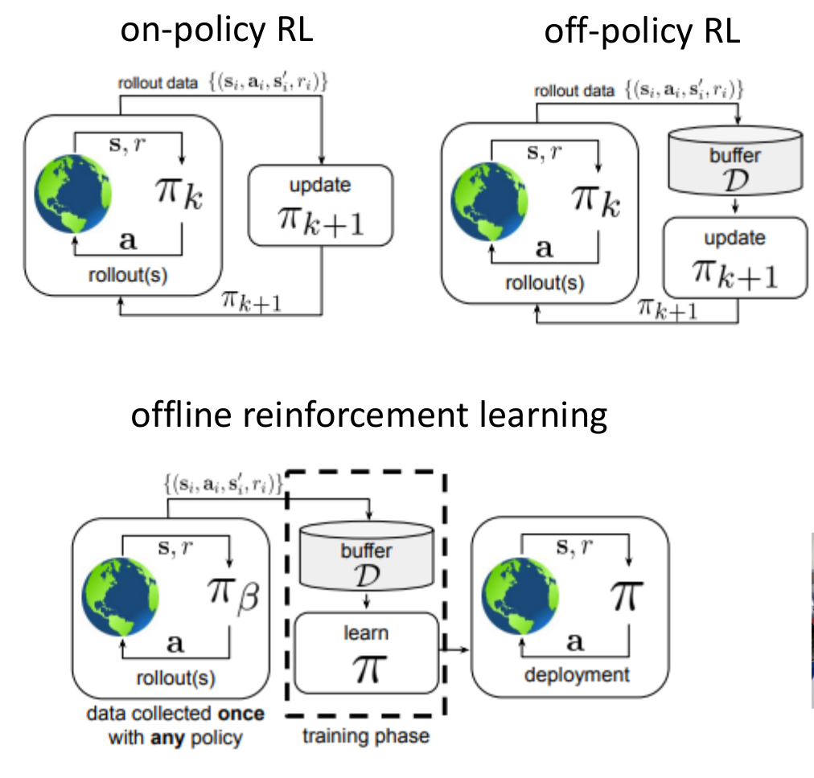

# Offline Reinforcement Learning 

实验上，人们会注意到一个问题：RL的方法相比于DL而言，generalize的能力还是较差。比如，DL的图片模型在训练后可以在测试集的完全未知的图片上也有很好的效果，但RL的模型基本上集中在一个具体的环境，也就是说只能在这一环境上有效。那么，假设我们希望某个模型（比如说）可以做多种家务，应该怎么办呢？

一个自然的想法就是，我们增加数据集的大小。但问题在于，前面给出的RL算法中数据集是由agent和环境交互产生的，如果这个数量过大，和环境交互的代价就会很大。回想在DL的时候，比如有人收集好了一个数据集，所有人都可以用；但RL中，每个人都要重新和环境交互。

正是为此，**Offline RL**（也叫做batch RL或者fully off-policy RL）被引入：它的目标是，只要一个人用某种sample policy $\pi_\beta$ 收集好了一个数据集，之后所有人都可以用这个数据集来训练自己的模型。如图所示。

同时，必须注意，这里的$\pi_\beta$ **并非**前面我们在imitation learning中说的expert policy，而可以是任意的policy。

> 举一个例子，对于开车的问题，数据集可能是若干数据的混合：比如让一个高手开车采集出几条轨迹，再让普通人采集一些轨迹，甚至还可能让一些不太会开车的人采集一些轨迹。但是Offline RL需要做的是，不管数据整体多么拉，我们都可以学到这个数据集中最好的policy。

Offline RL有什么用？除了前面说到的，可以共用数据之外，在某些特殊领域其也有重要作用。比如，让agent为病人推荐药物来治疗，这样的问题显然不能让agent在真实环境中随便尝试。此时，我们就可以希望Offline RL能利用历史上的数据，做出一个不错的决策。此外，Offline RL还可以用作initialization：实验上发现在Offline RL的训练基础上稍微用online RL进行一下finetune，效果就会特别好。

## Common Mistakes

一些常见的错误：

1. Q: Offline RL和Imitation Learning是一样的？
    - A：不是。比如上面的例子，Imitation Learning在理想的情况下学会的是人们平均的开车能力，而我们应该期待好的Offline RL学到更好的开车能力。

2. Q: Offline RL是不是相当于提取出数据集中价值大的部分，然后做Imitation Learning？
    - A：不完全正确。我们确实希望，Offline RL可以“取其精华”，但是这个过程并不是简单的提取。

        一个著名的用Offline RL完成的实验是：在一个环境里有一个抽屉，里面有一个物体，agent需要打开抽屉，拿出物体。训练数据里面虽然有打开抽屉的轨迹和拿出物体的轨迹，但不存在任何一个完整的，既包含打开抽屉又包含拿出物体的轨迹。但是，Offline RL可以学会把这两部分的数据结合起来，完成这个完整的动作。

        这一现象也叫做“**Stitching**”，是好的Offline RL算法的一个重要特点。
    
3. Q: 听你说的这么动人，那Offline Learning是不是在给任意的数据集的情况下都可以学到很好的policy？
    - A：不是。Offline RL的实际目的并不可能是学习**optimal policy**，而只能是**在给定数据集的基础上尽可能学习达到最好的效果**。很容易想像，如果数据集特别烂，那神仙来了也没有办法，更别提optimal policy了。但实际上对于正常的数据集，我们都希望Offline RL可以学到很好的policy。

## Important Issue: Distribution Shift

在了解了Offline RL的概念后，你可能立刻想到，我们为什么不能简单地直接用一个off policy的算法（比如Q learning）完成这一任务呢？原则上，完全没有任何问题。但实践上，这完全失败。其原因是不易察觉的。

实验上发现一个现象：在失败的Offline RL中有着惊人的over-confidence：比如在Q-learning中，算法可能计算出来的Q value是$10^{20}$量级，但实际上的return只有-100。这并不是巧合，而是有深意的。

为了阐述这一问题，还是考虑驾车的例子：我们的数据集里面全部是人开车的数据。即使有水平比较差的人，他们至少也不会作出疯狂的事情。比如，在笔直的公路上，没有人会突然90度转弯。

但是在Q-learning中，我们的模型并不知道这一点。它在公路上时，有可能sample到一个90度转弯的动作。但是，这个动作在数据集中是不存在的，甚至和数据集任何数据都没有相似之处，所以模型对其的估计可以任意离谱。这很有可能导致模型相信，在直路上转弯具有很大的Q value。

那为什么这一问题在online的方法中没问题？因为，我们在online方法中（即便是off policy），总是有和环境的交互。这样，我们可以在模型对某个动作的估计过于离谱时，及时纠正。而在Offline RL中，我们没有这个机会。

像前面说的90度转弯，就叫做 **out-of-distribution(OOD)** 的action。许多这样的action在一起就很可能导致模型的失败。什么时候会有很多这样的action？就是当我们测试的分布和训练的分布不一样（或者差距很大）的时候。这就叫做**distribution shift**。

此外，注意必须区分out-of-distribution和out-of-sample的区别。out-of-distribution是离谱得离谱的action，而out-of-sample的action不一定很离谱，只是没有被采样到。比如，在路口，Q-learning的采样可能只采样了右转10度和20度的两组数据，此时右转30度就是out-of-sample的action；而在此突然熄火，就是out-of-distribution的action。

### Reason of Over-Confidence

前面，我们只是指出了这一问题，但为什么模型会过度自信？我们来研究一下。

在经典的DL中，有一种方法叫做**advarsial attack**：比如，对于图片分类的模型，我们可以对图片梯度下降，只增加一个小小的扰动，在人看不出来图片任何变化的情况下改变模型的分类结果。这实际上并不是模型的锅，因为我们的训练目标本身就是

$$
L=\mathbb{E}_{x\sim D}\left[(f(x)-y)^2\right]
$$

因此，模型好说的是平均好，**而非每个都很好，更不是对任意$x\sim R^n$都好**。因此，只要有意地搞一个$x$，很容易“攻破”这一模型。更进一步地，我们甚至不需要使用梯度的方法，只要我们选取一个极端的数值，比如

$$
x_0=\arg\max f(x)
$$

那么$(f(x_0)-y)^2$就很可能比较大，因为神经网络的各种峰值很可能是自己fit过去的，很难准确。

但你会问，现在没有人来攻击我们的模型啊？实际上，是Q-learning的算法在攻击自己。具体地，我们的目标是

$$
L=\mathbb{E}_{s,a\sim \pi_\beta(s,a)}\left[\left(Q(s,a)-\left(r(s,a)+\gamma \mathbb{E}_{a'\sim \pi(a'|s')}[Q(s',a')]\right)\right)^2\right]
$$

可以料想，如果$\pi_\beta\approx \pi$，那么就相当于之前说的，在一个分布上训练，并在同样的分布上选取测试数据（在这里，“测试数据”实际上指的是下一轮Q backup的target，因此$\pi_\beta$相当于“训练集”，$\pi$相当于“测试集”）。也就是说，对于$\pi_\beta\approx \pi$的情况，或者之前虽然off-policy但仍然online的情况，问题都不大。

但是现在$\pi_\beta$固定不动，而$\pi$的选取恰恰是

$$
\pi = \arg\max_{\pi}\mathbb{E}_{a'\sim \pi(a'|s')}[Q(s',a')]
$$

这就好比是前面说的argmax攻击，会导致我们的模型不准确，或者几乎肯定比真值大很多！因此，几轮迭代下，Q value就会越来越大。

> Q：等等，你别蒙我，这不就是之前Q learning中也遇到的问题吗？我们不是可以用double Q learning解决吗？
>
> A: 不。这和前面online Q learning遇到的问题虽然相似，但原理上并不相同。原来的那个问题只是针对argmax本身；而现在的问题相当于在原来argmax问题的基础上进一步加剧。
>
> 原来的偏大对应着是正常训练一个神经网络（在同样的分布上面训练和测试），神经网络不可避免存在误差，而argmax定向地放大了这个误差；而现在的偏大对应着是在一个分布上训练，在另一个分布上测试，神经网络的误差就会比之前大得多，argmax之后的误差也就会比之前大得多。
>
> 因此，现在虽然使用double Q learning可以缓解这一问题，但并不能完全解决根本性的，由于两个分布不一致所造成的误差。为了解决这两个分布不同的distribution shift问题，我们必须使用一些新的方法。

# Importance Sampling in Offline RL

一个试图解决distribution shift的方法是使用importance sampling。我们简要介绍一下这一方法，它解决了一些问题，但也有不足。比如，我们就采用policy gradients。

回忆在[off-policy policy gradients](./5-policy_grad.md#off-policy-policy-gradients)中，我们给出的importance sampling的公式：

$$
\nabla_\theta J(\theta)=\mathbb{E}_{\tau\sim p_{\pi_{\beta}}(\tau)}\left[\prod_{t=1}^T\frac{{\pi_\theta}(a_t|s_t)}{{\pi_{\beta}}(a_t|s_t)}
\left(\sum_{t=1}^T \nabla_{\theta}\log \pi_\theta(a_t|s_t)\cdot \hat{Q}_t(\tau)\right)\right]
$$

和之前一样，我们也希望使用first-order approximation，以避免连乘积带来的梯度爆炸或消失的问题。在数学上可以做严格的恒等变形，给出

$$
\nabla_\theta J(\theta)=\sum_{t=1}^T\mathbb{E}_{\tau \sim p_{\beta}(\tau)}\left[\nabla_{\theta}\log \pi_\theta(a_t|s_t)\cdot \prod_{t''=1}^{t-1}\frac{{\pi_\theta}(a_{t''}|s_{t''})}{{\pi_{\beta}}(a_{t''}|s_{t''})}\sum_{t'=t}^T\left(\gamma^{t'-t} r(s_{t'},a_{t'})\prod_{t''=t}^{t'}\frac{{\pi_\theta}(a_{t''}|s_{t''})}{{\pi_{\beta}}(a_{t''}|s_{t''})}\right)\right]
$$

注意两个importance sampling的因子：第一个

$$
\prod_{t''=1}^{t-1}\frac{{\pi_\theta}(a_{t''}|s_{t''})}{{\pi_{\beta}}(a_{t''}|s_{t''})}
$$

代表按照$\pi_\theta$，在$t-1$步走到$s_t$的概率$p_{\pi_\theta}(s_t)$和按照$\pi_\beta$，在$t-1$步走到$s_t$的概率$p_{\pi_\beta}(s_t)$的不同造成的修正。而第二个

$$
\prod_{t''=t}^{t'}\frac{{\pi_\theta}(a_{t''}|s_{t''})}{{\pi_{\beta}}(a_{t''}|s_{t''})}
$$

代表后面的$\hat{Q}$表达式中，因为$\pi_\theta$和$\pi_\beta$不同而造成的修正。

相比于第一个因子，第二个因子对梯度爆炸的问题贡献还算小，因为只要$\gamma$略小，就可以避免梯度的爆炸。但是第一个因子就没办法了。回想一下，原来的时候，我们宣称第一个因子可以扔掉：但这是因为当时对于off-policy方法，$p_{\pi_\theta}$和$p_{\pi_\beta}$虽然不同但也比较接近。而现在，没有任何道理二者是接近的，因为$\pi_\beta$是采集数据的那个人随便选的。

因此，**在offline的场景中，我们不再能去除连乘积的影响**。实际上，理论上证明，要避免这个连乘积必须使用value-based method。

但即使有连乘积，我们也可以通过某些办法来避免之前所说的梯度爆炸问题。下面就介绍两种这样的方法。

为了简单起见，我们只考虑 **OPE(Offline Policy Evaluation)** 问题，也就是给定一个policy $\pi$，Offline地（即只利用用$\pi_\beta$采样出的数据）给出

$$
V^{\pi}(s_0)=\mathbb{E}_{\tau\sim p_{\pi}(\tau|s_0)}\left[\sum_{t=0}^{T}\gamma^t r(s_t,a_t)\right]
$$

## Doubly Robust Estimator

Doubly Robust Estimator 是一个统计学中的概念，大概是指给出一个估计，其中包含两个拟合的函数（比如神经网络）。一旦其中一个拟合的函数不准确，另一个拟合的函数可以弥补这一错误。

在进入统计的概念之前，我们首先推导一个递推的关系。对于一条轨迹，从单采样的角度来看，

$$
V^{\pi}(s_0)=\sum_{t=0}^{T}\gamma^t  r(s_t,a_t)\cdot \prod_{t'=0}^t\frac{\pi(a_{t'}|s_{t'})}{\pi_\beta(a_{t'}|s_{t'})}
$$

然后，如果令数列

$$
\bar{V}^{T-t}=\frac{\pi(a_t|s_t)}{\pi_\beta(a_t|s_t)}(r(s_t,a_t)+\gamma \bar{V}^{T-t-1})
$$

且$\bar{V}^{-1}=0$，那么就有$V^{\pi}(s_0)=\bar{V}^{T}$。

Doubly Robust Estimator则是从递推出发，给出一个近似的方式：

$$
\bar{V}^{T-t}=\hat{V}(s_t)+\frac{\pi(a_t|s_t)}{\pi_\beta(a_t|s_t)}(r(s_t,a_t)+\gamma \bar{V}^{T-t-1}-\hat{Q}(s_t,a_t))
$$

其中$\hat{V}(s_t)$和$\hat{Q}(s_t,a_t)$就是用来近似的函数。这个公式的意义在于，如果$r(s_t,a_t)+\gamma \bar{V}^{T-t-1}-\hat{Q}(s_t,a_t)$就是0，那么后面的连乘积贡献会非常小；而即使后面不是0,也部分地缓解了连乘积的问题。Doubly Robust的帮助是使得这一递推表达尽量接近于原来严格的公式。

当然，具体的细节也会比较复杂，可以参考[这里](https://arxiv.org/abs/1511.03722)。

## Marginalized Importance Sampling

这一思想更加直接：我们考虑一个全部（加权）marginalize掉的分布$p_{\pi}(s,a)$和$p_{\pi_\beta}(s,a)$，也就是

$$
p_{\pi}(s,a)=(1-\gamma)\sum_{t=0}^T\gamma^t p_{\pi}(s_t=s,a_t=a)
$$

这样，我们就可以近似地有

$$
V^{\pi}(s_0)=\mathbb{E}_{s,a\sim p_{\pi_\beta}(s,a)}\left[\frac{p_{\pi}(a|s)}{p_{\pi_\beta}(a|s)}r(s,a)\right]
$$

接下来，我们可以给出一个关于$w(s,a):=\frac{p_{\pi}(a|s)}{p_{\pi_\beta}(a|s)}$的递推式：首先，考虑最后一步，得到

$$
p_{\pi}(s,a)=(1-\gamma)p_0(s)\pi(a|s)+\gamma\sum_{s',a'}p(s|s',a')\pi(a|s)p_{\pi}(s',a')
$$

这样，我们就自然有

$$
w(s,a)p_{\pi_\beta}(s,a)=(1-\gamma)p_0(s)\pi(a|s)+\gamma\sum_{s',a'}p(s|s',a')\pi(a|s)w(s',a')p_{\pi_\beta}(s',a')
$$

实验上，我们可以把左边和右边放入某个divergence，然后采样估计（参见[原论文](https://arxiv.org/abs/2002.09072)），并梯度下降给出最好的$w$。有了$w$，我们就可以立刻估计出$V^{\pi}(s_0)$，从而在Offline的情况下完成policy evaluation。

# Offline RL: Old Methods

我们在这一节介绍一些早期的Offline RL方法，它们虽然在实际中不太常用，但是对于理解Offline RL的概念还是很有帮助的。在这些早期方法中，没有神经网络，一切都是通过**线性回归**的方式进行近似。

值得一提地，在以线性回归为基础的Offline RL研究中，distribution shift问题并不是很突出。但这种方法也注定无法应用到如今的复杂环境中，而且更是没有解决distribution shift的问题。

## Linear Model

我们把总共的 $|S|\times |A|$ 个(state,action) pair通过某种专家知识encode到一个$K$维向量中。这个固定的$(|S|\cdot|A|)\times K$矩阵称为feature matrix，记为$\Phi$。然后，我们以后不再研究每个state或action本身，只研究这个向量。我们需要：

- **reward model**：给定一个$K$维向量，用一个线性函数(对应的矩阵为$w_r$)输出reward。这一过程希望 $\text{OneHot}(s,a)\Phi w_r\approx r(s,a)$。
- **transition model**：给定一个$K$维向量，用一个线性函数(对应的矩阵为$P_\phi$)输出下一个state的向量。假设在(state,action)对上面的transition是$P^\pi$（注意，这和policy有关），那么我们希望 $\text{OneHot}(s,a)\Phi P_\phi\approx  \text{OneHot}(s,a) P^\pi\Phi$，也就是$\Phi P_{\phi}=P^{\pi}\Phi$。
- **(Q) value model**：给定一个$K$维向量，(对应的矩阵为$w_V$)输出value function。注意因为我们一开始不知道value function，所以这一过程并不是简单的线性回归，而是需要求解递推。这一过程希望 $\text{OneHot}(s,a)\Phi w_q\approx Q^\pi(s,a)$。

有了它们，我门就可以做OPE(Offline Policy Evaluation)了。具体地，我们先给出矩阵形式的递推：

$$
Q^{\pi}=r+\gamma P^{\pi}Q^{\pi}
$$

其中，$r$代表把每一个$(s,a)$的reward拼起来的列向量。虽然我们可以解出

$$
Q^{\pi}=(1-\gamma P^{\pi})^{-1}r
$$

但这样的形式对应的计算量比较大，因此我们希望使用feature space将其压缩到比较小的维度。也就是

$$
\Phi w_q\approx \Phi w_r+\gamma \Phi P_{\phi} w_q
$$

此时，我们就近似地有

$$
w_q\approx (1-\gamma P_{\phi})^{-1}w_r
$$

再利用线性回归的最优解

$$
P_{\phi}=(\Phi^T\Phi)^{-1}\Phi^T P^{\pi}\Phi,\quad w_r=(\Phi^T\Phi)^{-1}\Phi^T r
$$

代入，消去引入的中间变量$P_{\phi}$和$w_r$，就有

$$
w_q\approx (1-\gamma (\Phi^T\Phi)^{-1}\Phi^T P^{\pi}\Phi)^{-1}(\Phi^T\Phi)^{-1}\Phi^T r=(\Phi^T\Phi-\gamma \Phi^T P^{\pi}\Phi)^{-1}\Phi^T r
$$

这一表达式称为Q function的**least-square temporal difference (LSTD)**。Temporal Distance (TD)指的就是bellman equation的误差项，而least-square就是指我们使用了线性回归的方法。利用这一表达式，我们就可以根据transition和reward的数据（这由环境提供）来估计q value function，从而实现policy的offline evaluation。

当然，如果我们不把action embedd进入feature matrix，那么也可以得到正统的LSTD，也就是估计value function。这一方法相比于上面我们介绍的基于Q function的方法有许多缺陷，我们就不详细展开了。之后我们只考虑这种基于Q function的方法。

## Case of Infinite State-Action Space

我们上面的方法基于把一切的(state,action) pair通过一个feature matrix映射到一个有限维的向量空间中。如果我们的state和action是连续的，那么这一方法就不再适用。但稍微做一修改即可：我们的$\Phi$不再是对于每一个可能的(state,action)给出一个向量，而是对**数据集中的**(state,action)给出向量。

接下来，对于别的方面，我们只需要再做一些很小的修改即可。不妨假设我们只需要对数据集内部的$s$（或者$(s,a)$）计算value（对于数据集外部的$s$，我们确实无法保证任何东西），那么我们就还可以使用前面得到的

$$
w_q=(\Phi^T\Phi-\gamma \Phi^T P^{\pi}\Phi)^{-1}\Phi^T r
$$

进行计算。但略需要注意的是，我们并不能得到真正的transition matrix $P^{\pi}$，而只能得到在数据集中的transition matrix。不过这也容易解决，注意到

$$
(P^{\pi}\Phi)(s,a)=\sum_{s',a'}P^{\pi}(s',a'|s,a)\cdot \Phi(s',a')\approx \mathbb{E}_{s',a'\sim P^{\pi}(\cdot|s,a)}[ \Phi(s',a')]
$$

因此，我们可以通过单采样来估计这一表达式，也就是说，对于数据集的一组$(s,a,s')$，可以近似地有

$$
(P^{\pi}\Phi)(s,a)\approx \Phi(s',a')
$$

其中，$a'$应该从policy $\pi$中采样。这样我们就可以完全按照$w_q$的表达式进行计算，唯一的误差来自于采样。

> 这里可能的一个误解：$\Phi$不是一个“字典”，记录大量(state,action)对应的feature；而是说，$\Phi(s,a)$对于任意的$(s,a)$都是可以直接计算的，因为feature是专家知识或者一个pretrain好的神经网络给出的。只不过，在推导中，为了避免$\Phi$是无穷维这一困难，我们只取数据集中的feature作为$\Phi$。
>
> 因此，虽然从$\pi$中采样得到的$a'$不一定使得$(s',a')$落入offline training的数据集中，但我们依然可以计算$\Phi(s',a')$。

更进一步地，我们既然可以完成policy的评估，我们也就很容易进行offline policy improvement。这样的方法称为LSPI(Least Square Policy Iteration)。其方法为：

> **LSPI Algorithm**

重复：

1. 利用当前的policy和固定不动的数据集计算 $w_q=(\Phi^T\Phi-\gamma \Phi^T \Phi')^{-1}\Phi^T r$，其中$\Phi'$的构造方式是：如果$\Phi$的某一行对应着$(s,a)$的feature，那么$\Phi'$的那一行就对应着$(s',a')$的feature。（每次第二步更换$\pi$之后，都要重新计算一次$\Phi'$。）
2. 利用$w_q$，更新：$\pi(s)\leftarrow \arg\max_a [\Phi(s,a)w_Q]$

这就介绍完了早期的Offline RL方法。当然，还是如前面所说，它们无法从根本上解决distribution shift的问题。如何解决这一问题，我们将在下一节讨论。