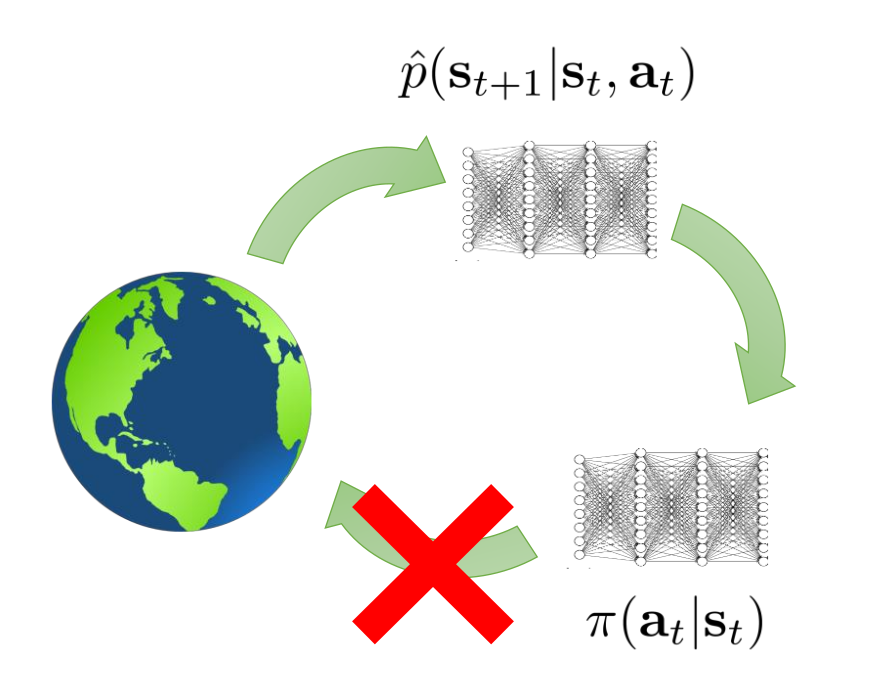

# Offline Reinforcement Learning 2: Addressing Distribution Shift

就如我们之前所说，distribution shift的问题是offline RL中最大的挑战之一。之前给出的方法都不够吊打，而本讲介绍的方法都是比较前沿的，在这方面做的很好的一批算法。

## Introduction: Starting from a Naive Method

我们先从最简单的思路出发。还记得，我们的问题是在update过程

$$
L_Q=\mathbb{E}_{s,a,s'\sim \pi_{\beta}}\left[(Q(s,a)-(r(s,a)+\gamma \mathbb{E}_{a'\sim \pi(\cdot|s')}[Q(s',a')]))^2\right]
$$

$$
\pi\leftarrow \arg\max_{\pi}\mathbb{E}_{s\sim \pi_\beta}\left[\mathbb{E}_{a\sim \pi(\cdot|s)}[Q(s,a)]\right]
$$

中，因为$\pi$和$\pi_\beta$相差过大，所以很难保证$Q$值的准确性。一个直接的想法便是，我们不如规定$\pi$和$\pi_\beta$不能差太远？比如，令

$$
\text{KL}(\pi||\pi_\beta)\le \epsilon
$$

然后在这一约束下做前面的优化。

抛开实现方法不谈，人们也要埋怨这一方法不够好：
- 一方面，这一方法太保守，以至于很难学到比较好的$\pi$。比如说，$\pi_\beta$本身比较差，那么$\pi$就算再好也被约束所限制了上界。
- 另一方面，这一方法的保守程度还不够。扪心自问，KL divergence小，一定代表着估计准确吗？就如同再精确的模型在训练集上也有错误，即使我们把两个分布做到KL divergence为0，也仍然会有错误的Q value的存在。而这样的错误就像滚雪球，使得Q value越来越大。

因此，我们发现，KL divergence并不是我们想要的刻画这两个分布距离的方式。相反，我们希望的实际上是所谓**support constraint**：

$$
\pi(a|s)> 0 \text{ only when } \pi_\beta(a|s)\ge \epsilon
$$

这一约束明显地更加合理，因为它反映了我们的真实需要——我们不希望policy通过做那些数据里面没有的action来exploit $Q$网络的漏洞。

总而言之，对于约束而言，KL divergence不够合理，而support constraint虽然合理但更像一种理论上的结构，很难被实现。对于真实的方法，我们需要在这两者之间取得平衡。

## First Trial: Using KL Divergence

我们先介绍使用KL divergence的方法。我们只需要更改一下policy的update rule：

$$
\pi\leftarrow \arg\max_{\pi}\left(\mathbb{E}_{s\sim \pi_\beta}\left[\mathbb{E}_{a\sim \pi(\cdot|s)}[Q(s,a)]\right]-\lambda \mathbb{E}_{s\sim \pi_\beta}\left[\sum_a \pi(a|s)\log \frac{\pi(a|s)}{\pi_\beta(a|s)}\right]\right)
$$

也就是

$$
\pi\leftarrow \arg\max_{\pi}\left(\mathbb{E}_{s\sim \pi_\beta}\left[\mathbb{E}_{a\sim \pi(\cdot|s)}[Q(s,a)+\lambda \log \pi_\beta(a|s)]+\lambda \mathcal{H}(\pi(\cdot|s))\right]\right)
$$

一种方法是直接对这一目标进行优化。但我们实际上还可以再进一步，求导给出理论最优的$\pi^\star$（虽然由于神经网络表现力问题，这一$\pi^\star$不一定可以被实现）：

$$
Q(s,a)-\lambda (\log \pi^\star(a|s)+1-\log \pi_\beta(a|s))-\mu=0
$$

（$\mu$为一常数）也就是说

$$
\pi^\star(a|s)=\frac{1}{Z(s)}\pi_\beta(a|s)\exp\left(\frac{A(s,a)}{\lambda}\right)
$$

其中，$A(s,a)$可以是$Q(s,a)$减去任何一个不依赖action的值。因此，我们可以修改训练目标，这一新的训练目标的最优值仍为$\pi^{\star}$：

$$
L_{\text{AWAC}}(\theta)=\mathbb{E}_{s,a\sim \pi_\beta}\left[(\log \pi_\theta(s|a))\cdot\exp\left(\frac{A(s,a)}{\lambda}\right)\right]
$$

这一方法长得很像actor critic，但加了权，因此被称为**AWAC(Advantage-Weighted Actor-Critic)**，其中的$\lambda$被称为**temperature**。$\lambda$作为拉格朗日乘子，可以控制$\pi$和$\pi_\beta$的距离：当$\lambda$趋于无穷，就变成了MLE training，$\pi$会趋向于$\pi_\beta$；当$\lambda$趋于0，就变成了policy gradient training，$\pi$会趋向于argmax policy。

实验上，可以证明，这样的objective相比于原来的objective表现更好。（它们在理论上是等价的，但实际上因为神经网络表现力有限，就有了优劣之分。）

我们来总结一下AWAC算法的过程：

> **AWAC Algorithm**

重复：

1. 使用 $L_{\text{AWAC}}(\theta)=\mathbb{E}_{s,a\sim \pi_\beta}\left[(\log \pi_\theta(s|a))\cdot\exp\left(\frac{A_{\phi}(s,a)}{\lambda}\right)\right]$ 来训练$\theta$；
2. 使用 $L_Q(\phi)=\mathbb{E}_{s,a,s'\sim \pi_{\beta}}\left[(Q_\phi(s,a)-(r(s,a)+\gamma \mathbb{E}_{a'\sim \pi_\theta(\cdot|s')}[Q_\phi(s',a')]))^2\right]$ 来训练$\phi$。

## Improvement

我们还可以改进AWAC算法。第一步是核心步骤，比较好地限制住了$\pi$和$\pi_\beta$的距离，因此没什么可以改变的；但第二步略有缺陷：我们训练$Q$的目的是提升我们的policy，但训练数据集一直在$\pi_\beta$上面，这可能导致$Q$“抓不住重点”。

比如，设想我们在训练开车，有一个很难转的弯，大部分人都转两次才能转过去；但数据集里也有几个专家，他们一次就转过去了。假设转两次的reward较低，而转一次的reward较高。那么，想一想：我们的policy是否能学会转一次？

> 实际上是很困难的，因为我们的数据集里有很多转两次的例子，所以$Q$网络最赚的方式是拟合这些数据拟合的比较好，因此其不见得能意识到转一次的reward高很多。这样，我们的policy从Q网络中学习时，也不见得能学到转一次的action。

因此，我们需要改进$Q$网络的训练方式。我们需要想办法**对于每一个state，找到专家的action**。为此，与其在update中取期待值（对应着某种平均），我们不如取一个统计学中的**expectile**：

$$
\text{Expectile}_{\tau}[p(x)]=\arg\min_{y}[\text{ExpectileLoss}_{\tau,p(x)}(y)]
$$

$$
\text{ExpectileLoss}_{\tau,p(x)}(y)=\mathbb{E}_{x\sim p(x)}[(x-y)^2\cdot l^{\tau}(x-y)]
$$

其中函数$l^{\tau}$定义为：

$$
l^{\tau}(z)=\begin{cases}\tau,&z> 0\\ 1-\tau,&z\le 0\end{cases}
$$

这样，当$\tau\to 1$的时候，我们就相当于取了一个最大值；而通过调整$\tau$，我们可以保证$y$是分布$p(x)$中的较大值，但又不out of distribution。

为了把expectile加入我们的训练过程，我们可以引入value function。这样，对$V$的训练是：

$$
L_V(\psi)=\mathbb{E}_{s\sim \pi_\beta}\left[\text{ExpectileLoss}_{\tau,Q_\phi(s,a)(a\sim \pi_\beta)}(V_\psi(s))\right]
$$

这里$Q_\phi(s,a)(a\sim \pi_\beta)$指的是，$a\sim \pi_\beta(a|s)$的时候，$Q_\phi(s,a)$的分布。注意这里expectile loss没有用$\pi$，因为我们希望从数据集中找到专家的action。对$Q$的训练则是常规的：

$$
L_Q(\phi)=\mathbb{E}_{s,a,s'\sim \pi_\beta}\left[(Q_\phi(s,a)-(r(s,a)+\gamma V_\psi(s')))^2\right]
$$

可以看到，这一过程中，没有明确地出现policy——这是因为这一方法通过expectile来改进策略，而非通过之前基于policy的方法。正是因为如此，这一方法被称为**IQL(Implicit Q-Learning)**。

> 当然，如果硬是要说，IQL“等效地”也有一个policy，使得$\mathbb{E}_{a'\sim \pi(s')}[Q_{\psi}(s',a')]=V_{\psi}(s')$，也就是这个policy作出的效果和expectile一致。
>
> 这也说明了为何IQL会解决之前distribution shift的问题：在DQN中，我们相当于直接取argmax作为policy，这样如果Q 存在一些错误，那么policy就可能利用这些错误。而在IQL中，我们通过$\tau$很大但不是1,实现了“在support中取最大”，从而保证policy不会被Q的少数错误所影响。

当然，最后我们在eval的时候也需要学习一个policy。注意同样此时不能简单地取argmax，因此我们还是可以用AWAC的方法：

$$
L_{\text{AWAC}}(\theta)=\mathbb{E}_{s,a\sim \pi_\beta}\left[(\log \pi_\theta(s|a))\cdot\exp\left(\frac{A_{\phi}(s,a)}{\lambda}\right)\right]
$$

并取$A_{\phi}$为value和Q的差。当然，这里的value function相当于改变一个常数（baseline），因此不是关键；关键在于$\lambda$还是保证了policy不要太远离数据集$\pi_\beta$。总结一下，IQL的算法过程如下：

> **IQL Algorithm**

1. 重复：
    1. 使用$L_V(\psi)=\mathbb{E}_{s\sim \pi_\beta}\left[\text{ExpectileLoss}_{\tau,Q_\phi(s,a)(a\sim \pi_\beta)}(V_\psi(s))\right]$来训练$\psi$；
    2. 使用$L_Q(\phi)=\mathbb{E}_{s,a,s'\sim \pi_\beta}\left[(Q_\phi(s,a)-(r(s,a)+\gamma V_\psi(s')))^2\right]$来训练$\phi$；

2. 最后（在eval时）：
    1. 使用$L_{\text{AWAC}}(\theta)=\mathbb{E}_{s,a\sim \pi_\beta}\left[(\log \pi_\theta(s|a))\cdot\exp\left(\frac{A_{\phi}(s,a)}{\lambda}\right)\right]$来训练$\theta$。

可以看到，IQL通过使用expectile，相当于采用了support constraint的思想。可以料想到其表现会比AWAC更好。

## Another Method: Controlling Q Values

最后的一个方法另辟蹊径，我们来想：既然问题在于Q值可能会出现一些错误，而且偏大，我们能不能刻画这一点并把它纳入我们的训练目标呢？

这一方法的关键思想是，我们首先搞一个虚假的policy $\mu$，专门用来攻击$Q$，取出其最大值。然后，我们训练$Q$，使得这个虚假的policy作出的action对应的Q值尽可能小。也就是

$$
\arg\min_Q \max_{\mu}\mathbb{E}_{s\sim D,a\sim \mu(a|s)}[Q(s,a)]
$$

但稍微思考一下，会发现这并不行。我们制定目标的时候，总是要考虑网络是否会想到投机取巧的方法。比如这里，$Q$网络可能会发现，只要把所有的Q都下降就可以了。因此，一个更好的方式是，取

$$
L_{Q,\text{additional}}=\alpha\cdot\left[\max_{\mu}\mathbb{E}_{s\sim D,a\sim \mu(a|s)}[Q(s,a)]-\mathbb{E}_{s\sim D,a\sim \pi_\beta(a|s)}[Q(s,a)]\right]
$$

其中后面的期望直接在数据集上面计算。理论上可以证明，这样的训练目标可以保证$Q$的值比不加入这一项（$\alpha=0$）的时候，期望下更加的小。这样，可以保证$Q$值比较保守——不会被policy错误地利用。这一方法就叫做**CQL(Conservative Q-Learning)**。此时，在训练policy的时候，就可以直接采用最普通的DQN方法，比如直接取argmax。CQL的算法过程如下：

> **CQL Algorithm**

重复：

1. 使用$L_Q(\phi)=\mathbb{E}_{s,a,s'\sim \pi_{\beta}}\left[(Q_\phi(s,a)-(r(s,a)+\gamma \mathbb{E}_{a'\sim \pi_\theta(\cdot|s')}[Q_\phi(s',a')]))^2\right]+L_{Q,\text{additional}}$来训练$\phi$；
2. 训练policy：$L_{\pi}(\theta)=-\mathbb{E}_{s\sim \pi_\beta}\left[\mathbb{E}_{a\sim \pi_\theta(\cdot|s)}[Q(s,a)]\right]$

不过，我们还可以再次改进这一方法。现在的这个$\mu$会变成argmax策略，因此有点像“打地鼠”：有一个地方$Q$值冒起头来，就把它打下去。这样虽然理论上没问题，但给人的感觉不够好，在训练的时候也不够稳定。因此，有人提出，我们加入一个对$\mu$的限制，避免它是这样的one-hot policy：

$$
L_{Q,\text{additional}}=\alpha\cdot\left[\max_{\mu}\left(\mathbb{E}_{s\sim D,a\sim \mu(a|s)}[Q(s,a)]+\lambda \mathbb{E}_{s\sim D}[\mathcal{H}(\mu)]\right)-\mathbb{E}_{s\sim D,a\sim \pi_\beta(a|s)}[Q(s,a)]\right]
$$

其中$\mathcal{H}$的引入保证了$\mu$这一分布不能太窄。此时，我们可以给出一个明确的$\mu$的表达式：

$$
\mu(a|s)=\frac{\exp(Q(s,a)/\lambda)}{\sum_{a'}\exp(Q(s,a')/\lambda)}
$$

其中$\lambda$称为CQL temperature。代入，可以发现，

$$
L_{Q,\text{additional}}=\alpha\cdot\left[\lambda \mathbb{E}_{s\sim D}\left[\log\left(\sum_{a}\exp\left(\frac{Q(s,a)}{\lambda}\right)\right)\right]-\mathbb{E}_{s\sim D,a\sim \pi_\beta(a|s)}[Q(s,a)]\right]
$$

这样的CQL方法的好处在于无需计算$\mu$，速度更快。实际上也一般采取这种方法。

> **小贴士**
>
> 你知道`torch.logsumexp`吗？

# Model Based Offline RL

可以发现，前面的方法的问题都来自于，我们只有一个固定的dataset，而且是由一个不一定好的policy $\pi_\beta$生成的。因此我们自然地想，能否把model-base方法引入，这样我们就可以获得更多的数据了！

我们先回忆一下model-based方法是怎样工作的：我们收集一些数据，在上面训练一个model，然后利用环境的数据和model生成的新数据，进行一些off-policy的方法的训练。直观地想，这一方法完全可以用到现在offline的场景中：我们根据事先收集好的、固定的数据来训练环境model，然后利用这个model生成新的数据，进行policy的训练。

但这有着很大的问题。在之前讨论model-based方法时候，我们都没有太关注下面图中所示的“闭环”，因为那是理所当然的。但现在，从$\pi$到环境的交互这一条线断开了！设想我们的model犯了一个错误，认为在直路上向左转，得到的state才是向前的。那么，没有人来纠正它。

> 一个关键的对model-based方法的看法是，**model-based 方法中的model解答的是“what if”的问题**。 换句话说，model的用处在于，假设我的policy想在某个点上作出决策，数据不够的情况下model能做一些预测。这固然是好的，但是如果预测是错误的，那就还不如没有了。

如何解决这一问题？简单来说，我们还是估计model的uncertainty。之前在普通的model-based方法中我们也提到过[估计uncertainty的必要性](./11-model-based.md#uncertainty)。但和之前不同，原来我们只是希望消除这个不确定性（比如，通过ensemble等方式）；但现在，我们连这也不敢了，因为任何微小的错误都是致命的。因此，我们应该**避免去往model不确定的地方**。

带着这一思想，假设我们可以估计模型的uncertainty $u(s,a)$，那么我们就定义一个新的reward:

$$
\tilde{r}(s,a)=r(s,a)-\lambda u(s,a)
$$

理论上可以证明，用这样的reward，有

$$
\eta (\pi)\ge \eta(\pi')-2\lambda \epsilon (\pi')
$$

其中$\pi$代表我们这样训练出来的policy，而$\pi'$是任意一个policy。$\epsilon$代表着这一policy走过的$(s,a)$中，model的uncertainty的期望。这样，比如，把$\pi'$取为最好的policy，那么就是说：**只要最好的policy走过的地方我们的model比较确定，那么我们的policy就可以接近最好的policy**。

除此之外，我们还有一些其他的方法。

## COMBO: Conservative Model-Based Offline RL

和CQL一样，以C开头的算法强调保守：我们还是去打击一些东西。这一方法惩罚model生成的数据上面的$Q$ value：

$$
L_{Q,\text{additional}}=\beta\cdot(\mathbb{E}_{s,a\sim \hat{p}}[Q(s,a)]-\mathbb{E}_{s,a\sim \pi_\beta}[Q(s,a)])
$$

其中，$\hat{p}$代表我们的环境模型。

> Q: 你胡说八道。按照你的这个loss来，那就导致model生成的$(s,a)$上面Q值都很小。这样，我们还要model干什么？
>
> A: 别急，并非如此。别忘了我们除了这个additional的loss之外还有一个正常的loss。设想现在model在某一个$(s,a)$上面表现的很好（也就是和真实的环境数据相似），那么因为$\beta$只是很小的数，正常的loss会主导，这样$Q(s,a)$还是正常的数值。而只有当model预测了一个比较不合理的$s'$的时候，$Q$ function之前的update完全没有作用，这个additional的loss才会变得主要，使得这一处的$Q$变小。

其实，这一方法背后的逻辑有点像之前exploration中提到的[RND](./13-exploration_1.md#counting-method-4-heuristic-estimation-using-errors)：通过某个网络（这里是$Q$ 网络）找到模型不擅长的地方。然后，这一方法就可以减少这里的Q 值。

## Trajectory Transformer: Model-based Method without Policy

我们最后介绍一个比较新奇的方法：用transformer来当作model。

如果仔细想一想最开始我们提出的问题：

> Offline RL的问题陈述是：我们有一组各种地方收集来的数据，可能没有一个是完整能完成任务的；但我们希望我们的model能做"Stiching"，集众家之长，来完成目标。

我们会发现，sequence model实际上就可以完成这一件事——在autoregressive model的生成过程中，我们一般取probability argmax进行next token prediction，或者进行beam search。但现在，假设对于sequence

$$
s_0 \to a_0 \to s_1 \to a_1 \to \cdots
$$

我们在每一次决定$a$的时候，都采用reward而非probability来作为计算的标准；而每一次决定$s$的时候，采用probability，那么这样的autoregressive生成就可以很好地刻画model-based policy optimization的过程。当然，贪心方法大概不够优，所以可能需要beam search。

不仅如此，这一方法不再具有distribution shift的问题，因为language model本质就是取一个最大概率的sequence，所以这样的序列一定是在原来分布中概率比较高的。

这就是trajectory transformer的基本思想。当然，实际应用中，还需要考虑很多细节，比如如何把连续的state和action离散化（不能简单地全部离散化，否则出来的个数是随着维度指数增大的；需要把每一个state拆为$d_s$个token才可以。），等等。同时，它的代价也很明显，我们需要训练一个很大很大的模型，才能完成之前比较小的任务。

# Summary and Practial Tips

Offline RL迄今为止还是一个十分前沿的领域。因此，不同的问题的解决方法也没有固定的说法。这门课的老师[Sergey Levine](https://scholar.google.com/citations?user=8R35rCwAAAAJ)作为这一领域的专家，给出了如下的建议：

- 对于纯粹offline训练：
    - 使用CQL或IQL
- 对于offline pretrain和online finetune的这样的过程：
    - 使用AWAC或IQL
    - CQL不好，因为即使对于online，其policy也会被限制，不能达到最好的结果。
- COMBO和Trajectory Transformer的使用一般在model比较简单的时候（比如，humanoid这样的简单的物理环境，trajectory transformer可以十分精确地预测100轮和环境的交互）。

最后再回到之前的问题，我们为什么要研究offline RL？其实，在实际研究中，人们最重视的往往是数据集的重用性。比如，人们研究一种新提出的算法，在某个环境下失败了。随后，人们给出了这一算法的改进，那么原先失败的数据还可以拿过来重用，作为一个不错的initialization；而新的数据又可以被加入数据集。这样，每一点努力都没有被浪费。

# Reference Papers

1. [AWAC: Accelerating Online Reinforcement Learning with Offline Datasets](https://arxiv.org/abs/2006.09359)
2. [Offline Reinforcement Learning with Implicit Q-Learning](https://arxiv.org/abs/2110.06169)
3. [Conservative Q-Learning for Offline Reinforcement Learning](https://arxiv.org/abs/2006.04779)
4. [MOPO: Model-Based Offline Policy Optimization](https://arxiv.org/abs/2005.13239)（惩罚模型不确定度的方法）
5. [COMBO: Conservative Offline Model-Based Policy Optimization](https://arxiv.org/abs/2106.11407)
6. [Reinforcement Learning as One Big Sequence Modeling Problem](https://arxiv.org/abs/2104.13694)（Trajectory Transformer）
7. [Actionable Models: Unsupervised Offline Reinforcement Learning of Robotic Skills](https://arxiv.org/abs/2104.07749)（Unsupervised learning，基于goal-conditioned）