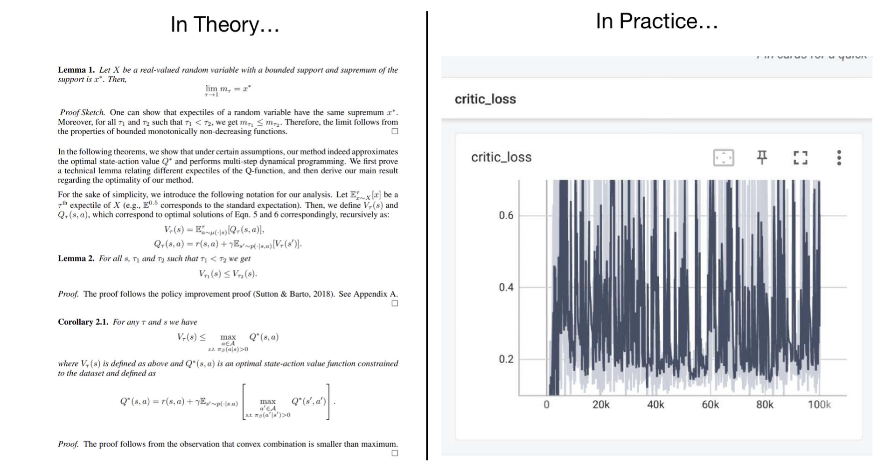

# Reinforcement Learning Theory Basics

在这一讲中，我们介绍基础的一些RL理论知识。首先，仅针对本讲，做一声明：
- 忽略global constant。比如，一个方法成功的概率是$1-\delta$，和是$1-2\delta$，没有区别。

## What we expect

首先提问：我们希望从RL理论中获得什么？

> Student: 我们希望给出一个定量的刻画！比如说，我们设法计算出，discount是0.98的时候最终的policy获得的Q值的期望值是discount是0.99的时候的0.871倍。
>
> Teacher: 这基本不可能。你这好比用普通物理的知识分析一个实际汽车中的汽油发动机的输出功率：需要考虑的因素太多了，你很难确保你的结果是精确的。
>
> Student: 那……我们希望论证算法可以达到一个界？比如，给定一个算法，我们可以论证在任意的MDP问题下，以超过0.99的概率，它最终到达的Q值不差于最优策略的0.98倍？
>
> Teacher: 还是不可能。现代的RL方法，连收敛性都无法保证，更别提这种强的界了。
>
> Student: 唉，那我们到底能获得什么呢？
>
> Teacher: 我们可以获得一些**定性**的结论。比如说，某个算法跑出的策略和最优策略的差距，随着state space的增大是变大还是变小？随着horizon（定义为$\frac{1}{1-\gamma}$）又是怎么变的？此外，还必须强调，即使是这样，我们也无法保证像你所说的，“对任意的MDP问题都给出保证”。实际上，我们往往需要**做很强的假设**。

也就是说，RL理论的关键问题在于在很强的假设下分析极度简化的问题，并给出一种渐进成立的界。这也与普通的ML theory类似。

更加specific地，我们一般研究两种问题：

- exploration：给定某个exploration方法，我们能否保证在$|S|,|A|,T=\frac{1}{\gamma}$的**多项式**次和环境的交互后，到达某种几乎访问了所有有意义的(state,action)对的状态？
- policy learning：假设我们可以完全explore，那么学到的policy在真实的环境中表现如何？    
    - 这里，“完全explore”就是一种strong assumption，有几种阐述：
        - 有一个oracle，可以告诉我们任何一个(state,action)对的下一个state的概率分布；
        - 或者略弱一些，对于每一个(state,action)，我们都至少访问了$N$次，得到了$N$个next state的样本。

注意通过这样，我们把policy learning和exploration解耦合，进而可以分别讨论。

# Problem 1: Policy Evaluation with Model

我们先来研究这第一个问题。这一问题的假设是，我们对于每一个$(s,a)$，从环境的真实分布$P(s'|s,a)$中采样了$N$个$s'$，并使用统计的方法给出一个离散的categorical分布$\hat{P}(s'|s,a)$。这一个$\hat{P}$就相当于我们的"model"。

然后，我们使用这一model进行$Q$ value的训练。这一部分的算法不是我们关心的内容，因此假设可以学到准确的Q value，也就是bellman方程严格被满足。同时，利用这一Q value（记作$\hat{Q}$），我们还可以得到一个最优的策略$\hat{\pi}^{\star}$；而对于原先的环境，也有一个最优的策略$\pi^{\star}$。我们从而定义下面的六个量：

| Environment | $P$| $\hat{P}$ |
| --- | --- | --- |
| Policy=$\pi^{\star}$ | $Q^{\star}$ | $\hat{Q}^{\pi^\star}$ |
| Policy=$\hat{\pi}^{\star}$ |$Q^{\hat{\pi}^{\star}}$| $\hat{Q}^{\star}$ |\
| Arbitrary Policy $\pi$ | $Q^{\pi}$ | $\hat{Q}^{\pi}$ |

比如说，第一行第二列的意思是，使用$\hat{P}$训练出来一个Q function，然后把$\pi^{\star}$在这一Q function下的Q值记作$\hat{Q}^{\pi^\star}$。

在这一情况下，我们关心几个问题：

- 对于某个任意的policy $\pi$，${Q}^{\pi}$和$\hat{Q}^{\pi}$ 差多远？
- ${Q}^{\star}$和$\hat{Q}^{\star}$相差多远？
- （终极问题，也是最有用的问题）$Q^{\star}$和$Q^{\hat{\pi}^\star}$差多远？注意这一问题就是说我们的model最终能表现的多好。

可以看到，前面两个问题相当于为最后一个问题做了铺垫。我们先研究第一个问题。

## Distance of $Q^{\pi}$ and $\hat{Q}^{\pi}$

首先，我们看一看我们有哪些已知的工具。根据假设，有

$$
Q^{\pi}(s_t,a_t)=r(s_t,a_t)+\gamma \mathbb{E}_{s_{t+1}\sim P(s_{t+1}|s_t,a_t)}[\mathbb{E}_{a_{t+1}}[Q^{\pi}(s_{t+1},a_{t+1})]]
$$

我们可以试着把它写为矩阵的形式。为此，引入两个矩阵：$P\in \mathbb{R}_{(|S|\cdot |A|)\times |S|}$ 对应着环境转移的概率分布；而$\Pi\in \mathbb{R}_{|S|\times(|S|\cdot |A|)}$ 对应着reward的期望。这样，我们可以写出

$$
Q=r+\gamma P\Pi Q
$$

这样，我们就有$Q^{\pi}=r+\gamma P\Pi Q^{\pi}$和$\hat{Q}^{\pi}=r+\gamma \hat{P}\Pi \hat{Q}^{\pi}$。由此可以得到

$$
Q^{\pi}-\hat{Q}^{\pi}=\gamma \left({P}\Pi {Q}^{\pi}-\hat{P}\Pi {Q}^{\pi}\right)+\gamma \left(\hat{P}\Pi Q^{\pi}-\hat{P}\Pi \hat{Q}^{\pi}\right)
$$

这给出

$$
Q^{\pi}-\hat{Q}^{\pi}=(1-\gamma \hat{P}\Pi)^{-1}\cdot \gamma (P-\hat{P})\Pi Q^{\pi}
$$

此时，如果我们估计$Q^{\pi}$和$\hat{Q}^{\pi}$的无穷范数（即最大绝对值），我们就有

$$
||Q^{\pi}-\hat{Q}^{\pi}||_{\infty}\le \gamma \cdot \frac{1}{1-\gamma} ||\Pi Q^{\pi}||_{\infty}\cdot ||P-\hat{P}||_{\infty}
$$

其中，我们使用了以下比较直观的结论：如果矩阵$A$满足$||A||_{\infty}<1$（把矩阵的无穷范数定义为每一行的绝对值和的最大值），那么

$$
||(1-\gamma A)^{-1}v||_{\infty}\le \frac{||v||_{\infty}}{1-\gamma},\forall v
$$

（这里略去证明）。接下来，我们只需要考察如何估计等式右边剩下的两个无穷范数。首先，对于$\Pi Q^{\pi}$，注意到它具有reward的量纲，因此我们必须有一个同样量纲的东西才能bound住它。不妨设$r(s,a)$具有上界$R_m$，那么可以给出

$$
(\Pi Q^{\pi})(s)=\sum_{a}\pi(a|s)Q^{\pi}(s,a)\le \max_{a}[Q^{\pi}(s,a)]\le \frac{R_m}{1-\gamma}
$$

而对于$P-\hat{P}$，这一项实际上是在说，我们采样估计出来的model和真实情况比较相似。因此，我们需要使用一些估计采样的bound。根据某个concentration inequality，我们立刻可以得到，对于$(s,a)$，采样得到的个数

$$
\Pr\left\{\left|\frac{N(s',s,a)}{N(s,a)}-P(s'|s,a)\right|\ge \epsilon \right \}\le 2e^{-2n\epsilon^2}
$$

