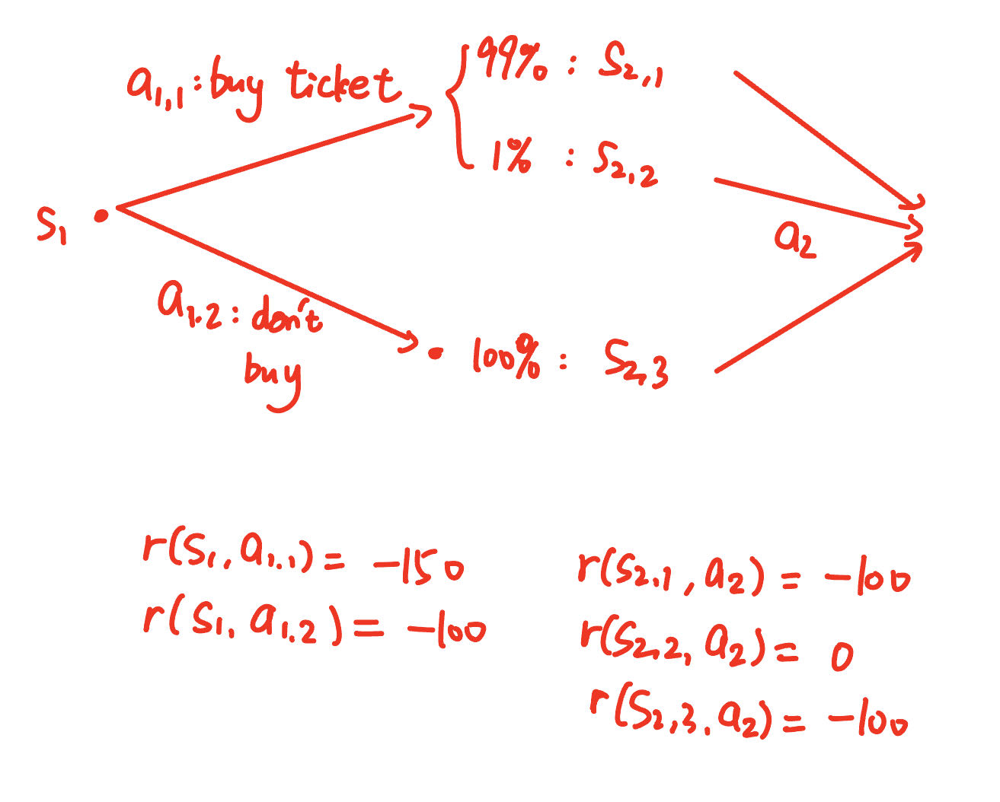
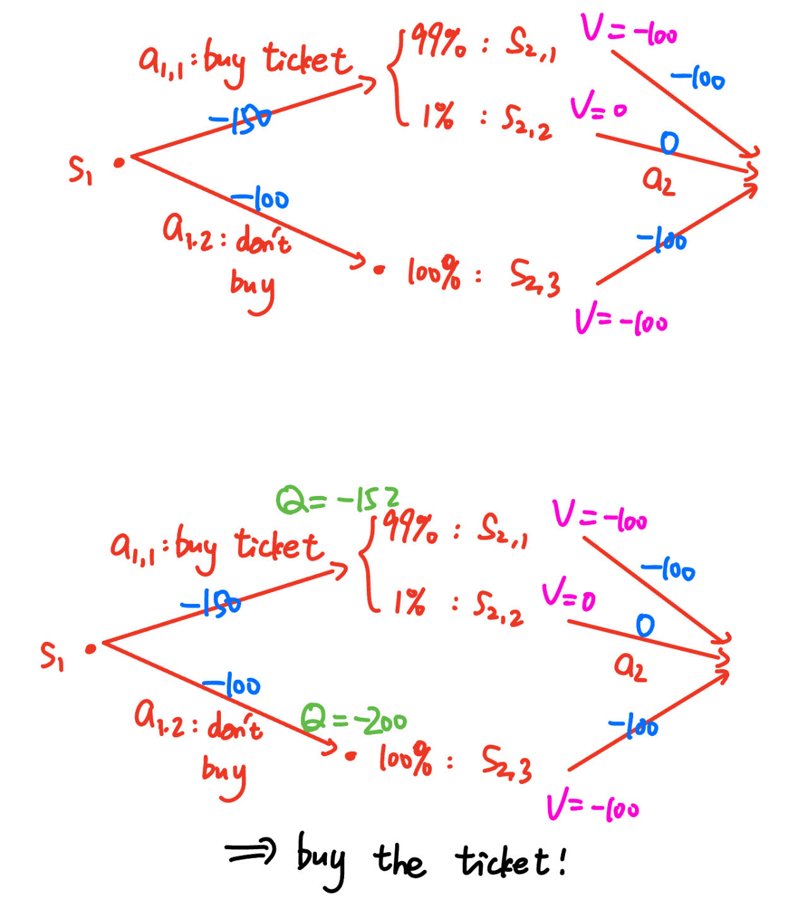

# Soft Optimality

(a.k.a. Reframing Control as an Inference Problem in the original PPT)

这一讲介绍一个很好玩的概念——Soft Optimality。我们从一个问题来出发，一步步引出最终的概念和结论。

## Modeling a Monkey?

我们考虑这一个问题：假设现在我们有一个简单的游戏。比如说，屏幕上有一个随着控制柄运动的红点，和一个绿点。我们的目标是移动控制柄把红点移动到绿点上。对于神经网络而言，随便给定reward，只要不太离谱，这一问题几乎是弱智。

但设想我们并不是为了**解决**这一问题，而是希望**模拟**玩这个游戏的**一只猴子**（可以理解为通过某种“图灵测试”，别人不能区分是猴子还是agent在玩这一游戏）。这一任务就略有难度了，因为显然猴子并不会只做最优的策略。当然，为了使得它和生物学脱耦合，我们做一些假设：

- 猴子的行为可以具有一些随机性（这些随机性不错地刻画了一些我们无法access的生物学变量，比如猴子当前是否很烦躁，或者很疲倦，之类）；
- 但猴子在任何一步，采取最优策略的概率都比较大。

此外，必须强调，这一任务不是imitation learning，因为我们并不能access到猴子的trajectory。我们（比如说）可以做的是，给出一个具有若干超参数的模型，并且（比如）当temperature调到0.1的时候，行为和猴子很相近，调到0.03的时候，和人类很相近，等等。

对于这一问题，倘若我们采用之前的方法，都是不行的，因为我们的目标就是cumulative reward最大，所以无法解释猴子为何作出不是最优的行为。为了解决这一问题，我们需要建立一个全新的方法。

> Q: 感觉你能想到模拟猴子这种事情，还是吃得太饱了。
>
> A: 不！这是十分重要的一个问题。比如，在很多研究项目里，我们希望训练一个agent，使得它的行为和人类的行为尽可能相似（比如，“AI狼人杀”）。不仅如此，我们可以看到，接下来的方法还可以反过来给我们原先的optimal control问题提供一个新的思路和更好的算法。

## Graphical Model of Dicision Making

我们建立这样一个graphical model。所谓graphical model，就是指每一条线代表一个依赖关系。比如， $s_2$ 依赖于 $s_1,a_1$ ，且依赖关系就是 $s_2\sim p(s_{2}|s_1,a_1)$ 这一转移概率。

需要注意，图中的 $O$ 并不是observation，而是我们引入的重要变量——**Optimalty**。它是一个布尔变量，**大致**代表这一步是不是作出“优的”决策（这一概念比较玄乎，需要慢慢体会）。 $p(O_t|s_t,a_t)$ 是一个未知的概率分布，但是我们假设它对于不同的 $t$ 是同一个函数形式。我们据此**重定义 reward**：

$$
r(s_t,a_t)=\log p(O_t=1|s_t,a_t)
$$

最后，我们需要建模的对象是 $p(\tau|O_{1,...,T}=\text{True})$ 。这里注意，我们设置 $O_{1,...,T}=\text{True}$ ，是因为我们模拟的基本原则还是尽可能作出“优的”决策。

> Q: 等等，什么玩意，如果让 $O_{1,...,T}=\text{True}$ ，不就是一直做最优的决策，那策略不就确定了吗？
>
> A: 你理解的不够准确，这里确实比较抽象。 $O_t=1$**并不代表这一步作出的 $a_t$ 在 $s_t$ 下是最优的**。相反，从表达式 $\log p(O_t=1|s_t,a_t)=\exp r(s_t,a_t)$ 来看，我们也可以看出 $O_t=1$ 和 $s_t,a_t$ 是“最优的”**没有必然的关系**，它们都是以概率的形式出现的。
>
> Q: 你完全把我搞晕了。那这个 $O_t$ 到底是什么？
>
> A: 其实，如果你不深究，直接按照我们给出的概率和假设来计算也不错。但如果你要深究的话，我们给出的graphical model实际上是一个[Hidden Markov Model(HMM)](https://en.wikipedia.org/wiki/Hidden_Markov_model)。通俗地讲，HMM是一种模型，它认为可观测的变量由一个隐藏的Markov Process的状态决定，而这个Markov Process的状态是不可观测的。HMM的目的就是根据可观测变量尽可能地推测一些关于隐藏变量的信息。
>
> 在这里， $O_t$ 就对应着可观测变量；不即如此，观测到的所有数据（即我们的模型跑出的trajectory）里， $O_t$ 都是1。我们的目标就是given了 $O_t$ 都是1,计算trajectory的条件概率， $p(\tau|O_{1...T})$ 。
>
> Q: 不是，那你把 $O_t$ 都取成1,这一变量还有什么用呢？
>
> A: 这你说的就不对了。比如说，如果不给定这个全是1的条件，在只given $s_{1..t-1},a_{1..t-1}$ 的情况下， $a_t$ 和 $s_t$ 是完全独立的变量；但现在，绝对不是这样。
>
> 换句话说，HMM的特点就是，因为观察到了可观测变量，导致隐藏变量的transition probability发生了改变。**而我们通过取可观测变量的 $O_t$ 以某种方式依赖于trajectory，并且强行令 $O_t=1$ ，就改变了trajectory的分布**：把它从完全没有约束时候的均匀分布，变到现在（至少我们希望）能够模拟猴子的trajectory的分布。

接下来，我们可以来初步计算 $p(\tau|O_{1,...,T}=\text{True})$ ：以下所有常数代表不依赖于 $\tau$ 的常数。

$$
p(\tau|O_{1...T}=1)=\frac{p(\tau,O_{1...T}=1)}{p(O_{1...T}=1)}
$$

$$
=C\cdot p(\tau)\cdot p(O_1|\tau)\cdot p(O_2|\tau)\cdots
$$

$$
=C\cdot p(\tau)\cdot \exp\left( \sum_{t} r(s_t,a_t)\right)
$$

其中

$$
p(\tau)=p(s_1)p(a_1|s_1)p(s_2|s_1,a_1)p(a_2|s_2)p(s_3|s_2,a_2)\cdots
$$

是只与环境有关的概率。（这里 $p(a_1|s_1)$ 等都是均匀的概率分布。）

现在，考虑一个简化情况，我们会发现我们的模型确实合理：假设 $p(\tau)$ 只是一些consistency check，也就是 $p(s_{t+1}|s_t,a_t)$ 在 $s_{t+1}$ 满足某些和 $s_t,a_t$ 的关系时是均匀分布，否则是0。这样，前面的表达式就变成了

$$
p(\tau|O_{1...T}=1)\propto \exp\left( \sum_{t} r(s_t,a_t)\right)
$$

也就是说，对于最大的cumulative reward，选择这一trajectory的概率是最大的；但对于其他trajectory，也有概率可以选到。这就说明，我们的模型给出的还算是一只合理的猴子。

### Inference of the Graphical Model

稍微理解了这一model在做什么之后，我们就可以把整个问题转化为一个概率问题（称为这个graphical model的**Inference**）：给定上面的graphical model，和概率分布

- $p(s_{t+1}|s_t,a_t)$ 已知；
- $p(O_t=1|s_t,a_t)=\exp r(s_t,a_t)$ ；

我们的目标是来计算：

- $\beta_t(s_t,a_t)=p(O_{t..T}=1|s_t,a_t)$ ，称为backward message；
- $\pi_t(a_t|s_t)=p(a_t|s_t,O_{1..T}=1)$ ，也就是policy；
- $\alpha_t(s_t)=P(s_t|O_{1..{t-1}}=1)$ ，称为forward message。

其中第二条是我们最感兴趣的，也和我们的问题有关；而第一条和第三条是graphical model的术语，我们后面会看到它们的作用。

在开始计算之前，我们首先声明：按照我们的graphical model， $a_t|s_t$**这一分布是均匀的**。对于这一分布不均匀的情况，也可以做类似的推导，但我们就不在这里讨论了。

#### Backward Message

对于backward，我们可以建立起一个递推关系。具体地，

$$
\beta_t(s_t,a_t)=p(O_{t..T}=1|s_t,a_t)=\exp(r(s_t,a_t))\sum_{s_{t+1},a_{t+1}}p(s_{t+1}|s_t,a_t)p(a_{t+1}|s_{t+1})\beta_{t+1}(s_{t+1},a_{t+1})
$$

引入记号 $\beta_t(s_t)=\mathbb{E}_{a_t\sim p(a_t|s_t)}[\beta_t(s_t,a_t)]$ ，有

$$
\beta_t(s_t,a_t)=\exp(r(s_t,a_t))\mathbb{E}_{s_{t+1}\sim p(s_{t+1}|s_t,a_t)}[\beta_{t+1}(s_{t+1})]
$$

我们忽然发现这样的表达式有些眼熟！的确，如果令

$$
V_t(s_t)=\log \beta_t(s_t),\quad Q_t(s_t,a_t)=\log \beta_t(s_t,a_t)
$$

那么我们就有

$$
Q_t(s_t,a_t)=r(s_t,a_t)+\log \mathbb{E}_{s_{t+1}\sim p(s_{t+1}|s_t,a_t)}[\exp V_{t+1}(s_{t+1})]
$$

$$
V_t(s_t)= \log \mathbb{E}_{a_t\sim p(a_t|s_t)}[\exp Q_t(s_t,a_t)]
$$

注意，我们的 $r(s_t,a_t)$ 并不是传统意义上的reward（在本讲不妨把传统意义上的reward记作 $r_{c}$ ），而是通过前面的奇怪方式定义得到的。因此，我们也就知道了，当**我们选取**

$$
\log p(O_t|s_t,a_t)=:r(s_t,a_t)\propto r_c(s_t,a_t)
$$

并且 $r(s_t,a_t)\to \infty$ 的时候，我们这一graphical model给出的 $\beta_t$ 具有一种“Q function”和“V function”的意思。当然，backup方程中并不是直接取最大值，而是取了一个`logsumexp`，这可以视作一种“软的”最大值，但softmax这一名词已经用过了，我们不妨管这一操作叫做 **“birdmax”**（注意，这个名词是我自己造的，不要用）。

$$
\text{BirdMax}(x)=\log \mathbb{E}_{x\sim p(x)}[e^x]
$$

这样，我们就有

$$
Q_t(s_t,a_t)=r(s_t,a_t)+\text{BirdMax}_{s_{t+1}}[V_{t+1}(s_{t+1})]
,
V_t(s_t)=\text{BirdMax}_{a_t}[Q_t(s_t,a_t)]
$$

这是一个递推的方程，我们可以从 $V_T(s_T)=0$ 开始，倒着计算出所有的 $V_t(s_t)$ 和 $Q_t(s_t,a_t)$ 。

#### Policy

我们需要计算

$$
\pi_t(a_t|s_t)=p(a_t|s_t,O_{1..T}=1)=\frac{p(O_{1..T}=1|a_t,s_t)p(a_t|s_t)}{p(O_{1..T}=1|s_t)}
$$

注意到 $p(O_{1..T}=1|a_t,s_t)=p(O_{1..t-1}=1)p(O_{t..T}=1|a_t,s_t)$ ，因此有：

$$
\pi_t(a_t|s_t)=\frac{1}{Z(s_t)}\beta_t(s_t,a_t)p(a_t|s_t)
$$

而归一化系数实际上是已知的。因此，有

$$
\pi_t(a_t|s_t)=\frac{\beta_t(s_t,a_t)}{\beta_t(s_t)}p(a_t|s_t)\propto \frac{\beta_t(s_t,a_t)}{\beta_t(s_t)}
$$

换句话说，就是

$$
\pi_t(a_t|s_t) = p(a_t|s_t)\cdot {\exp [Q_t(s_t,a_t)-V_t(s_t)]}\propto \exp A(s_t,a_t)
$$

也就是说，我们的policy是一个softmax形式的policy，其中logit就是advantage。如果你之前了解过[SAC(Soft Actor-Critic)](https://arxiv.org/abs/1801.01290)算法，你会发现这里的形式和SAC的形式是很像的；如果你不了解，也没有关系，因为SAC的一种理论来源就是这里。我们之后就会介绍SAC方法。

当然，就如之前提到的那样，这里的 $r(s_t,a_t)$ 和真实世界的reward $r_c(s_t,a_t)$ 并不相等，因此我们实际的应用中一般引入一个参数 $\alpha$ ，给出

$$
\pi(a|s)\propto \exp\left(\frac{1}{\alpha}A_c(s,a)\right)
$$

其中 $A_c$ 是传统的Q function $Q_c$ 和V function $V_c$ 的差值计算出的advantage。

#### Forward Message

最后，我们讨论forward message，也就是

$$
\alpha _t(s_t)=p(s_t|O_{1..t-1}=1)
$$

对于 $\alpha$ 的递推，其实很难写出比较简洁的形式。我们类似地有

$$
\alpha_{t+1}(s_{t+1})=p(s_{t+1}|O_{1..t}=1)=\sum_{s_t,a_t}p(s_{t+1}|s_t,a_t)p(s_t,a_t|O_t=1,O_{1..t-1}=1)
$$

$$
=\sum_{s_t,a_t}p(s_{t+1}|s_t,a_t)\frac{p(O_t=1|s_t,a_t,O_{1..t-1}=1)p(a_t|s_t)p(s_t|O_{1..t-1}=1)}{p(O_t=1|O_{1..t-1}=1)}
$$

$$
=C\sum_{s_t,a_t}p(a_t|s_t)\cdot \exp(r(s_t,a_t))\cdot \alpha_t(s_t)\cdot p(s_{t+1}|s_t,a_t)
$$

按这个递推式理论上可以给出forward message的表达式。但实际上更重要（也更漂亮）的一个表达式，是 $s_t$ 的state marginal：

$$
p(s_t|O_{1..T})=\frac{p(s_t|O_{1..t-1})p(O_{t..T}|s_t,O_{1..t-1})}{p(O_{t..T}|O_{1..t-1})}
$$

$$
=\frac{\alpha_t(s_t) p(O_{t..T}|s_t)}{p(O_{t..T}|O_{1..t-1})}\propto \alpha_t(s_t)\beta_t(s_t)
$$

我们可以思考这一表达式的含义，它实际上很有道理：backward message $\beta_t(s_t)$ 描述的是，在state $s_t$ 处向后看，作出的决策是“优的”的概率；而forward message $\alpha_t(s_t)$ 描述的是，一直做“优的”决策，到达 $s_t$ 的概率。这二者结合起来，大概就刻画了 $s_t$ 在整个“优”决策中的分布。

## Variational Inference of the Graphical Model

### What's the Problem?

上面的模型真的能很好地模拟猴子的行为吗？看起来，policy的表达式以exponential advantage为正比，已经很接近我们的直觉了。但是，有一个很严重的问题——optimism problem。

问题的来源出现在Q function的update:

$$
Q_t(s_t,a_t)=r(s_t,a_t)+\text{BirdMax}_{s_{t+1}}[V_{t+1}(s_{t+1})]
$$

注意birdmax的计算方式是logsumexp，这很容易造成过度的自信。

> 我们考虑如下的例子。

> 考虑一个流浪汉，他每天都会饿肚子，因此每天正常都有一个负的reward。我们考虑开始的一天（ $s_1$ ），他发现一个售卖彩票的商店。如果买了彩票（记为 $a_{1,1}$ ），那么他可能会付出额外的钱，因此这一天的reward为-150（ $r(s_1,a_{1,1})=-150$ ）。但如果他不买彩票（记为 $a_{1,2}$ ），那么他就不会付出额外的钱，reward为-100（ $r(s_1,a_{1,2})=-100$ ）。如果他买了彩票，第二天他会以99%的概率没有获得任何（ $s_{2,1}$ ），他不管做什么（记这个没什么用的action为 $a_2$ ）都会继续饿肚子（ $r(s_{2,1},a_2)=-100$ ）；但他也有1%的概率中奖，他得以吃饱（ $r(s_{2,2},a_2)=0$ ）。当然，如果他没有买彩票，那依然是饿肚子（ $r(s_{2,3},a_2)=-100$ ）。
>
> （这个例子有点唐，主要是因为我们的reward必须不能超过0）。现在，我们可以按照前面的birdmax update方式计算一下这个环境下的Q function和V function。

> 我们会发现，对于买彩票的action，虽然大概率第二天的reward是-100，期望上也基本是-100，但是其birdmax之后是 $\log (0.99\times 10^{-100}+0.01\times 1)\approx -2$ 。这就导致，买彩票之后，Q function反而更高（-152）。并且，此时按照exponential advantage给出的policy有接近于1的概率买彩票！对于这位可怜的流浪汉，这显然是不合理的。

我们仔细想一想，这一问题究竟来自于哪里？从数学公式上看，对不同state的birdmax过分高估了state的“潜能”，但这不够本质；本质实际上是，我们**过分地condition on了决策是“优”的这一事实**。

具体地，在上面的例子里，我们考虑买彩票这一个action。假设我们什么都不condition，那么赚钱的概率显然是很低的（1%）；但如果我们condition on了决策是“优”的这一事实，那么赚钱的概率就变成了

$$
p(s_2=s_{2,2}|s_1,a_{1,1},O_2=1)=\frac{p(O_2=1|s_1,a_{1,1},s_2=s_{2,2})\cdot p(s_2=s_{2,2}|s_1,a_{1,1})}{p(O_2=1|s_1,a_{1,1})}
$$

$$
=\frac{1\cdot 1\%}{1\cdot 1\% + 10^{-100}\cdot 99\%}\approx 100\% !
$$

换句话说，在前面的推导里，我们取

$$
\pi_t(a_t|s_t)=p(a_t|s_t,O_{1..T}=1)
$$

这一点并不合适。因为这相当于告诉了流浪汉：“你放心买彩票吧，我有后门，包准赢！”。但事实是残酷的，转移概率不是 $p(s_{t+1}|s_t,a_t,O_{1..T}=1)$ ，而是 $p(s_{t+1}|s_t,a_t)$ 。

因此，我们的policy应该重新被选取。很自然地，我们选取它为残酷的事实下的最近似分布：

$$
\pi = \arg\min_{\pi}\text{KL}\left(p_{\pi}(s_{1..T},a_{1..T})||p(s_{1..T},a_{1..T}|O_{1..T}=1)\right)
$$

其中

$$
p(s_{1..T},a_{1..T}|O_{1..T}=1)=p(s_1|O)p(a_1|s_1,O)p(s_2|s_1,a_1,O)p(a_2|s_2,O)\cdots
$$

为理想的分布；而

$$
p_{\pi}(s_{1..T},a_{1..T})=p(s_1)\pi(a_1|s_1)p(s_2|s_1,a_1)\pi_2(a_2|s_2)p(s_3|s_2,a_2)\cdots
$$

为我们约束下的分布。

### Variational Inference

我们发现，**这一问题十分像variational inference**！如果记

$$
z=(s_{1..T},a_{1..T}),\quad x=O_{1..T},\quad q(z|x=1)=p_\pi(z)
$$

那么这一问题就是

$$
\pi = \arg\min_{\pi}\text{KL}\left(q(z|x)||p(z|x)\right)
$$

还记得我们在前一讲[VAE](./18-vae.md#elbo-revisited)的介绍中给出的，

$$
\text{ELBO}=\log p(x)-\text{KL}\left(q(z|x)||p(z|x)\right)
$$

而和之前不同的是，现在 $\log p(x)$ 和我们要优化的东西无关，因此我们**只需要最大化ELBO**。这时，我们就可以用它的第二种表达形式：

$$
\text{ELBO}= \mathbb{E}_{z\sim q(z|x)}[\log p(x|z)]-\text{KL}(q(z|x)||p(z))
$$

这时，注意到 $p(x|z)$ 是容易计算的：

$$
p(x|z)=p(O_1=1|s_1,a_1)p(O_2=1|s_2,a_2)\cdots=\exp\left(\sum_{t}r(s_t,a_t)\right)
$$

而KL divergence中的

$$
\log \frac{q(z|x)}{p(z)}=\log \frac{p_{\pi}(z)}{p(z)}=\sum_t \log \frac{\pi(a_t|s_t)}{p(a_t|s_t)}
$$

这样，我们就最终写出objective：

$$
\pi = \arg \max_{\pi} \mathbb{E}_{\tau\sim p_{\pi}(\tau)}\left[\sum_{t}r(s_t,a_t)-\log \frac{\pi(a_t|s_t)}{p(a_t|s_t)}\right]
$$

在 $p(a_t|s_t)$ 均匀的假设下，这就变成了

$$
\pi = \arg \max_{\pi} \mathbb{E}_{\tau\sim p_{\pi}(\tau)}\left[\sum_{t}r(s_t,a_t)+\mathcal{H}(\pi(\cdot|s_t))\right]
$$

可以看到，这一objective和我们熟悉的RL objective非常相似，只是多了一个**entropy bonus**。这很合理，因为我们一开始的假设就是，猴子会基本按照最优策略，但是也会有一些随机性。这一随机性就恰恰由entropy bonus给出，而entropy bouns也解释了为何sub-optimal的action也会被选取。

### Solving for the Optimal Policy

我们把前面的objective展开：

$$
J=\mathbb{E}_{s_1\sim p(s_1)}\mathbb{E}_{a_1\sim \pi(a_1|s_1)}\left[r(s_1,a_1)-\log \pi(a_1|s_1)+\mathbb{E}_{s_2\sim p(s_2)}\mathbb{E}_{a_2\sim \pi(a_2|s_2)}\left[r(s_2,a_2)-\log \pi(a_2|s_2)+\cdots\right]\right]
$$

这样，我们可以像之前说的[LQR](./10-optimal_control_planning.md#lqr)一样，求解最优的policy。作为假设，我们认为我们的网络表现能力足够强，以至于given任意state $s$ 都可以随意选取 $\pi(a|s)$ 。这样，对于 $s_T$ 的最优policy就可以直接计算得到：

$$
\pi(a_T|s_T)\propto \exp r(s_T,a_T)=\exp Q(s_T,a_T)
$$

再注意到

$$
V(s_T)=\text{BirdMax}_{a_T}[Q(s_T,a_T)]=\log \mathbb{E}_{a_T\sim p(a_T|s_T)}[\exp {Q(s_T,a_T)}]
$$

因此，立刻可以给出

$$
\pi(a_T|s_T)=\frac{\exp Q(s_T,a_T)}{\exp V(s_T)}p(a_T|s_T)
$$

接下来，我们再次递推。假设 $t+1$ 时已经给出了最优的策略为

$$
\pi(a_{t+1}|s_{t+1})=\frac{\exp \hat{Q}(s_{t+1},a_{t+1})}{\exp \hat{V}(s_{t+1})}p(a_{t+1}|s_{t+1})
$$

并且使得

$$
\mathbb{E}_{a_{t+1}\sim \pi(a_{t+1}|s_{t+1})}\left[r(s_{t+1},a_{t+1})-\log \pi(a_{t+1}|s_{t+1})+\cdots\right]:=J_{t+1}=\hat{V}(s_{t+1})
$$

（这里扔掉了一些可能和 $\log p(a_{t+1}|s_{t+1})$ 相关的常数）其中 $\hat{Q},\hat{V}$ 是某待定函数。这样，带回到 $t$ 时，我们就可以得到 $t$ 时刻的等效objective为

$$
J=\mathbb{E}_{s_t\sim p(s_t)}\mathbb{E}_{a_t\sim \pi(a_t|s_t)}\left[r(s_t,a_t)-\log \pi(a_t|s_t)+\mathbb{E}_{s_{t+1}}[\hat{V}(s_{t+1})]\right]
$$

因此，只要满足

$$
\hat{Q}(s_t,a_t)=r(s_t,a_t)+\mathbb{E}_{s_{t+1}}[\hat{V}(s_{t+1})],\quad \hat{Q}(s_T,a_T)=r(s_T,a_T)
$$

$$
\hat{V}(s_{t+1})=\text{BirdMax}_{a_{t+1}}[\hat{Q}(s_{t+1},a_{t+1})]
$$

就可以使得归纳被满足。这样，我们就给出了最优policy的解。

略微总结，我们使用variational inference，**最终得到的答案是**（合理地插入了discount）

$$
\hat{Q}(s_t,a_t)=r(s_t,a_t)+\gamma \mathbb{E}_{s_{t+1}}[\hat{V}(s_{t+1})]
$$

$$
\hat{V}(s_{t+1})=\alpha\cdot \mathbb{E}_{a_{t+1}\sim p(a_{t+1}|s_{t+1})}\left[\exp \left(\frac{\hat{Q}(s_{t+1},a_{t+1})}{\alpha}\right)\right]
$$

$$
\pi(a_t|s_t)=\frac{\exp \left(\frac{\hat{Q}(s_t,a_t)}{\alpha }\right)}{\exp \left(\frac{\hat{V}(s_t)}{\alpha }\right)}p(a_t|s_t)
$$

（这里出于和之前说的一样的理由，一个temperature参数 $\alpha$ 作为hyperparameter需要被引入。）

可以看到，这一迭代方式比较奇特——在Q算V的时候，我们用的是比较“软”的birdmax；而在V算Q的时候，我们直接使用期望值。这有点像是之前第一个版本的graphical model inference方法和普通的Q-V iteration方法的结合。普通的Q-V iteration不允许sub-optimal behavior的出现；graphical model inference方法出现严重的optimism问题；而这一方法结合了两者的优点，并且建立在坚实的理论依据上，给出了一个很好的解决方案。

如果你感兴趣，也可以把这个新的迭代公式代入我们之前买彩票的例子。你会发现，流浪汉不会再作出那荒谬的决定了。

## Soft Optimality

我们终于可以引入soft optimality的概念了。其实，这也没有它听起来的那样高级：

- 它的目标就是之前说的那样，试图**模拟**人类的行为。也就是说，它给出一个向往美好，但也不严格最优的行为。
- 为了产生最优解之外的解，模型引入**随机性**，表现为**entropy bonus**。注意到entropy bonus不仅强调了**随机**，还强调了**均匀的随机**。
- 同时，传统的Q-V iteration保证了模型依然具有一定的**最优性**。

soft optimality就是这些东西的杂交产物，在一个specific的，目标是“刷分”的传统RL问题中，它的表现不一定比传统的Q-V iteration好；但必须注意，它的设计本身并不是为了解决传统的，使得agent获得最大reward的问题。

但有意思的是，即便这么说，在很多情况下，加入了entropy bonus的方法反而比之前我们介绍的那些Q learning方法更好。我们接下来就来介绍soft optimality的一些应用。

# Application of Soft Optimality

## Soft Actor-Critic

SAC算法可以说是Q learning方法中最大名鼎鼎的一种（虽然我们之前的18讲中都没怎么提到它！）。它就是基于前面的soft optimality的理论。

> **SAC algorithm**

重复：

1. 更新 Q function: $Q(s,a)\leftarrow r(s,a)+\gamma[Q(s',a')-\log \pi(a'|s')]$ （当然，要采用target network等优化，和之前一样，不再赘述）；
2. 使用 REINFORCE 或者 REPARAMETERIZE 来更新policy，objective为 $J=\mathbb{E}_{a\sim \pi(a|s)}[Q(s,a)-\log \pi(a|s)]$ 。
    - 如果使用 REINFORCE，那么 fake loss 为 $\hat{J}=\mathbb{E}_{a\sim \pi(a|s)}[\log \pi(a|s)Q(s,a)]+\mathcal{H}(a|s)$ （这是对一组数据的梯度）；
    - 如果使用 REPARAMETERIZE，那么直接计算loss就可以了。
    - 你可能会疑问，用 REINFORCE 怎么计算熵 $\mathcal{H}$ 的梯度？实际上，也不是不可以，只需要把fake loss设置为 $\frac{1}{2}\mathbb{E}_{a\sim \pi(a|s)}[(\log \pi(a|s))^2]$ 就可以了。当然，这看起来比较奇怪。实际上，REPARAMETERIZE的效果确实也更好。
3. 根据policy来收集数据。

注意这一algorithm和之前的soft optimality给出的公式具有细微的差别：在update Q 的时候，我们不再单独使用birdmax计算 $V$ ，因为在continous action space上很难计算出来；转而我们用 $\log \pi$ 来估计 $V$ ，这是普适的。当然，在discrete action上面，我们也可以使用birdmax。这一算法叫做 **“soft Q-learning”**：

> **Soft Q-learning**

1. 更新 Q function: $Q(s,a)\leftarrow r(s,a)+\gamma\cdot \text{BirdMax}_{a_{t+1}}[Q(s_{t+1},a_{t+1})]$ （当然，还是要采用target network等优化）；
2. 根据某种exploration policy来收集数据。

SAC algorithm的效果十分显著。一方面，它训练出来的policy具有很强的**robustness**，因为entropy bonus鼓励policy四处探索，可以理解为它在各种方向上都有很好的解决方案。在实验上，用SAC训练出来的移动物品的机器人，即使人对它拳打脚踢导致它的机械臂移动了很远，当“攻击”结束后它依然能反应过来，继续完成任务。

另外一方面，SAC可以做很好的**pretraining**。什么样的任务需要pretraining呢？设想这样一个问题：我们要训练一个humanoid走迷宫的任务，ddl是5天。但迷宫这一环境在第四天才会公布。在此之前，我们只能在无限大的平面上训练一个humanoid来走路。在pretraining过程的reward（比如用质心速度作为reward）下面，我们训练出一个模型参数；我们希望在这组参数的初始化下，当新的reward来临时，我们的模型能够很快地适应。

在这样的情况下，Soft optimality-based的方法**显著地outperform**了DDPG等传统算法。道理也很简单——传统的方法没有关注entropy项，因此policy很可能只学习某种方案。比如，humanoid只能一路向北，而完全没有向西或东走的能力。这样，假设目标在humanoid的东边，那么预训练还不如不做——模型要先“unlearn”之前学到的错误方向的东西，再“relearn”新的知识。

但是，Soft optimality-based的方法，由于有entropy bonus，因此在pretraining的时候就会学到各种方案，因此在新的reward下，它迅速可以适应并找到之前的方案里面哪一个是最优的，实施就可以了。

# Summary: What Soft Optimality Brings Us

我们最后来简单总结soft optimality的一些优点：

- **exploration**：因为max entropy，所以policy会四处探索，这就是为什么有时候SAC在经典的任务上也跑的更好；
- **easy to finetune**：就像我们刚刚所说的那样，soft optimality-based的方法在pretraining上表现更好；
- **robustness**：仍然是因为max entropy，policy学会的更多，所以它的robustness更好；
- **more general approach**：不管怎么说，再不济，我们把temperature调节为0也可以回到传统的Q learning方法。因此，这样的方法肯定在调参后不会差。
- **more human-like**：这一点是最重要的，也是我们的初心。这样训练出来的agent像有血有肉的人，而不是变成一个追求最优的机器。

# Reference Papers

1. [Reinforcement Learning and Control as Probabilistic Inference: Tutorial and Review](https://arxiv.org/abs/1805.00909)（graphical model的引入）
2. [Modeling Interaction via the Principle of Maximum Causal Entropy](https://www.cs.cmu.edu/~bziebart/publications/maximum-causal-entropy.pdf)（maximum causal entropy的引入）
3. [Reinforcement Learning with Deep Energy-Based Policies](https://arxiv.org/abs/1702.08165)（soft Q-learning的引入）
4. [Soft Actor-Critic Algorithms and Applications](https://arxiv.org/abs/1812.05905)（更多的SAC算法）
5. [Equivalence between policy gradients and soft Q-learning](https://arxiv.org/abs/1704.06440)