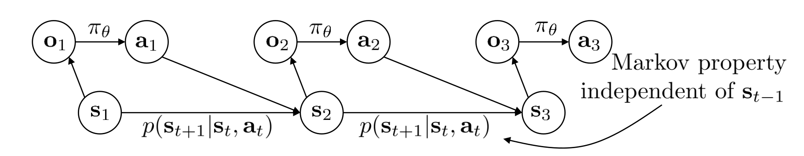

# Terminology

- $\pi_\theta$
- $o_t$: observation at time $t$
- $a_t$: action at time $t$
- $s_t$: state at time $t$

The Markov property can be illustrated in the graph below.

# Imitation Learning

Imitation Learning 的思路很简单：我们找一个专家来label data，构建一个数据集
$$
\mathcal{D}=\{s,a\}
$$
然后，我们训练一个模型，使得
$$
\theta^\star = \argmax_{\theta}\log \pi_\theta(a=\pi^\star(s)|s)
$$
其中，$\pi^\star$ 是专家的策略。需要注意，这里完全没有RL的知识，只是普通的DL问题。这也有时候被叫做behavior cloning。

模型的实现可以是DL中的很多类型的网络。比如说CNN,VAE,甚至diffusion models。更进一步，有些研究考虑专家的Non-Markov性质，因此使用RNN来建模。当然，很多经验证明有“历史”的模型不一定比“无历史”的模型好。

# Behavior Cloning Analysis

直观上，bahavior cloning应该**失败**。

比如说，一个模型在“走钢丝”，它每一步有98%的概率走在正确的道路上。这样的模型如果从我们训练数据的角度来看，已经是一个很不错的DL模型了。但是假设模型决策100步，那么只有13%左右的概率它依然保持在专家的道路上！

下面给出了一些数学上的分析。它们的主要目的都是为了bound住behavior cloing的模型和专家之间的差距。

## Notations
- $a=\pi^{\star}(s)$: the expert policy gives $a$ when the state is $s$
- $\pi_\theta$: the policy we are trying to learn
- $p_{\pi_\theta}(s_t)$: the probability of being at state $s_t$ at time $t$ if we follow $\pi_\theta$. 
    - **重要提示**: $p_{\pi_\theta}(s_t)$的这个 $p_{\pi_\theta}$ 分布和 $p_{\pi_\theta}(s_{t+1})$的这个 $p_{\pi_\theta}$ 分布可不是一个分布！一个是在 $t$ 时的分布，一个是在 $t+1$ 时的分布。 
- Use $|p_1-p_2|$ to denote the total variance distance between $p_1$ and $p_2$: $|p_1-p_2|=\sum_{x}|p_1(x)-p_2(x)|$

## Distribution Distance
**Assumptions.**
(Notice: this assumption is only used to derive this **one** conclusion.)

- $\forall (a,s), \pi_\theta(a\ne \pi^{\star}(s)|s)\le \epsilon$

**Conclusion**: for arbitrary $t$,

$$
\sum_{s_t}|p_{\pi_\theta}(s_t)-p_{\pi^{\star}}(s_t)|\le 2\epsilon t.
$$

**Proof**. In these kind of problems (there is also one in the homework), we prove by **induction**.

We can associate the relation at time $t+1$ with the relation at time $t$:
$$
\left|p_{\pi_\theta}(s_{t+1})-p_{\pi^\star}(s_{t+1})\right|=\left|\sum_{s_t,a_t}p(s_{t+1}|s_t,a_t)\pi_\theta(a_t|s_t)p_{\pi_\theta}(s_t)-\sum_{s_t}p(s_{t+1}|s_t,\pi^\star(s_t))p_{\pi^\star}(s_t)\right|.
$$

$$
=\left|\sum_{s_t}\left(\sum_{a_t\ne \pi^\star(s_t)}p(s_{t+1}|s_t,a_t)\pi_\theta(a_t|s_t)+p(s_{t+1}|s_t,\pi^\star(s_t))\pi_\theta(\pi^\star(s_t)|s_t)\right)p_{\pi_\theta}(s_t)-\sum_{s_t}p(s_{t+1}|s_t,\pi^\star(s_t))p_{\pi^\star}(s_t)\right|.
$$

$$
\le \epsilon \sum_{s_t}p_{\pi_\theta}(s_t)+\sum_{s_t}p(s_{t+1}|s_t,\pi^\star(s_t))p_{\pi_\theta}(s_t)\cdot \epsilon+\sum_{s_t}p(s_{t+1}|s_t,\pi^\star(s_t))\left|p_{\pi_\theta}(s_t)-p_{\pi^\star}(s_t)\right|
$$

$$
=\epsilon+\epsilon \sum_{s_t}p_{\pi_\theta}(s_t)p(s_{t+1}|s_t,\pi^\star(s_t))+\sum_{s_t}p(s_{t+1}|s_t,\pi^\star(s_t))\left|p_{\pi_\theta}(s_t)-p_{\pi^\star}(s_t)\right|.
$$

Summing up with $s_{t+1}$, we immediately get the conclusion.

*Side Note.* Problem 1 of Homework 1 actually gives a similar conclusion given the weakened condition
$$
\mathbb{E}_{s_t\sim p_{\pi^\star}}[\pi_\theta(a_t\ne \pi^{\star}(s_t)|s_t)]\le \epsilon.
$$

## The total cost

**Assumptions.**
- $\mathbb{E}_{s_t\sim p_{\pi^\star}}[\pi_\theta(a_t\ne \pi^{\star}(s_t)|s_t)]\le \epsilon.$

Define $c_t$ to be the **cost function** given by
$$
c_t(s_t,a_t)=\begin{cases}0&,a_t=\pi^{\star}(s_t)\\1&,\text{otherwise}\end{cases}.
$$

**Conclusion**: 

$$
S=\sum_{t\le T} E_{s_t\sim p_{\pi_\theta}}[c_t(s_t,a_t)]=\mathcal{O}(\epsilon T^2).
$$

（直观上说，这是指我们的模型失败的步数是 $\mathcal{O}(T^2)$ 的。虽然这只是一个上界，但 intuitively 它应该是比较准确的。）

**Proof**. 

$$
S=\sum_{t\le T} E_{s_t\sim p_{\pi_\theta}}[c_t(s_t,a_t)]=\sum_{t\le T} \sum_{s_t}p_{\pi_\theta}(s_t)c_t(s_t,a_t)
$$

$$
\le \sum_{t\le T} \sum_{s_t}p_{\pi^\star}(s_t)\pi_\theta(a_t\ne \pi^\star(s_t)|s_t)+\sum_{t\le T} \sum_{s_t}|p_{\pi_\theta}(s_t)-p_{\pi^{\star}}(s_t)|c_t(s_t,a_t)
$$

Now, we use the previous result to get

$$
S\le \sum_{t\le T} \epsilon+\sum_{t\le T} 2\epsilon t = \mathcal{O}(\epsilon T^2).
$$

# Make Bahavior Cloning Work

介绍几个常见的方法，解决bahavior cloning的这个问题。

## Adding Mistakes
 
假设我们的模型学会改正自己的错误（比如，在走钢丝的时候，身体向左倾倒的时刻，我们的模型能够自动调整身体向右倾倒）。这样的话，成功的概率会大很多。

一个典型的实验是，我们做一个驾驶的模型，然后做三个摄像头：一个正常的摄像头，一个向左偏移的摄像头，一个向右偏移的摄像头。在训练的时候，左边摄像头的图片被标记为“右转”，右边摄像头的图片被标记为“左转”。这样的话，我们的模型就能够学会自动调整。

## Multi-task Learning

还记得我们之前的问题：只要模型一步误入歧途，接下来就再也没有挽回的余地。回顾一下，之前的模型失误的时候会走向一条全新的道路，是完全没有训练过的；但 multi-task learning 可以解决这个问题——它通过巧妙的设计收集大量的 trajectory 信息，使得模型在哪里都不至于完全不知所措。

具体地，我们在训练的时候让专家并非向往一个目标 $s_T$ 前进；相反，让它对很多个 $s_T$ 走多条这样的路径：

$$
s_1,a_1,\cdots,s_{T-1},a_{T-1},s_T
$$

然后，我们的数据集收集

$$
\{(a_t|s_t,g_t=s_T)\}\in \mathcal{D}
$$

也就是说，我们模型知道了对于每一个 **目标$s_T$** 应该每一步怎样走。这样的操作也叫做 Goal-conditioned behavior cloning。

## DAgger

DAgger也试着解决原来的问题。它的思路是，为了防止模型走错之后不知道该怎么走，我们就在每一个训练 iteration 完成之后让模型自己跑一次，并让专家来标记正确答案。具体地，我们从 $\pi_\theta$ 中采样

$$
s_1,a_1\sim \pi_\theta(\cdot|s_1),\cdots,s_T,a_T\sim \pi_\theta(\cdot|s_T)
$$

然后把这些新的数据加入数据集中：

$$
\mathcal{D}= \mathcal{D}\cup \left\{(s_t,a_t^\star=\pi^{\star}(s_t))|t=1,2,\cdots,T\right\}
$$

当然，实际上可能采用一些其他策略，比如每一次不是在越来越大的数据集上完整地训练一轮，而是把所有训练的数据存到一个 buffer 内部，然后从中随机地采样。

当然， DAgger 也有很显著的问题：需要很多次专家进行数据的标注，因此这部分的代价可能会很昂贵。