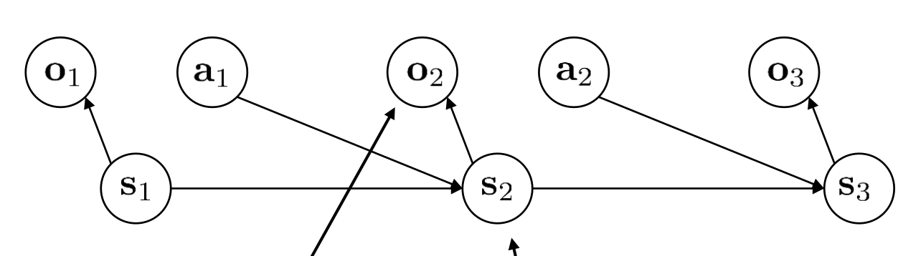

# RL and Language Models

## Partially Observed Scenarios

之前我们介绍的大部分问题都是fully observed的，因此也不用区分state和observation；但在很多问题中，我们观察到的observation $o_t$和state $s_t$并非一致。比如游戏图像并不包含全部的状态，或者对话的过程中历史也产生影响，等等。

把这类问题formalize一下，就是所谓**POMDP**(Partially Observed MDP)，其结构如图所示：state $s_t$是和之前一样的，具有Markov property的；但我们的policy只能condition on $o_t$，但$o_t$并不包含$s_t$的全部信息。

对于这样的问题，也有两种policy；第一种称为“memoryless”，也就是policy就是$\pi(a_t|o_t)$，不依赖于$o_{1..t-1}$；第二种则可以利用全部的$o_{1..t}$，这更加普遍。

### Basics of POMDP

POMDP可能比较奇怪。首先，可能有一些奇怪的action出现，其“牺牲小我成就大我”，也就是虽然这个action对于当前的reward是负面的，但收集到了信息，所以有助于未来的reward。比如说，在走迷宫的时候，最优的策略很可能是先随便试一试，再有策略地走。

此外，对于普通的MDP，一定存在一个决定性的策略，不差于任何其他的策略（即为最优策略）；但对于POMDP并且memoryless的情况下，并非如此。

> 比如，考虑一个例子：state 有A,B,C三个；到达B获得reward并立刻结束，否则不获得reward。从A出发，一半概率留在A，一半到达B；从B出发到达A,C各一半；从C出发一半到达B，一半留在C。
>
> 我们再定义observation，使得它无法提供任何信息：$o_A=o_B=o_C$。这样，如果memoryless并且决定性，那只能不断向左或者向右，成功的概率只有一半；但一个memoryless并且非决定性的策略是一半概率向左，一半概率向右，这样一定能成功。

### Method 1: Treating POMDP as MDP

接下来，我们来研究如何解决POMDP的问题。一个很自然的想法就是，我们在之前的方法里面，直接把所有state替换为observation。这样行不行呢？这就取决于，原来的方法是否依赖于state的Markov property。接下来，我们分别来讨论。

需要注意，这样给出的policy只能是memoryless的，因为原来的policy只依赖于当前的$s_t$。

#### Policy Gradients

替换后的第一种形式是

$$
\nabla_\theta J(\theta) = \mathbb{E}_{\tau\sim \pi_\theta}\left[\log \pi_\theta(a_t|o_t)\hat{A}(o_t,a_t)\right]
$$

其中

$$
\hat{A}(o_t,a_t)=\sum_{t'=t}^T \gamma^{t'-t}r(o_{t'},a_{t'}) - b(o_t)
$$

是advantage；这里$b(o_t)$是baseline。这一形式的推导是否依赖于Markov property呢？答案是**不依赖**，具体可以回顾很久之前的[推导过程](./5-policy_grad.md)。

但是如果再进一步到actor-critic algorithm，就不行了：一个actor-critic的尝试是把advantage改为模型的近似：

$$
\hat{A}(o_t,a_t) \approx r(o_t,a_t) + \gamma V^{\pi_\theta}(o_{t+1}) - V^{\pi_\theta}(o_t)
$$

这里其实就已经用到了markov property。原因是，$V^{\pi_\theta}(o_{t+1})$大概用来估计$o_{t+1}$之后的所有reward的加权和，但这个和可能依赖于$o_1,\cdots,o_{t+1}$，而不是只依赖$o_{t+1}$。因此，actor-critic based methods并不能简单地做上面的替换。当然，就如上面所说，baseline的引入是可以的，因为它只是起到减小方差的作用。

#### Q-Learning and Value-based Methods

根据前面的讨论，可以料想到，Q function和value function一般地都需要依赖于全部的history，而不仅仅是当前的observation。因此，简单的替换是不行的。

#### Model-based Methods

model-based method行不行？直观上，肯定不行，因为model学习的是$p(o_{t+1}|o_t,a_t)$，对于$o_{t+1}$而言只有$o_t,a_t$是不够的。这里，也可以举出一些例子，但为了简单起见，这里不再详细讨论。

### Method 2: State space Models

接下来介绍的Method 2和Method 3都不属于memoryless的方法。state space model是指，我们学习一个类似VAE的model：latent variable $z$是state；而“图片”是observation $x$。在decode的时候，$x_t$只依赖于$z_t$；而在encode的时候，$z_t$依赖于$x_1,\cdots,x_t$（当然，你可以设计糟糕透顶的observation使得$x$不包含任何信息，因此无法通过$x_1,\cdots,x_t$得到state $z_t$，但我们暂时不考虑这类情况）。这样，我们就可以用VAE的方法来学习这个model：

$$
p_\theta(x|z)=\prod_t p_\theta(x_t|z_t)
$$

$$
q_\phi(z|x)=\prod_t q_\phi(z_t|x_{1:t})
$$

但和普通VAE不同的是，hidden state $z$并非均匀高斯，而是需要一个新的dynamic model来学习：

$$
p(z)=p(z_1)\prod_t p_\psi(z_{t+1}|z_t,a_t)
$$

我们依然可以使用ELBO作为目标来训练。回顾一下，它写为：

$$
\text{ELBO}= \mathbb{E}_{z\sim q_{\phi}(z|x)}\left[\log p_{\theta}(x|z)\right]-\text{KL}(q_{\phi}(z|x)||p(z))
$$

注意到给定了$x$之后，$z$的分布是独立的高斯乘积，因此很容易`rsample`；唯一的问题是，$p(z)$不是高斯分布，因此第二项KL divergence不容易立刻看出来。一个方法可能是，我们直接把$p(z)$中不同的部分脱离开：

$$
\text{KL}(q_{\phi}(z|x)||p(z))\approx \sum_t \text{KL}(q_{\phi}(z_t|x_{1:t})||p(z_t|z_{t-1},a_{t-1}))
$$

虽然这并不严格相等，因为$p(z_t|z_{t-1},a_{t-1})$也依赖于$z_{t-1}$，但是考虑到$a_{t-1}$也是随机采样得到的，这个分工是合理的。

假设训练完成之后具有很小的Loss，那么我们就可以用$z_t$当作state做之后的任务。这样，我们就可以用普通的RL方法来解决POMDP问题了。

但这一方法有些过火——为了给出最好的model，我们学出一个很复杂的VAE。实际上，有可能不需要state也可以作出接近memory-ful的policy。因此，接下来探讨一些折中的方案。

### Method 3: Recurrent Models

