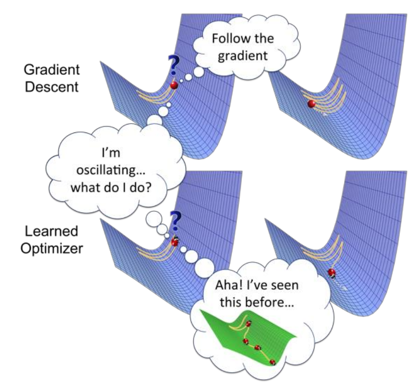
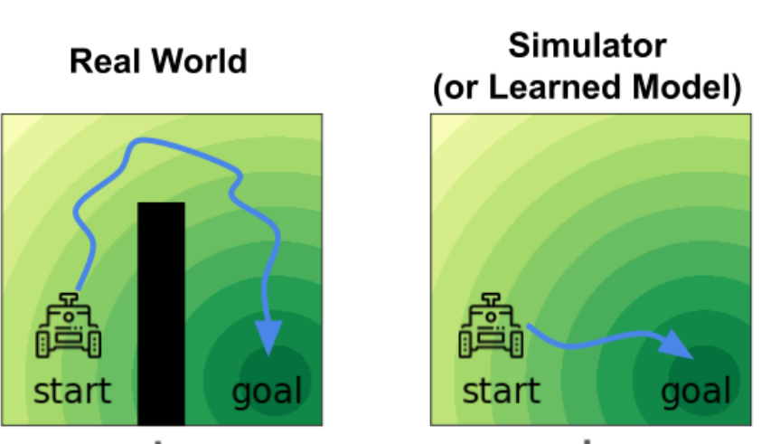

# Transfer Learning & Meta Learning (in RL)

在这一讲，我们来探讨一些非常前沿的话题——transfer learning和meta learning。这些问题把传统的问题提升了一个档次——具体的含义马上就会看到。

在本讲，我们主要讨论下面三个一般的问题（不仅限于RL）：
- 假设一个model在A任务上面训练，有没有办法在B任务上面表现的很好？这称为**forward transfer learning**。
    - 假设在B任务上，我们只能提供相比在A任务上很少的数据。比如，在A任务上训练10000个样本，但在B任务上只有10个样本。
    - 顺便一提，A称为**source task**，B称为**target task**。
- 假设一个model在$A_1,A_2,\cdots,A_n$这$n$个任务上面训练，有没有办法在B任务上面表现的很好（其他的假设和之前一样）？这称为**multi-task transfer learning**。
- 最为神奇地，我们能否在若干个task $A_1,\cdots,A_n$上面训练某种“智能体”。然后，把B任务的**训练集**给它，它**自己利用训练集对自己进行操作（注意这一操作不一定是传统的梯度下降）**，然后在B任务上面表现的很好？这称为**meta learning**，也就是learn to learn。
    - meta learning也有很多表述，比如说，这也可以被理解为，我们 **“学习”一个optimizer**，输入model的初始参数和训练集，输出一个在这个训练集上面表现的很好的新参数。如图所示。

在RL里，也可以类似地定义这三个问题。作为初步的理解，你只需要把“任务”理解为“MDP”即可。但是有些时候可能会有差异——比如，在RL里，我们要想了解target domain只能通过我们自己的policy和环境交互的方法（相比之下，DL里面我们可以直接看到数据），因此如果初始化的policy比较差就只能看到biased的数据。因此，RL里的transfer learning和meta learning会遇到更大的挑战。

如果你没有接触过这些概念，你可能完全被它们的新奇所震撼了（尤其是meta learning）。的确——这些问题的确是非常前沿的。因此，这一讲有点像一个“导览”，我们不会进入太深的detail，但简单地科普一下这些问题的算法。

## Forward Transfer Learning

首先，我们来看forward transfer learning。其实，在普通的DL中，我们也接触过类似的问题。比如说，我们都多少做过实验，使用pretrain的大语言模型（比如，MiniCPM）进行supervised fine-tuning，可以（比如说）完成高考语文选择题。这其实就是一个forward transfer learning的例子。

但是在RL中，我们如果采用同样的方法，会面临三个问题：
- **domain shift**：这指的是，两个任务可能具有视觉上的不同。比如说，都是开车，但是原先的任务是在模拟器中用虚拟渲染的图像训练，而新的任务是在真实的摄像头图像中进行。
- **difference in dynamics**：这是更加严重的问题，代表两个任务具有实质上的不同。
- **lack of exploration**：这是RL所特有的问题——经过pre-train之后的模型很大概率收敛到一个接近deterministic的policy。这样，在新的MDP中它很难很快采集到丰富的轨迹。当然，如同我们在第十九讲里介绍的那样，SAC等方法可以很好地解决这个问题。

### Domain Shift

Domain shift实际上是人们在DL中就可以解决的问题。按照我们的阐述，这类问题对应着只是表现的不同（比如，视觉上出现不同）。这可以通过**domain adapation**来解决。

我们假设在source domain上面训练好了一个不错的representation（比如，卷积出来的feature），但这个representation不一定适用于target domain。（注意，我们这里不是说的是feature之后的MLP的参数对于不同domain要变化，而是说**卷积的参数要变化**。）如何在target上面训练呢？这里给出的方法是，我们训练一个类似GAN的结构：discriminator看卷积出来的feature，然后判断这个feature是来自source还是target domain；而target domain模型的卷积层要尽量欺骗这个discriminator。

可以想象，如果这一个训练成功了，那么输出的feature应该在source和target上面是同样的分布；这样，feature就可以很好地和RL的部分对接，或者在DL的领域里的话，和MLP分类器的部分对接。从而，我们完成了forward transfer learning。

注意其中的关键思想——对于这两个不同的domain，只要它们的实质是一样的，那么一定存在两个domain分别的两个feature，使得它们处于同一个distribution。换句话说，**两个实质相同的domain之间的表观差别都是可以忽略的**（通过卷积来“殊途同归”）。这称为**Invariance Assumption**。

但是这一方法在RL中真的一定好吗？可以说，大部分时候还是可以的——但是有时候也有反例。

> 比如说，我们在模拟器的图片上训练开车，但是碰巧模拟器做的比较差，导致在真实环境中开车时，初始未经finetune的模型走的步步出错，是很差的策略。
>
> 接下来，我们按照前面的方法训练。如果原始卷积模型很好的话，它应该能卷出来开车有没有开好的特征（比如，车玻璃是不是撞到东西了）。但是如果这样的话，discriminator一下就发现了——来自target domain的这一特征大概是“差”，而来自source domain可能有好有差。这样，target domain上面的模型为了欺骗discriminator，只好“装疯卖傻”，删掉表达开车开没开好的这个特征。这样，开的好不好这一重要信息就在这一条传输链（图片->卷积模型->RL的policy模型）中断开了。
>
> 可以看到，归根结底，这一failure case来源于一开始所说的，RL中的transfer learning和普通DL的transfer learning的区别，也就是一个差的policy可能导致exploration不足，从而让DL里面本来一定work的方法失效。

### Difference in Dynamics

介绍完了第一个比较“小”的问题——domain shift之后，我们继续来介绍difference in dynamics。这就更有挑战性，我们主要介绍一个研究的结果。如图所示，假设在simulator训练的过程中，我们开车到达终点；而在实际情况中，起点和终点之间被一个墙隔离。如何让模型学会绕过这个墙到达终点呢？

研究者决定依然采用GAN的方法；但是现在，discriminator观察(state,action)对，然后判断这个对是来自source还是target domain。这样的话，如果在墙旁边，因为target domain中模型无法被穿过，所以就立刻会被判断为target domain。因此，模型会学会很远地绕过墙，不被它所干扰。

当然，这是一个极度简化的描述；实际的实现中，我们会建立一个新的reward $\tilde{r}$：

$$
\tilde{r}(s,a)=r_{\text{src}}(s,a)+\Delta r(s,a)
$$

（注意我们是在source domain的reward上面做更改。）其中，$\Delta r(s,a)$就是discriminator给出的附加reward，模型做的事情在target domain里面越不可能，这个reward越小。

用这样的方法，研究者做了一个实验：训练一个ant在无穷大平面上奔跑。接下来，把它限制在一个有限的圆盘上。实验发现，真的很像一只动物一样，ant先迅速奔跑到圆盘边缘，然后忽然减速，似乎有些犹豫地转了几圈，随后立刻折返。

> 这一方法一定work吗？同样，我们依然能给出反例。但最直接的思想是，这一方法学会的是**source domain和target domain的交集**，因为我们相当于是在source domain的policy做修改，删除了在target domain上面“离经叛道”的错误action。这样，我们不可能学会的是，在source domain上面没有但是在target domain上面有的action。
>
> 就最简单的例子，如果把上面的问题反过来——source domain中间有个墙，而target domain没有，那么这一方法就不会学会从墙中间直线穿过。

### Trick: Randomization

关于lack of exploration，可以参考第十四讲和第十九讲的内容，这里就不再介绍了。我们来额外介绍一个trick——randomization。

回想一下，在DL中，我们如何做pretrain+finetune的？以大语言模型为例，pretrain的模型通常都见到各式各样的数据，而fine tune以一个很狭窄的类型为主。这样，可以想象模型确实可以generalize。

但是对于RL，情况并非如此；很多时候，比如我们pretrain一个humanoid向前走，但是在fine tune的时候，我们要求它向后走。这样，模型的generalize就更加困难。

为了解决这个问题，**randomize**的方法被提出：我们可以**给dynamic加噪声**，使得模型更加robust，也更容易generalize。比如说，在humanoid环境里，我们可以调节肢体的相对大小、重量，和人与地面的摩擦。在训练的时候，我们可以随机地改变这些参数，让模型在“不同的环境”上面分别训练。

令人不惊奇的是，这样训练出来的policy在一组新参数构成的环境上面表现更好；而让人惊奇的是，在更多的环境上训练**几乎没有导致单个环境reward的下降**！这有点像“free lunch”，有些违背我们对generalization的预期；但我们也可以理解为，模型真的学会了一些实质性的内容，不因这些物理参数而改变。

## Multi-Task Transfer Learning

其实，在forward transfer learning的最后引入randomization时，我们已经有了一个思路——pretrain的时候task的分布越广，fine tune的时候表现越好。这就是为什么人们会进一步想做multi-task transfer learning——在多个不同（但有共性）的task上训练。（forward transfer learning中的randomize方法其实也可以视作一种multi-task transfer learning的简化版本。）

Multi-task transfer learning的理想未来是：
- 在多个task上面训练，使得模型在新的task上面表现更好；
- 不仅如此，我们希望多个task的同时训练反而会**加速每个task的平均训练速度**。这是因为，我们希望避免模型overfit，使得模型更加robust，从而收敛的更快。

### Multi-task RL is a RL problem!

在RL里面，其实可以把multi-task RL“压缩”为**一个**MDP，从而把它转化为一个RL问题。

一个最简单的方法是，在$s_0$做一个action $a_0$，进入哪个$s_1$代表进入哪个“世界”；而进入了这一世界之后再按照MDP演化。当然，这只是一个文字游戏，不同的“世界”之间的共性的提取并没有因此而简化，因此意义不大。

一个有意义的简化方式是，如果很多task包含共同的state,action（比如，我们的task有让hopper前进，有的让hopper后退，有的让它原地跳跃，等等），那么就可以把他们（有意义地）放入同一个MDP。此时，如何分辨task？我们加入一个$\omega$，称为**context**，刻画了我们在做什么。这样，完整的state space是$(s,\omega)$，我们在这样的一个MDP上面学习。这才真正地把multi-task RL变成了一个RL问题。这称为**contextual policies**。它的主要应用就是所说的，多个task是改变某个目标的参数的情形（向前，向后，不动）。

另外一个方式也是我们之前提到的，**goal-conditioned policies**。这一方法的state space是$(s,g)$，其中$g$代表最后要到达的state。还记得我们之前提到，这种方法可以让机器使用自己的reward（比如 $\mathbf{1}[s=g]$ ）来“dream goal to learn”，不需要环境额外提供reward。我们只需要把模型放进环境里，让他设计goal并试图reach goal，就可以完成Multi-task RL。

这一方法的优势是，如果test的goal就是dream过的goal，那么就立刻完成；但是缺陷也很明显——不是所有的目标都可以写为goal的形式。（我们[当时](./14-exploration_2.md#exploration-by-skills)也举过例子，要求绕开某个区域，就是对历史的刻画，不能表述为只依赖于最终state的goal形式。）

## Meta Learning

我们最后来介绍本讲的重头戏——meta learning。