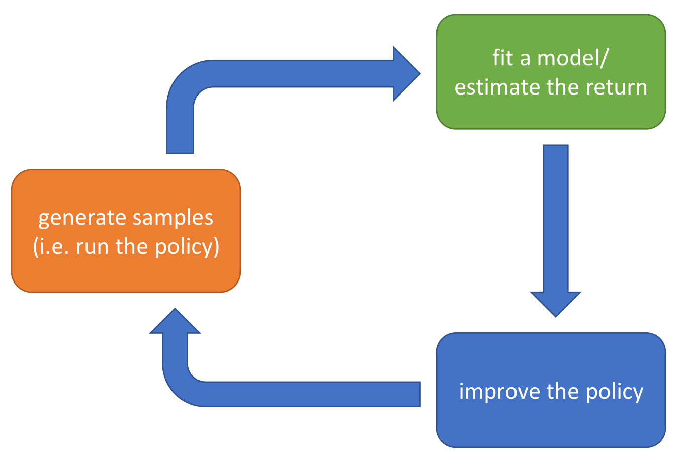

# Markov Decision Process (MDP)

## Basic Concepts

A **Markov Chain** is 
$$
\mathcal{M}=\{S,T\}
$$

where $S$ is a set of states and $T$ is a transition matrix. The transition is given by
$$
p_{t+1}(s')=\sum_{s\in S}T(s',s)p_t(s)
$$

which is just a matrix multiplication.

A **Markov Decision Process** is 
$$
\mathcal{M}=\{S,A,T,r\}
$$

where $S$ is the state space, $A$ is the action space, and the $T$ is the transition matrix which states
$$
p_{t+1}(s')=\sum_{s,a}T(s',s,a)p_t(s)p^{(A)}_t(a)
$$

where $p^{(A)}_t(a)$ is the probability of taking action $a$ at time $t$.

$r$ is the **reward function**, which gives a reward
$$
r(s,a)\in \mathbb{R}
$$
for any given state-action pair.

In **Partially Observed MDP**, observation $o_t$ is included in the system, which is stochastically determined by $s_t$: a probability distribution $O(o_t|s_t)$.

## Goal

For a MDP, the **goal** is to maximize **cumulative reward**:
$$
\theta^\star=\argmax_\theta \mathbb{E}_{\tau\sim p_\theta(\tau)}\left[\sum_{t=0}^T r(s_t,a_t)\right]
$$

where $\tau$ denotes the trajectory $(s_0,a_0,s_1,a_1,\ldots)$, and $p_\theta(\tau)$ is the probability of the trajectory if the policy is $\pi_\theta$.

Importantly, we may re-write the goal so that it can be extend to the case when $T=\infty$. (Notice that in the current expression, the probability space of $\tau$ grows to infty as $T\to \infty$, which makes things complex.) Define $p_{\theta}(s_t,a_t)$ to be the probability of having state-action pair $(s_t,a_t)$ at time $t$. （注：参见第二讲**Notation**部分的重要注意事项，$p_\theta$ 对于不同的 $t$ 不是一个分布）

We have
$$
p_{\pi_\theta}((s_{t+1},a_{t+1})|(s_t,a_t))=p(s_{t+1}|s_t,a_t){\pi_\theta}(a_{t+1}|s_{t+1})
$$

So a **re-written form** of the goal is
$$
\theta^\star=\argmax_\theta \sum_{t=0}^T\mathbb{E}_{(s,a)\sim p_{\pi_\theta}(s_t,a_t)}\left[ r(s,a)\right]
$$

Clearly, this form can be extended to the case when $T=\infty$.

## Value Function and Q Function

Value function is a great mathematical tool to help us optimize the goal. First notice that our last form of the goal $J$ can be written as

$$
J=\sum_{t=0}^T\mathbb{E}_{(s_t,a_t)\sim p_{\pi_\theta}(s_t,a_t)}\left[ r(s_t,a_t)\right]
$$

$$
=\mathbb{E}_{s_0\sim p(s_0)}\left[\mathbb{E}_{a_0\sim \pi_\theta(a_0|s_0)}\left[r(s_0,a_0)+\sum_{t= 1}^T\mathbb{E}_{(s_t,a_t)\sim p_{\pi_\theta}(s_t,a_t|s_0,a_0)}\left[ r(s_t,a_t)\right]\right]\right]
$$

So we may want to define the well-known **Q-Function** as

$$
Q^{\pi_\theta}(s_t,a_t)=r(s_t,a_t)+\sum_{i={t+1}}^T\mathbb{E}_{(s_i,a_i)\sim p_{\pi_\theta}(s_i,a_i|s_{t},a_{t})}\left[ r(s_i,a_i)\right]
$$

（注意，这里还是一样的问题：如果$T$有限，那么$Q^{\pi_\theta}(\cdot,\cdot)$对于不同的 $t$很可能不是一个函数，但这一点从记号上没有显示出来。可以发现很多RL的记号都存在这种问题，需要自己意会。）

and the **Value Function** as

$$
V^{\pi_\theta}(s_t)=\mathbb{E}_{a_{t}\sim \pi_\theta(a_t|s_t)}\left[Q^{\pi_\theta}(s_t,a_t)\right]
$$

Then the objective becomes

$$
J=\mathbb{E}_{s_0\sim p(s_0)}\left[V^{\pi_\theta}(s_0)\right]=\mathbb{E}_{(s_0,a_0)\sim p_{\pi_\theta}(s_0,a_0)}\left[Q^{\pi_\theta}(s_0,a_0)\right]
$$

Besides the definition, there is also one relation between $Q$ and $V$:

$$
Q^{\pi_\theta}(s_t,a_t)=r(s_t,a_t)+\mathbb{E}_{s_{t+1}\sim p(s_{t+1}|s_t,a_t)}\left[V^{\pi_\theta}(s_{t+1})\right]
$$

This makes $Q$ and $V$ solvable by **Dynamic Programming**, which will be discussed afterwards.

### Planing with Q and V

The most important aspect of $Q,V$ is that they can express the goal, which means that we can optimize policy if we have $Q,V$.

For example, if we have $Q^{\pi}(s,a)$, then we can optimize the policy by

$$
\pi(a^\star,s)\leftarrow 1, a^\star=\argmax_a Q^{\pi}(s,a)
$$

Besides that, since $V$ is the expectation of $Q$, we know that our policy should select a good $a$ such that $Q(s,a)\ge V(s)$. These intuitions are important, and will be discussed later.

# RL Algorithms Overview

All RL algorithms have the following structure:

"Generating Samples" is usually easy and not the focus of the algorithm. The key parts is the green and blue boxes: **Reward Evaluation** and **Policy Improvement**.

Some common algorithms and their corresponding methods are listed below:

| Algorithm | Reward Evaluation | Policy Improvement |
| --- | --- | --- |
| Policy Gradients| $J$ is sum of rewards | Gradient Descent on $J$ |
| Value-based | Learn $V,Q$ of the **optimal policy** | Improve policy using $V,Q$ (with the intuition discussed above)|
| Acter-Critic | Learn $V,Q$ of the **current policy** | Improve policy using $V,Q$ |
| Model-based | Learn $f_\phi$, $s_{t+1}=f_\phi(s_t,a_t)$ (Simulate the env) | Backprop onto $\pi_\theta$ using $f_\phi$ |

## Tradeoff

- **sample efficiency**: 
    - 这也被称为是否 "off-policy" ？"off-policy" 指的是，就算policy改变了，我们也可以利用之前的数据。这样的算法更加sample efficient。
    - 我们什么时候要care sample efficiency呢？可以发现，如果我们的环境是一个真实的物理环境，那么sample efficiency就很重要了。但如果我们的环境是一个模拟环境，我们就不用管这个。
    - 可以发现，最需要sample的当然是policy gradient；而model-based 和 value-based 需要的sample数是最少的。
- **wall clock time**:这是计算复杂度的一个简称。如果我们的模型要高频地与环境交互，那么计算复杂度就很重要了。
- **stability**:这是指算法的稳定性。policy gradient作为一个梯度下降算法，总是可以保证convergence；但其他大部分的RL算法的convergence还是open question。
