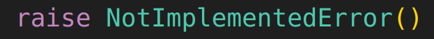

# Policy Gradient Algorithm

The policy gradient algorithm directly optimize the objective

$$
J(\theta)=\mathbb{E}_{\tau\sim p_{\pi_\theta}(\tau)}\left[\sum_t r(s_t,a_t)\right]
$$

by taking gradient descent and apply a little math trick:

$$
\nabla_\theta J(\theta)=\nabla_\theta\left[\int p_{\pi_\theta}(\tau)\sum_t r(s_t,a_t)d\tau\right]
$$

$$
=\int p_{\pi_\theta}(\tau) \nabla_\theta \log p_{\pi_\theta}(\tau)\sum_t r(s_t,a_t)d\tau
$$

$$
=\mathbb{E}_{\tau\sim p_{\pi_\theta}(\tau)}\left[\nabla_\theta \log p_{\pi_\theta}(\tau)\sum_t r(s_t,a_t)\right]
$$

$$
=\mathbb{E}_{\tau\sim p_{\pi_\theta}(\tau)}\left[\left(\sum_t \nabla_\theta\log \pi_\theta(a_t|s_t)\right)\left(\sum_t r(s_t,a_t)\right)\right]
$$

Of course, in reality, we may sample $N$ trajectories and estimate the gradient by

$$
\nabla_\theta J(\theta)\approx \frac{1}{N}\sum_{n=1}^N \left(\sum_t \nabla_\theta\log \pi_\theta(a_t|s_t)\right)\left(\sum_t r(s_t,a_t)\right)
$$

This vanilla algorithm is also called the **REINFORCE** algorithm. It has 3 steps (see the 4th lecture, where we have basically the same steps):

1. Sample $N$ trajectories $\tau_n$ by $\pi_\theta$.
2. Compute the gradient of $J(\theta)$ approximately
3. Update $\theta$ by gradient descent.

*Comments.* 直观上看，对于使得reward $\sum r(s_t,a_t)$很大的$a_t$，梯度$\nabla \log \pi_\theta(a_t|s_t)$ 的"learning rate"更大，所以模型会倾向于把更大的概率给这个action。

## Issues with the vanilla Policy Gradient

这个算法听起来很直观并且很好实现，但是实际上会发现有一定的问题：**reward出现的方式不对**。

设想现在我们把每一个reward加一个常数，这个体系本身不应该受影响；但现在的形式中reward作为一个类似于"learning rate"的形式乘在上面，这就导致了可能的问题。

- 举个例子：假设现在我们取3条轨迹，他们的reward分别为-2,1,1，那么（粗略来说）第一条的概率会下降，第二、三条的概率会上升。但是假设现在reward全局增加一个常数，导致它们变成了100,103,103,那么可以想到它们三条轨迹的概率都会上升，这明显是不对的（因为第一条轨迹在取样的三条中都是最差的，很难说他是一条很好的轨迹）！
- 但是另一方面，如果样本足够多($N\to\infty$)，根据理论我们知道整体reward的平移不会影响policy的gradient。
    - 注意上面的解释只不过是intuition；假设现在我们每一个reward都加了一个100导致全部是正的了，这并不会导致所有概率都增加（因为最后的梯度并不是传到概率上，而是传到概率分布的parameters上！）。可以想象，如果所有reward都等于100，那么就像所有都是0一样不会有任何update发生。
    - 因此，这实际上是policy gradient的一个典型问题：**估计本身是unbiased的，但在sample数量不够的时候会产生很大的variance，从而导致估计具有很大的bias**。

为了解决这个问题，引入了重要的两个方法：**baseline**和**causality**。

### Baseline

Baseline直接对上面的问题开刀：既然reward上叠加的uniform constant不影响gradient，那我们不妨修改一下梯度的表达式:

$$
\nabla_\theta J(\theta)\approx \frac{1}{N}\sum_{n=1}^N \nabla_\theta\log p_{\pi_\theta}(\tau_n)\left(r(\tau_n)-b\right)
$$

这里的$b$（称为**baseline**）应该是任意的，因为
$$
\mathbb{E}_{\tau\sim p_{\pi_\theta}(\tau)}\left[\nabla_\theta\log p_{\pi_\theta}(\tau)\right]=0
$$

但是另一方面，就像我们前面提到的那样，样本有限的时候可不能乱搞——我们必须选取$b$使得variance最小。但这个计算复杂度太高了，实际上一般不会使用。

### Causality

Causality关注到了一个不易察觉的问题：我们原来的表达式其含义是，$\pi_\theta(a_t|s_t)$的梯度依赖于整个过程的reward大小$\sum_{t}r(s_t,a_t)$；但实际上这并不合理——根据因果性，$t$时刻的决策不会影响 $t'<t$ 时刻的reward。因此，即使前面几步走的比较差，你不能让后面走的很好的步骤也蒙受这个惩罚。

按照这个思路，我们直接改写

$$
\nabla_\theta J(\theta)\approx \frac{1}{N}\sum_{n=1}^N \sum_{t=1}^T \nabla_\theta\log \pi_\theta(a_t|s_t)\left(\sum_{t'=t}^T r(s_{t'},a_{t'})\right)=\frac{1}{N}\sum_{n=1}^N \sum_{t=1}^T \nabla_\theta\log \pi_\theta(a_t|s_t)\hat{Q}^{\pi_\theta}_{n,t}
$$

其中的 $\hat{Q}^{\pi_\theta}_{n,t}$有点类似于Q-function但并不是——它是依赖于路径的，“未来所有reward之和”。

数学上，也可以直接证明这样的causality表达式和原先的表达式在$N\to\infty$时是等价的，因为

$$
\mathbb{E}_{\tau\sim p_{\pi_\theta}(\tau)}\left[\nabla \log \pi_\theta(a_t|s_t)\left(\sum_{t'<t}r(s_{t'},a_{t'})\right)\right]=0
$$ 

只不过，就如我们之前说的那样，通过减小不应该出现的项进行约化，这个利用了causality的表达式会减小variance。

# Off-Policy Policy Gradients

除了巨大的variance之外，policy gradient的on-policy特性（见第4讲）也造成了sample efficiency的问题。当然，一般policy gradient都是用在sample efficiency不需要特别考虑的地方，但是我们还是讨论一类特别的方式，把off-policy的思想引入policy gradient。

关键在于采用**Importance Sampling**。假设现在我们有$p_{\pi_{\bar{\theta}}}$这个分布中取样的若干样本，那么我们就可以用importance sampling利用这些样本来估计$p_{\pi_\theta}$分布中某些东西的期望。具体地，我们写出

$$
\nabla_{\theta}J(\theta)=\mathbb{E}_{\tau\sim p_{\pi_\theta}(\tau)}\left[\nabla_{\theta}\log p_{\pi_\theta}(\tau)\sum_t r(s_t,a_t)\right]
$$

$$
=\mathbb{E}_{\tau\sim p_{\pi_{\bar{\theta}}}(\tau)}\left[\frac{p_{\pi_\theta}(\tau)}{p_{\pi_{\bar{\theta}}}(\tau)}\nabla_{\theta}\log p_{\pi_\theta}(\tau)\sum_t r(s_t,a_t)\right]
$$

$$
=\mathbb{E}_{\tau\sim p_{\pi_{\bar{\theta}}}(\tau)}\left[\prod_{t=1}^T\frac{{\pi_\theta}(a_t|s_t)}{{\pi_{\bar{\theta}}}(a_t|s_t)}
\left(\sum_{t=1}^T \nabla_{\theta}\log \pi_\theta(a_t|s_t) \right)\left(\sum_{t=1}^T r(s_t,a_t)\right)\right]
$$

这样，在连续几轮对policy的训练中，我们只需要在一开始对策略$\pi_{\bar{\theta}}$进行一个采样，就可以用于几轮的训练。我们成功把off-policy的思想引入了policy gradient。

接下来，我们展示几个变形。

## With Causality

This is a very demanding calculation. We begin with the old causality expression (without doing important sampling):

$$
\nabla_\theta J(\theta)=\mathbb{E}_{\tau\sim p_\theta(\tau)}\left[ \sum_{t=1}^T \nabla_\theta\log \pi_\theta(a_t|s_t)\left(\sum_{t'=t}^T r(s_{t'},a_{t'})\right)\right]
$$

$$
=\sum_{t=1}^T\sum_{t'=t}^T \mathbb{E}_{\tau\sim p_\theta(\tau)}\left[r(s_{t'},a_{t'}) \nabla_\theta\log \pi_\theta(a_t|s_t) \right]
$$

$$
=\sum_{t=1}^T\sum_{t'=t}^T \sum_{s_1,a_1,\cdots,s_T,a_T}p(s_1)\pi_\theta(a_1|s_1)\cdots p(s_T|a_{T-1},s_{T-1})\pi_\theta (a_T|s_T)r(s_{t'},a_{t'}) \nabla_\theta\log \pi_\theta(a_t|s_t)
$$

（接下来这一步的思想是对概率分布使用causality，但数学上是严格等的）

$$
=\sum_{t=1}^T\sum_{t'=t}^T \sum_{s_1,a_1,\cdots,s_{t'},a_{t'}}p(s_1)\pi_\theta(a_1|s_1)\cdots p(s_{t'}|a_{{t'}-1},s_{{t'}-1})\pi_\theta (a_{t'}|s_{t'})r(s_{t'},a_{t'}) \nabla_\theta\log \pi_\theta(a_t|s_t)
$$

$$
=\sum_{t=1}^T\sum_{t'=t}^T\mathbb{E}_{\tau_{\le t'}\sim p_{\bar{\theta}}(\tau_{\le t'})}\left[\prod_{t''=1}^{t'}\frac{{\pi_\theta}(a_{t''}|s_{t''})}{{\pi_{\bar{\theta}}}(a_{t''}|s_{t''})}r(s_{t'},a_{t'})\nabla_{\theta}\log \pi_\theta(a_t|s_t)\right]
$$

$$
=\sum_{t=1}^T\sum_{t'=t}^T\mathbb{E}_{\tau \sim p_{\bar{\theta}}(\tau)}\left[\prod_{t''=1}^{t'}\frac{{\pi_\theta}(a_{t''}|s_{t''})}{{\pi_{\bar{\theta}}}(a_{t''}|s_{t''})}r(s_{t'},a_{t'})\nabla_{\theta}\log \pi_\theta(a_t|s_t)\right]
$$

$$
=\sum_{t=1}^T\mathbb{E}_{\tau \sim p_{\bar{\theta}}(\tau)}\left[\nabla_{\theta}\log \pi_\theta(a_t|s_t)\cdot \prod_{t''=1}^{t}\frac{{\pi_\theta}(a_{t''}|s_{t''})}{{\pi_{\bar{\theta}}}(a_{t''}|s_{t''})}\sum_{t'=t}^T\left(r(s_{t'},a_{t'})\prod_{t''=t+1}^{t'}\frac{{\pi_\theta}(a_{t''}|s_{t''})}{{\pi_{\bar{\theta}}}(a_{t''}|s_{t''})}\right)\right]
$$

最后，可以证明，我们可以忽略最后的

$$
\prod_{t''=t+1}^{t'}\frac{{\pi_\theta}(a_{t''}|s_{t''})}{{\pi_{\bar{\theta}}}(a_{t''}|s_{t''})}
$$

使得算法依然有效。证明会在后面的lecture中提到，届时我会把它移动到这里。

最后，causality的表达式可以写成

$$
\nabla_\theta J(\theta)=\sum_{t=1}^T\mathbb{E}_{\tau \sim p_{\bar{\theta}}(\tau)}\left[\nabla_{\theta}\log \pi_\theta(a_t|s_t)\cdot \prod_{t''=1}^{t}\frac{{\pi_\theta}(a_{t''}|s_{t''})}{{\pi_{\bar{\theta}}}(a_{t''}|s_{t''})}\sum_{t'=t}^Tr(s_{t'},a_{t'})\right]
$$

## With First-order Approximation

接下来，我们进一步丢掉大部分的项，给出

$$
\nabla_\theta J(\theta)=\sum_{t=1}^T\mathbb{E}_{\tau \sim p_{\bar{\theta}}(\tau)}\left[\frac{{\pi_\theta}(a_{t}|s_{t})}{{\pi_{\bar{\theta}}}(a_{t}|s_{t})}\nabla_{\theta}\log \pi_\theta(a_t|s_t)\sum_{t'=t}^Tr(s_{t'},a_{t'})\right]
$$

这称为first-order approximation。而为什么可以作这一步操作，我们会在后面的lecture中提到。

# Policy Gradient In Practice

## Fake Loss Function for Autograd

我们先回到vanilla policy gradient的表达式：

$$
\nabla_\theta J(\theta)\approx \frac{1}{N}\sum_{n=1}^N \sum_{t=1}^T \nabla_\theta\log \pi_\theta(a_t|s_t)\left(\sum_{t'=t}^T r(s_{t'},a_{t'})\right)=\frac{1}{N}\sum_{n=1}^N \sum_{t=1}^T \nabla_\theta\log \pi_\theta(a_t|s_t)\hat{Q}^{\pi_\theta}_{n,t}
$$

为了避免手动计算梯度，我们可以构造一个没有实际意义的loss，但这个loss的梯度就是$\nabla_\theta J(\theta)$。它可以是

$$
\tilde{J}(\theta)=\frac{1}{N}\sum_{n=1}^N \sum_{t=1}^T \log \pi_\theta(a_t|s_t)\hat{Q}^{\pi_\theta}_{n,t}
$$

（注意$\hat{Q}^{\pi_\theta}_{n,t}$和$\theta$无关，只和路径有关）

## Tune the Hyperparameters

- Learning rate: hard to tune, so better use Adam.
- Batch size: as large as possible, since the variance is large.

# Advanced Policy Gradient Methods

