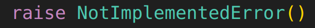

# Improve Policy Gradient

## Introduce Q,V into Policy Gradient

我们重新考虑之前的考虑causality的 policy gradient的表达式：

$$
\nabla_\theta J(\theta)=\mathbb{E}_{\tau \sim p_{\bar{\theta}}(\tau)}\left[\sum_{t=1}^T\left(\nabla_{\theta}\log \pi_\theta(a_t|s_t)\sum_{t'=t}^Tr(s_{t'},a_{t'})\right)\right]=\mathbb{E}_{\tau \sim p_{\bar{\theta}}(\tau)}\left[\sum_{t=1}^T\nabla_{\theta}\log \pi_\theta(a_t|s_t)\hat{Q}^{\pi_\theta}_{n,t}
\right]
$$

但这个表达式具有比较大的variance。仔细一想，是因为对于每一次 $\hat{Q}^{\pi_\theta}_{n,t}$ 我们只计算一条轨迹，这会导致variance很大。请记住本讲的takeover：

> **重要思想.** 对于很多问题，有两种方案：
> 1. 一个单采样的估计，虽然unbiased但方差大；
> 2. 一个模型的拟合，虽然对不准确的model有一定bias，但方差小。
> 
> 我们需要在这两者之间做一个tradeoff。

本讲很多地方都要采用这种思想。比如这里，根据这个**重要思想**，我们希望把 $\hat{Q}^{\pi_\theta}_{n,t}$ 换成很多轨迹的期待值。

那这个期待值是什么？我们发现，其实就是

$$
Q^{\pi_\theta}(s_t,a_t)=\mathbb{E}_{\tau_{\ge t} \sim p_{\bar{\theta}}(\tau_{\ge t}|s_t,a_t)}\left[\sum_{t'=t}^Tr(s_{t'},a_{t'})\right]=\mathbb{E}_{\tau_{\ge t} \sim p_{\bar{\theta}}(\tau_{\ge t}|s_t,a_t)}\left[\hat{Q}^{\pi_\theta}_{n,t}\right]
$$

所以一个更好的（variance更小）的表达式是

$$
\nabla_\theta J(\theta)=\mathbb{E}_{\tau \sim p_{\theta}(\tau)}\left[\sum_{t=1}^T\nabla_{\theta}\log \pi_\theta(a_t|s_t)Q^{\pi_\theta}(s_t,a_t)\right]
$$

### With Baseline

为了进一步减小variance，我们可以引入一个**baseline**。它的选取应该是 $Q^{\pi_\theta}(s_t,a_t)$ 的某种平均，我们会发现相比于之前最普通的直接平均，我们可以有

$$
V^{\pi_\theta}(s_t)=\mathbb{E}_{a_t\sim \pi_\theta(a_t|s_t)}\left[Q^{\pi_\theta}(s_t,a_t)\right]
$$

这样，就有了一个新的表达式

$$
\nabla_\theta J(\theta)=\mathbb{E}_{\tau \sim p_{\theta}(\tau)}\left[\sum_{t=1}^T\nabla_{\theta}\log \pi_\theta(a_t|s_t)\left(Q^{\pi_\theta}(s_t,a_t)-V^{\pi_\theta}(s_t)\right)\right]
$$

这里的$Q^{\pi_\theta}(s_t,a_t)-V^{\pi_\theta}(s_t)$也被称作Advantage Function（记作$A^{\pi_\theta}(s_t,a_t)$）：它代表你作action $a_t$相比于平均情况的优势。

## Fitting Q and V

显然，既然引入了Q和V，我们就需要一个方法来估计$Q$和$V$。假设我们的算力只支持拟合一个网络，我们的神经网络拟合哪个比较好呢？

我们注意到

$$
Q^{\pi_\theta}(s_t,a_t)=r(s_t,a_t)+\mathbb{E}_{\tau_{> t} \sim p_{\bar{\theta}}(\tau_{> t}|s_t,a_t)}\left[\sum_{t'=t+1}^Tr(s_{t'},a_{t'})\right]
=r(s_t,a_t)+\mathbb{E}_{s_{t+1}\sim p(s_{t+1}|s_t,a_t)}\left[V^{\pi_\theta}(s_{t+1})\right]
$$

根据之前提到的**重要思想**：期待值虽然带来小的variance，但是需要多付出一个model（用来拟合$Q$）的代价。因此，这里我们不如随机选取一个$s_{t+1}$，然后直接用

$$
Q^{\pi_\theta}(s_t,a_t)\approx r(s_t,a_t)+V^{\pi_\theta}(s_{t+1})
$$

显然这样的估计虽然unbiased但是variance很大。但这样我们完全可以不用再拟合$Q$，所以作了很好的tradeoff。接下来，只需要拟合$V$了。

### Policy Evaluation

policy evaluation就是指拟合$V$。问题的关键是如何收集用来拟合$V$的数据。最简单的思路就是Monte Carlo：我们就利用每一条轨迹的reward来拟合$V$。具体地，每次采样$N$条轨迹，计算

$$
y_{n,t}=\sum_{t'=t}^Tr(s_{n,t'},a_{n,t'})
$$

然后训练

$$
L(\phi)=\frac{1}{N}\sum_{n=1}^N\sum_{t=1}^{T}\left(y_{n,t}-V^{\pi_\theta}_{\phi}(s_{n,t})\right)^2
$$

注意这里的$V^{\pi_\theta}_{\phi}$是一个只依赖于参数$\phi$，而不依赖于$\theta$的网络。

当然，容易看到这里$y_{n,t}$又是一个单采样，所以variance很大。因此，根据前面的**重要思想**，我们可以利用模型的结果：

$$
{y}_{n,t}=r(s_{n,t},a_{n,t})+\sum_{t'=t+1}^Tr(s_{n,t'},a_{n,t'})\approx r(s_{n,t},a_{n,t})+V^{\pi_\theta}_{\phi}(s_{n,t+1}):=\hat{y}_{n,t}
$$

这样，我们的目标变成了

$$
\hat{L}(\phi)=\frac{1}{N}\sum_{n=1}^N\sum_{t=1}^{T}\left(\text{SG}[\hat{y}_{n,t}]-V^{\pi_\theta}_{\phi}(s_{n,t})\right)^2=\frac{1}{N}\sum_{n=1}^N\sum_{t=1}^{T}\left(r(s_{n,t},a_{n,t})+\text{SG}[V^{\pi_\theta}_{\phi}(s_{n,t+1})]-V^{\pi_\theta}_{\phi}(s_{n,t})\right)^2
$$

（注意这里stop gradient，以稳定训练）这个最终的表达式就是我们的policy evaluation的目标。

## Summary

简单总结一下，我们究竟作了哪些事情：

- 引入Q,V来代替policy gradient中的reward求和，减小variance；
- 通过近似的方式，避免了对Q的拟合（虽然这步会增大variance）；
- 通过巧妙设计拟合V的目标，再次减小variance。

# Actor-Critic Algorithm

把前面的方法总结一下，我们就得到了Actor-Critic算法：

1. 利用现在的policy $\pi_\theta$ 取 $N$ 个trajectory；
2. 用这些数据训练 $V^{\pi_\theta}_{\phi}$；
3. 计算 $A^{\pi_\theta}(s_t,a_t)=V_\phi^{\pi_\theta}(s_{t+1})-V_\phi^{\pi_\theta}(s_{t})+r(s_t,a_t)$
4. 计算 $\nabla_\theta J(\theta)=\frac{1}{N}\sum_{n}\left[\sum_{t=1}^T\nabla_{\theta}\log \pi_\theta(a_t|s_t)A^{\pi_\theta}(s_t,a_t)\right]$
5. 用这个梯度更新 $\theta$

第二步就是我们前面讨论的policy evaluation，可以采用前面的两种方法中任何一种。

## Discount Factor

如果简单按照前面的方法训练，我们理想情况的$V^{\pi_\theta}_\phi$应该就是

$$
V^{\pi_\theta}_\phi(s_t)=\mathbb{E}_{\tau_{\ge t} \sim p_{\bar{\theta}}(\tau_{\ge t}|s_t)}\left[\sum_{t'=t}^Tr(s_{t'},a_{t'})\right]
$$

但这个求和对于infinite horizon的情况是发散的！因此我们引入一个discount factor $\gamma\in [0,1)$，重新定义我们的目标

$$
V^{\pi_\theta}_\phi(s_t)=\mathbb{E}_{\tau_{\ge t} \sim p_{\bar{\theta}}(\tau_{\ge t}|s_t)}\left[\sum_{t'=t}^T\gamma^{t'-t}r(s_{t'},a_{t'})\right]
$$

这会带来很多地方的改变。

> **小贴士**
> 
> 本讲有很多地方完全改变了原来的算法。为了保证理解，建议每一次这种地方都自己先思考一下引入的新修改会导致原来算法哪些部分的改变。

- $V^{\pi_\theta}_\phi$的训练要改变
- $A^{\pi_\theta}(s_t,a_t)$的计算要改变

### $V^{\pi_\theta}_\phi$的训练

具体地，我们

$$
{y}_{n,t}=r(s_{n,t},a_{n,t})+\sum_{t'=t+1}^T\gamma^{t'-t}r(s_{n,t'},a_{n,t'})\approx r(s_{n,t},a_{n,t})+\gamma V^{\pi_\theta}_{\phi}(s_{n,t+1}):=\hat{y}_{n,t}
$$

因此要修改训练方式：

$$
L(\phi)=\frac{1}{N}\sum_{n=1}^N\sum_{t=1}^{T}\left(\hat{y}_{n,t}-V^{\pi_\theta}_{\phi}(s_{n,t})\right)^2=\frac{1}{N}\sum_{n=1}^N\sum_{t=1}^{T}\left(r(s_{n,t},a_{n,t})+\gamma V^{\pi_\theta}_{\phi}(s_{n,t+1})-V^{\pi_\theta}_{\phi}(s_{n,t})\right)^2
$$

### $A^{\pi_\theta}(s_t,a_t)$的计算

$$
Q^{\pi_\theta}(s_t,a_t)=r(s_t,a_t)+\gamma\mathbb{E}_{\tau_{> t} \sim p_{\bar{\theta}}(\tau_{> t}|s_t,a_t)}\left[\sum_{t'=t+1}^Tr(s_{t'},a_{t'})\right]
=r(s_t,a_t)+\gamma\mathbb{E}_{s_{t+1}\sim p(s_{t+1}|s_t,a_t)}\left[V^{\pi_\theta}_\phi(s_{t+1})\right]
$$

这样

$$
A^{\pi_\theta}(s_t,a_t)=Q^{\pi_\theta}(s_t,a_t)-V^{\pi_\theta}_\phi(s_t)=r(s_t,a_t)+\gamma V^{\pi_\theta}_\phi(s_{t+1})-V^{\pi_\theta}_\phi(s_t)
$$

### Two Kinds of Discount Factor (Optional)

**Warning.** 如果感觉有点晕了，千万别看这一节。

# Actor-Critic in Practice

加入discount factor之后，我们就得到了最基本的batch actor-critic算法。

> actor-critic algorithm
1. 利用现在的policy $\pi_\theta$ 取 $N$ 个trajectory；
2. 用这些数据训练 $V^{\pi_\theta}_{\phi}$；
3. 计算 $A^{\pi_\theta}(s_t,a_t)=\gamma V_\phi^{\pi_\theta}(s_{t+1})-V_\phi^{\pi_\theta}(s_{t})+r(s_t,a_t)$
4. 计算 $\nabla_\theta J(\theta)=\frac{1}{N}\sum_{n}\left[\sum_{t=1}^T\nabla_{\theta}\log \pi_\theta(a_t|s_t)A^{\pi_\theta}(s_t,a_t)\right]$
5. 用这个梯度更新 $\theta$

接下来我们介绍一些改进。

## Online Actor-Critic

我们之前的算法是batch的，即每次都要收集$N$条轨迹。能否把这个算法变成一个online的算法呢？注意的，普通的policy gradient是绝对不能变成online的，因为它必须计算$t'\ge t$的reward求和。但是现在我们的算法是基于Q,V的，所以我们可以尝试把算法变为

1. 用当前的策略$\pi_\theta$走一步，记为$\{s_t,a_t,s_{t+1},r=r(s_t,a_t)\}$；
2. 用一步的数据$\{V_{\phi}^{\pi_\theta}(s_t),V_{\phi}^{\pi_\theta}(s_{t+1}),r\}$训练 $V^{\pi_\theta}_{\phi}$；
3. 计算 $A^{\pi_\theta}(s_t,a_t)=\gamma V_\phi^{\pi_\theta}(s_{t+1})-V_\phi^{\pi_\theta}(s_{t})+r(s_t,a_t)$
4. 计算 $\nabla_\theta J(\theta)=\nabla_{\theta}\log \pi_\theta(a_t|s_t)A^{\pi_\theta}(s_t,a_t)$
5. 用这个梯度更新 $\theta$

但我们很快发现这多了很多的单采样，variance会很大。解决方法是并行地进行很多个trajectory，然后用这些trajectory的平均来更新。具体实现方法不再介绍。

## Off-policy Actor-Critic

就算不采用online的方法，我们也在想：能否节约一下采样，把这个算法变成off-policy的呢？

off-policy的修改一定要涉及旧数据的重新利用。我们采用**Replay Buffer**的方法。首先回顾之前的算法：

1. 利用现在的policy $\pi_\theta$ 取 $N$ 个trajectory；
2. 用这些数据训练 $V^{\pi_\theta}_{\phi}$；
3. 计算 $A^{\pi_\theta}(s_t,a_t)=\gamma V_\phi^{\pi_\theta}(s_{t+1})-V_\phi^{\pi_\theta}(s_{t})+r(s_t,a_t)$
4. 计算 $\nabla_\theta J(\theta)=\frac{1}{N}\sum_{n}\left[\sum_{t=1}^T\nabla_{\theta}\log \pi_\theta(a_t|s_t)A^{\pi_\theta}(s_t,a_t)\right]$
5. 用这个梯度更新 $\theta$

我们观察第2和第4步的两个训练过程，可以发现其实没有必要必须对$t=1$到$T$依次训练，只要选取足够多的$\{s_t,a_t,s_{t+1},r\}$对就可以了。因此我们可以把这些数据存储在一个Replay Buffer里面，然后每次从这个Buffer里面随机取一些数据来训练。

> 现在，请你想一想，有哪些地方需要修改？

### 第2步的训练

我们本来打算

$$
L(\phi)=\sum_{\text{batch}}\left(r(s_{t},a_{t})+\gamma V^{\pi_\theta}_{\phi}(s_{t+1})-V^{\pi_\theta}_{\phi}(s_{t})\right)^2
$$

但现在$r,a_t$和$s_{t+1}$全都不对。实际上，$a_t$是好解决的，因为我们可以用$\pi_\theta$重新采样一个$a_t$。

但是$r$和$s_{t+1}$就不好解决了。我们可以用一个新的网络$Q_{\psi}$来估计$r$和$s_{t+1}$，然后用这个网络的输出来替代$r$和$s_{t+1}$。这样，我们的目标变成了

## Implementation Details

### Net Architecture

# State-dependent Baselines

